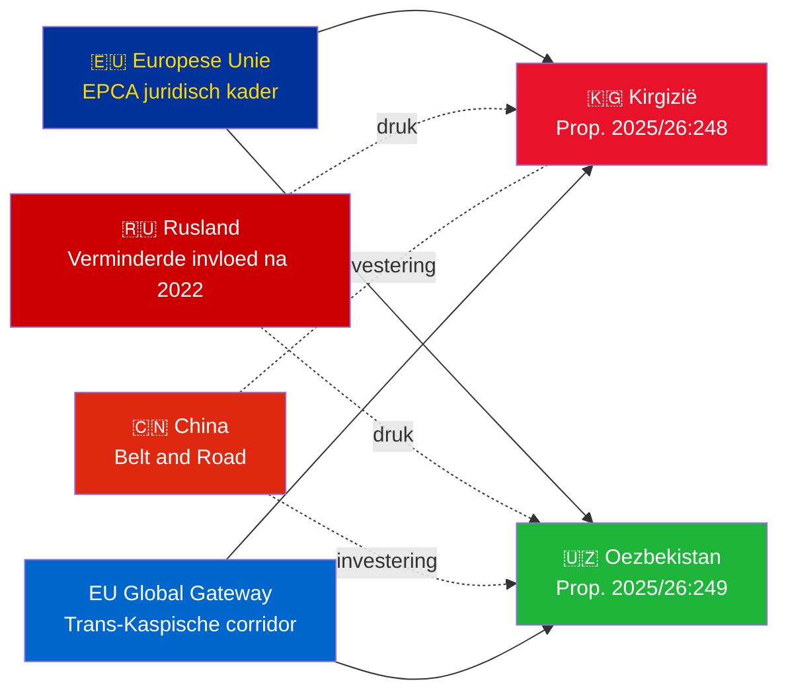

# Uitvoerende samenvatting — Regeringspropositioner 2026-05-06

**Classificatie**: Admiralty [B2] | **Horizon**: T+72h / T+90d
**WEP-vertrouwelijkheid**: Nagenoeg zeker (ratificatieresultaat) | Waarschijnlijk (geopolitieke trajectorie)
**DIW**: L2 Strategisch | **Datum**: 2026-05-06

---

## 🔴 Belangrijkste inlichtingenbevinding

**Zweden legt op 2026-05-06 ratificatiestemmen voor twee EU–Centraal-Aziatische EPCA's voor.** Beide overeenkomsten (EU–Kirgizië: HD03248; EU–Oezbekistan: HD03249) zijn verdragsratificatiepropositioner van het Utrikesdepartementet, doorverwezen naar het Utrikesutskottet. Parlementaire goedkeuring is **nagenoeg zeker** (vertrouwelijkheid: 95%+) — dit zijn niet-partijpolitieke EU-verdragsverplichtingen. De strategische inlichtingenwaarde ligt in de geopolitieke context, niet in de stemmen zelf.

---

## 📋 Wat in het Riksdag behandeld wordt

| Proposition | Land | Ondertekend | Sleutelbepalingen |
|------------|------|------------|-----------------|
| 2025/26:248 (HD03248) | Kirgizië | 2023 | Politieke dialoog, handel, rechtsstaat, connectiviteit |
| 2025/26:249 (HD03249) | Oezbekistan | 2023 | Handel, kritieke grondstoffen, digitale economie, klimaat |

Beide zijn **EPCA's (Enhanced Partnership and Cooperation Agreements)** — het meest uitgebreide bilaterale juridische kader dat de EU gebruikt naast associatieovereenkomsten. Ze vervangen de partnerschaps- en samenwerkingsovereenkomsten uit het Sovjet-tijdperk van 1999.

---

## 🌍 Geopolitieke context

**Geopolitieke heroriëntatie van Centraal-Azië na 2022**: Zowel Kirgizië als Oezbekistan hebben het EU-engagement versneld sinds Ruslands volledige invasie van Oekraïne. Ruslands economische moeilijkheden, het risico op secundaire sancties en de verminderde CSTO-geloofwaardigheid creëerden een venster voor diepgaandere EU-samenwerking. De EPCA-reeks (ratificaties voor Kazachstan, Kirgizië, Oezbekistan, Tadzjikistan lopen) vertegenwoordigt de meest significante uitbreiding van het EU-rechtskader in Centraal-Azië sinds de onafhankelijkheid.

---

## 🎯 Strategische inlichtingenbeoordeling

**Oezbekistan-EPCA (HD03249) heeft hogere strategische waarde** vanwege:
1. Bevolking 38M — volkrijkste staat van Centraal-Azië
2. Kritieke grondstoffen: uranium (wereldwijd nr. 7), goud, koper, lithiumverkenning
3. EU Critical Raw Materials Act (2024) identificeert Centraal-Azië als strategische aanvoercorridor
4. Hervormingstempo onder Mirzijojew — de meest pro-westerse CA-leider sinds 2016

**Kirgizië-EPCA (HD03248)** is lager maar niet triviaal:
1. Geografische toegangspoort tot bredere CA-connectiviteit
2. Chinees/Russisch dubbelkoppig invloedsuitdaging
3. Constitutionele machtconcentratie in 2021 schept verplichtingen voor mensenrechtenbewaking

---

## ⏱️ Onmiddellijke actietijdlijn

| Dag | Actie |
|-----|-------|
| **2026-05-06** | Propositioner HD03248 + HD03249 ingediend bij Riksdag |
| **2026-06** | UU-commissiehearings (waarschijnlijk gezamenlijke sessie) |
| **2026-09** | UU betänkande (aanbeveling) |
| **2026-10** | Plenumsstemming — nagenoeg zekere goedkeuring |
| **2026-11** | Zweedse ratificering gedeponeerd; EPCA's treden voorlopig in werking |

---

*Uitvoerende samenvatting | Riksdagsmonitor | 2026-05-06*

<!-- source-sha: 83ab95c995e928d2f484c02aef7ab0bee0f03535 -->
