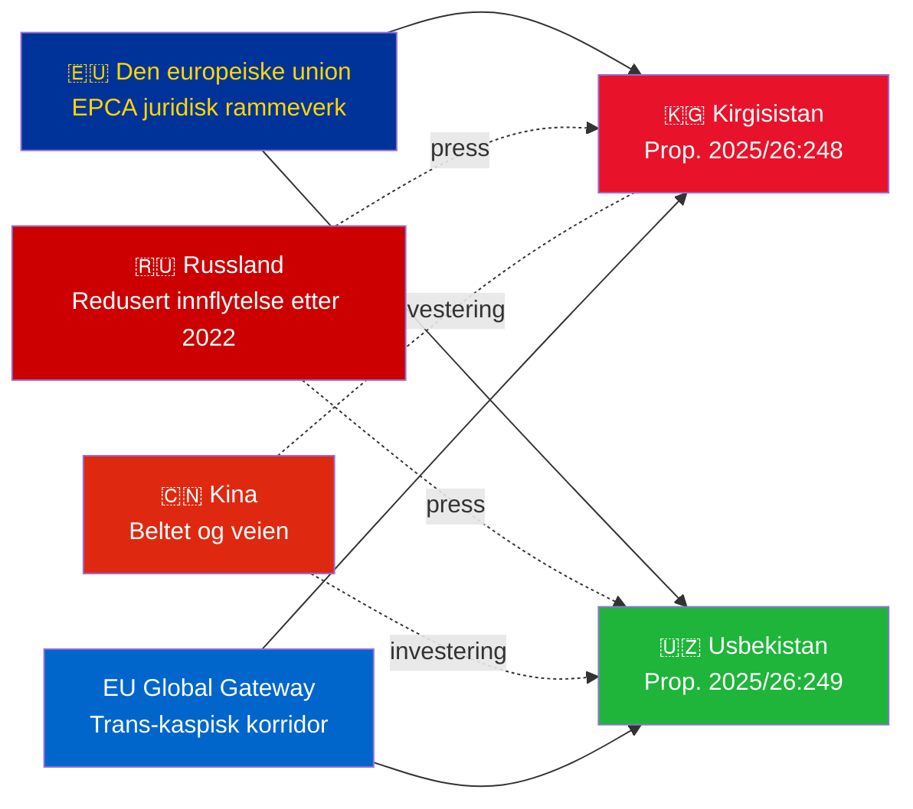

# Sammendrag — Regjeringens proposisjoner 2026-05-06

**Klassifisering**: Admiralty [B2] | **Horisont**: T+72h / T+90d
**WEP-konfidensialitet**: Nesten sikker (ratifiseringsutfall) | Sannsynlig (geopolitisk bane)
**DIW**: L2 Strategisk | **Dato**: 2026-05-06

---

## 🔴 Viktigste etterretningsfunn

**Sverige legger frem ratifiseringsvoter for to EU–Sentral-Asia-EPCA-er den 2026-05-06.** Begge avtalene (EU–Kirgisistan: HD03248; EU–Usbekistan: HD03249) er traktatsratifiseringsproposisjoner fra Utrikesdepartementet, henvist til Utrikesutskottet. Parlamentarisk godkjenning er **nesten sikker** (konfidensialitet: 95%+) — dette er ikke-partipolitiske EU-traktatsforpliktelser. Den strategiske etterretningsverdien ligger i den geopolitiske konteksten, ikke i selve votasjonene.

---

## 📋 Hva som behandles i Riksdagen

| Proposisjon | Land | Signert | Nøkkelbestemmelser |
|------------|------|---------|-------------------|
| 2025/26:248 (HD03248) | Kirgisistan | 2023 | Politisk dialog, handel, rettsstaten, konnektivitet |
| 2025/26:249 (HD03249) | Usbekistan | 2023 | Handel, kritiske råmaterialer, digital økonomi, klima |

Begge er **EPCA-er (Enhanced Partnership and Cooperation Agreements)** — det mest omfattende bilaterale juridiske rammeverket EU bruker bortsett fra assosieringsavtaler. De erstatter Sovjet-tidens partnerskap- og samarbeidsavtaler fra 1999.

---

## 🌍 Geopolitisk kontekst

**Sentral-asiatisk geopolitisk nyorientering etter 2022**: Både Kirgisistan og Usbekistan har akselerert EU-engasjementet siden Russlands fullskala invasjon av Ukraina. Russlands økonomiske vanskeligheter, risiko for sekundære sanksjoner og redusert CSTO-troverdighet skapte et vindu for dypere EU-partnerskap. EPCA-serien (ratifiseringer pågår for Kasakhstan, Kirgisistan, Usbekistan, Tadsjikistan) representerer den mest betydningsfulle utvidelsen av EU's juridiske rammeverk i Sentral-Asia siden selvstendighet.

---

## 🎯 Strategisk etterretningsvurdering

**Usbekistan-EPCA (HD03249) har høyere strategisk verdi** på grunn av:
1. Befolkning 38M — Sentral-Asias mest folkerike stat
2. Kritiske råmaterialer: uran (verdens 7.), gull, kobber, litiumprospektion
3. EU's Critical Raw Materials Act (2024) nevner Sentral-Asia som strategisk forsyningskorridor
4. Reformtakten under Mirziyoyev — den mest vestvendte SA-lederen siden 2016

**Kirgisistan-EPCA (HD03248)** er lavere men ikke ubetydelig:
1. Geografisk inngangsport til bredere SA-konnektivitet
2. Kinesisk/russisk dobbelt innflytelsesutfordring
3. 2021 konstitusjonell maktkonsentrasjon skaper forpliktelser til overvåking av menneskerettigheter

---

## ⏱️ Umiddelbar handlingstidslinje

| Dag | Handling |
|-----|---------|
| **2026-05-06** | Proposisjoner HD03248 + HD03249 sendt til Riksdagen |
| **2026-06** | UU-utvalgets høringer (trolig felles sesjon) |
| **2026-09** | UU betänkande (anbefaling) |
| **2026-10** | Plenarvotering — nesten sikker godkjenning |
| **2026-11** | Svensk ratifisering deponert; EPCA-er trer provisorisk i kraft |

---

*Sammendrag | Riksdagsmonitor | 2026-05-06*

<!-- source-sha: 83ab95c995e928d2f484c02aef7ab0bee0f03535 -->
