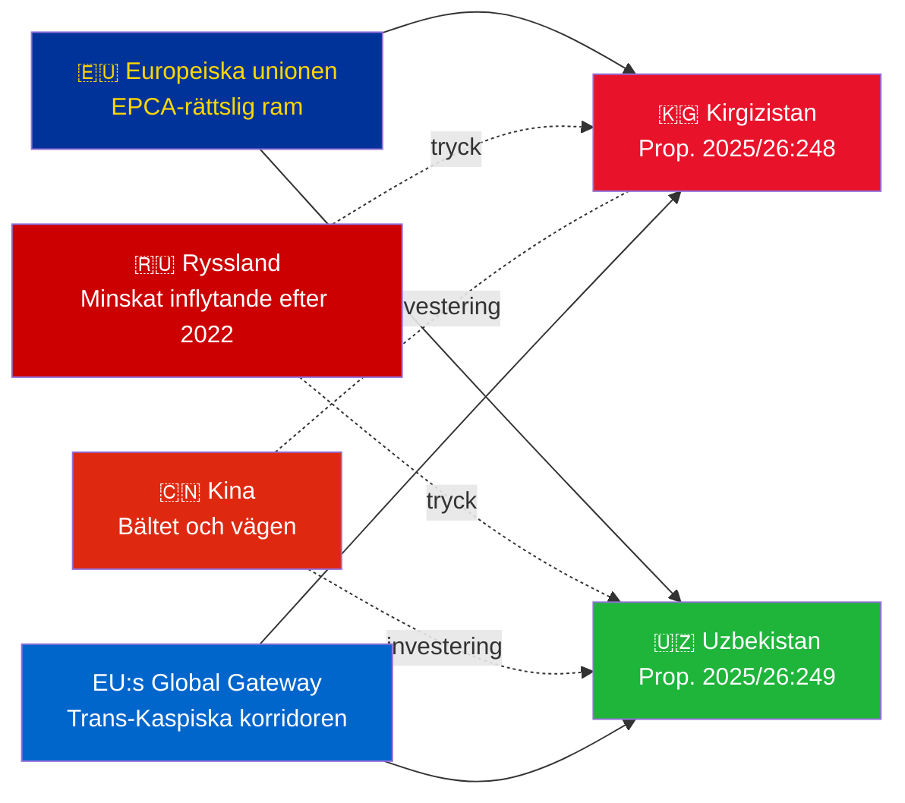

# Exekutiv sammanfattning — Regeringspropositioner 2026-05-06

**Klassificering**: Admiralty [B2] | **Horisont**: T+72h / T+90d
**WEP-konfidentialitet**: Nästan säker (ratificeringsutfall) | Trolig (geopolitisk bana)
**DIW**: L2 Strategisk | **Datum**: 2026-05-06

---

## 🔴 Viktigaste underrättelseresultat

**Sverige lägger fram ratificeringomröstningar för två EU–Centralasien-EPCA:er den 2026-05-06.** Båda avtalen (EU–Kirgizistan: HD03248; EU–Uzbekistan: HD03249) är fördragsratificeringspropositioner från Utrikesdepartementet, remitterade till Utrikesutskottet. Parlamentariskt godkännande är **nästan säkert** (konfidentialitet: 95%+) — dessa är icke-partipolitiska EU-fördragsåtaganden. Det strategiska underrättelsevärdet ligger i det geopolitiska sammanhanget, inte i omröstningarna i sig.

---

## 📋 Vad som är uppe för behandling i Riksdagen

| Proposition | Land | Undertecknad | Nyckelbestämmelser |
|------------|------|-------------|-------------------|
| 2025/26:248 (HD03248) | Kirgizistan | 2023 | Politisk dialog, handel, rättsstatsprincipen, konnektivitet |
| 2025/26:249 (HD03249) | Uzbekistan | 2023 | Handel, kritiska råmaterial, digital ekonomi, klimat |

Båda är **EPCA:er (Enhanced Partnership and Cooperation Agreements)** — det mest heltäckande bilaterala rättsliga ramverket EU använder vid sidan av associationsavtal. De ersätter sovjeterans partnerskap- och samarbetsavtal från 1999.

---

## 🌍 Geopolitiskt sammanhang

**Centralasiatisk geopolitisk omriktning efter 2022**: Både Kirgizistan och Uzbekistan har accelererat EU-engagemanget sedan Rysslands fullskaliga invasion av Ukraina. Rysslands ekonomiska svårigheter, risk för sekundära sanktioner och minskad CSTO-trovärdighet skapade ett fönster för djupare EU-partnerskap. EPCA-serien (ratificeringar pågår för Kazakstan, Kirgizistan, Uzbekistan, Tadzjikistan) representerar den mest betydelsefulla expansionen av EU:s rättsliga ramverk i Centralasien sedan självständigheten.

---

## 🎯 Strategisk underrättelsebedömning

**Uzbekistan-EPCA (HD03249) har högre strategiskt värde** tack vare:
1. Befolkning 38 miljoner — Centralasiens folkrikaste stat
2. Kritiska råmaterial: uran (världens 7:e), guld, koppar, litiumprospektering
3. EU:s lag om kritiska råmaterial (2024) namnger Centralasien som strategisk försörjningskorridor
4. Reformtakten under Mirziyoyev — den mest västvänliga CA-ledaren sedan 2016

**Kirgizistan-EPCA (HD03248)** är lägre men inte obetydligt:
1. Geografisk gateway till bredare CA-konnektivitet
2. Dubbel kinesisk/rysk påverkan som utmaning
3. 2021 konstitutionell maktkoncentration skapar övervakningsskyldigheter avseende mänskliga rättigheter

---

## ⏱️ Omedelbar handlingstidslinje

| Dag | Åtgärd |
|-----|--------|
| **2026-05-06** | Propositioner HD03248 + HD03249 inlämnade till Riksdagen |
| **2026-06** | UU-utskottets utfrågningar (troligen gemensam session) |
| **2026-09** | UU betänkande (rekommendation) |
| **2026-10** | Plenumomröstning — nästan säkert godkännande |
| **2026-11** | Svensk ratificering deponerad; EPCA:er träder provisoriskt i kraft |

---

*Exekutiv sammanfattning | Riksdagsmonitor | 2026-05-06*

<!-- source-sha: 83ab95c995e928d2f484c02aef7ab0bee0f03535 -->
