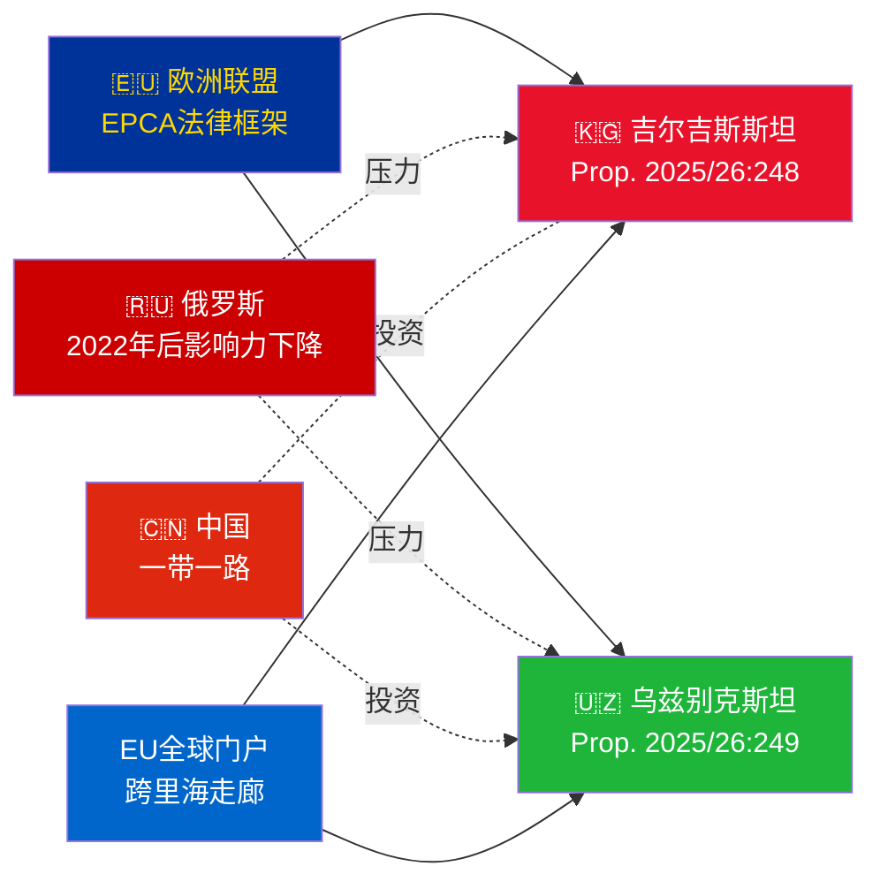

# 行政简报 — 政府议案 2026-05-06

**分类**: Admiralty [B2] | **时间范围**: T+72h / T+90d
**WEP置信度**: 几乎确定（批准结果）| 可能（地缘政治轨迹）
**DIW**: L2 战略 | **日期**: 2026-05-06

---

## 🔴 主要情报评估

**瑞典于2026-05-06提交两项欧盟-中亚EPCA批准投票。** 两项协定（欧盟-吉尔吉斯斯坦：HD03248；欧盟-乌兹别克斯坦：HD03249）均为Utrikesdepartementet提出的条约批准propositioner，已提交至Utrikesutskottet。议会批准**几乎确定**（置信度：95%+）——这些是超党派的欧盟条约义务。战略情报价值在于地缘政治背景，而非投票本身。

---

## 📋 Riksdag 审议内容

| 议案 | 国家 | 签署年份 | 主要条款 |
|-----|------|---------|---------|
| 2025/26:248 (HD03248) | 吉尔吉斯斯坦 | 2023 | 政治对话、贸易、法治、互联互通 |
| 2025/26:249 (HD03249) | 乌兹别克斯坦 | 2023 | 贸易、关键原材料、数字经济、气候 |

两者均为**EPCA（强化伙伴关系与合作协定）**——欧盟除联系协定外使用的最全面双边法律框架。取代1999年苏联时代的伙伴关系与合作协定。

---

## 🌍 地缘政治背景

**2022年后中亚地缘政治重组**: 自俄罗斯全面入侵乌克兰以来，吉尔吉斯斯坦和乌兹别克斯坦均加速与欧盟的合作。俄罗斯经济困难、二级制裁风险以及集体安全条约组织公信力下降，为深化欧盟伙伴关系创造了机遇。EPCA系列批准（哈萨克斯坦、吉尔吉斯斯坦、乌兹别克斯坦、塔吉克斯坦批准程序正在进行中）代表自独立以来欧盟法律框架在中亚最重要的扩展。

---

## 🎯 战略情报评估

**乌兹别克斯坦EPCA（HD03249）具有更高战略价值**，原因如下：
1. 人口3,800万——中亚人口最多的国家
2. 关键原材料：铀（全球第7位）、黄金、铜、锂勘探
3. 欧盟关键原材料法（2024年）将中亚列为战略供应走廊
4. 米尔济约耶夫执政以来的改革速度——2016年以来中亚最亲西方领导人

**吉尔吉斯斯坦EPCA（HD03248）**规模较小但不可忽视：
1. 中亚更广泛互联互通的地理门户
2. 中俄双重影响力挑战
3. 2021年宪法权力集中产生人权监督义务

---

## ⏱️ 近期行动时间表

| 日期 | 行动 |
|-----|-----|
| **2026-05-06** | Propositioner HD03248 + HD03249提交至Riksdag |
| **2026-06** | UU委员会听证会（可能举行联合会议） |
| **2026-09** | UU betänkande（建议） |
| **2026-10** | 全体投票——批准几乎确定 |
| **2026-11** | 瑞典批准书存放；EPCA暂时生效 |

---

*行政简报 | Riksdagsmonitor | 2026-05-06*

<!-- source-sha: 83ab95c995e928d2f484c02aef7ab0bee0f03535 -->
