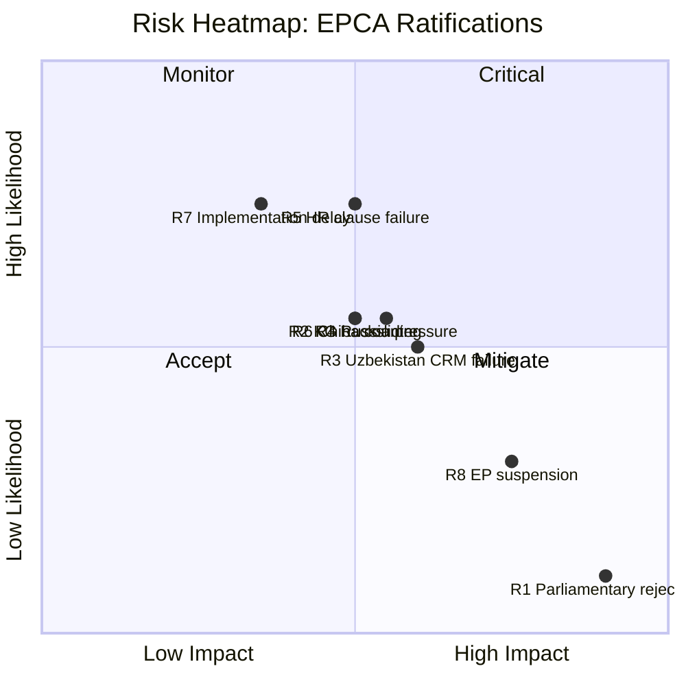

# Risk Assessment — Propositions 2026-05-06

**Framework**: 5×5 Likelihood × Impact matrix  
**Reference**: `political-risk-methodology.md`

## Risk Matrix

| Risk ID | Risk | L (1-5) | I (1-5) | Score | Category |
|---------|------|---------|---------|-------|---------|
| R1 | Parliamentary rejection of EPCAs | 1 | 5 | 5 | Constitutional |
| R2 | Kyrgyzstan democratic backsliding voids EPCA obligations | 3 | 3 | 9 | Geopolitical |
| R3 | Uzbekistan CRM cooperation fails to activate | 3 | 4 | 12 | Strategic |
| R4 | Russia sanctions pressure blocks EPCA implementation | 3 | 3 | 9 | Geopolitical |
| R5 | Human rights clause enforcement failure (both states) | 4 | 3 | 12 | Normative |
| R6 | China BRI counter-offers reduce CA EPCA value | 3 | 3 | 9 | Strategic competition |
| R7 | Implementation delay (mixed-agreement shared competence) | 4 | 2 | 8 | Procedural |
| R8 | EP suspension of EPCA over human rights (future) | 2 | 4 | 8 | Political |

## Heat Map

## Priority Risks and Mitigations

### R3: Uzbekistan CRM cooperation fails to activate (Score: 12)
**Driver**: CRM provisions in EPCA are enabling, not mandatory. Activation requires both sides to establish working groups, agree on exploration frameworks, and navigate Uzbek sovereignty concerns over extractive sector.  
**Mitigation**: Sweden should push at EU Council level for expedited EPCA Joint Committee establishment; Näringsdepartementet should brief Kommerskollegium on CRM opportunity within 30 days of ratification.

### R5: Human rights clause enforcement failure (Score: 12)
**Driver**: Both Kyrgyzstan (executive power concentration, media restrictions) and Uzbekistan (civil society space, labour rights) have poor HR records relative to EPCA standards.  
**Mitigation**: Riksdagen UU betänkande should include HR monitoring annex; Sweden to advocate for independent HR rapporteur in EPCA Joint Committees.

## Cascading Risk Scenario

R2 (KG backsliding) → R4 (Russia pressure) → R8 (EP suspension of KG EPCA) → collapse of Trans-Caspian connectivity framework for Kyrgyzstan. This scenario has 15% probability over 3 years.
