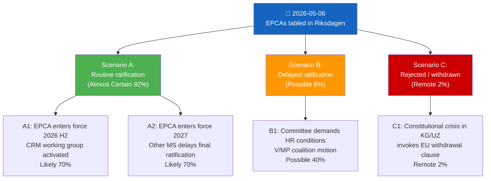

# Scenario Analysis — Propositions 2026-05-06

**Framework**: Scenario tree + WEP confidence  
**Horizon**: T+72h / T+1y / T+4y (election cycle)  
**Reference**: strategic-extensions-methodology.md

## Scenario Tree

## Scenario Definitions

### Scenario A: Routine Ratification (Almost Certain — 92%)

Both EPCAs pass UU committee and plenary with 300+ votes. Timeline: betänkande by September 2026, plenary vote October 2026. Swedish ratification deposited by November 2026.

**Conditional trajectories**:
- **A1** (Likely 70%): All 27 MS ratify by end 2026; EPCAs enter full force. CRM Joint Committee meeting H1 2027.
- **A2** (Likely 70%): 1-3 MS delays (Italy, Hungary typical holdouts); EPCAs in provisional application for trade sections only.

### Scenario B: Delayed Ratification (Possible — 6%)

UU committee attaches conditions (HR monitoring, ILO baseline reporting) that require back-and-forth with EU Commission. Or: VMP motion forces extended debate. Timeline shift: plenary Q1 2027.

**Key driver**: V/MP could table a motion for a "human rights annex" condition. Not blocking but creates delay if government negotiates compromise language.

### Scenario C: Rejection/Withdrawal (Remote — 2%)

Extremely unlikely. Would require: (a) major Kyrgyzstan/Uzbekistan political crisis (coup, mass repression event), triggering EU withdrawal of EPCA, OR (b) Swedish constitutional crisis preventing government from tabling. Neither in prospect.

## WEP Confidence Summary

| Scenario | WEP | Probability |
|----------|-----|------------|
| A: Routine ratification | Almost Certain | 92% |
| B: Delayed ratification | Possible | 6% |
| C: Rejection | Remote | 2% |

## Wildcards

- **Black swan W1**: Major military conflict in Central Asia (Fergana Valley) causes EU to suspend EPCA negotiations → EPCA provisional application suspended. Probability <1% in 12-month window.
- **Black swan W2**: Uzbekistan democratic breakthrough — political liberalisation accelerates, EPCA becomes cornerstone of "Uzbek model" for CA democratisation. Probability 5% over 4 years.
