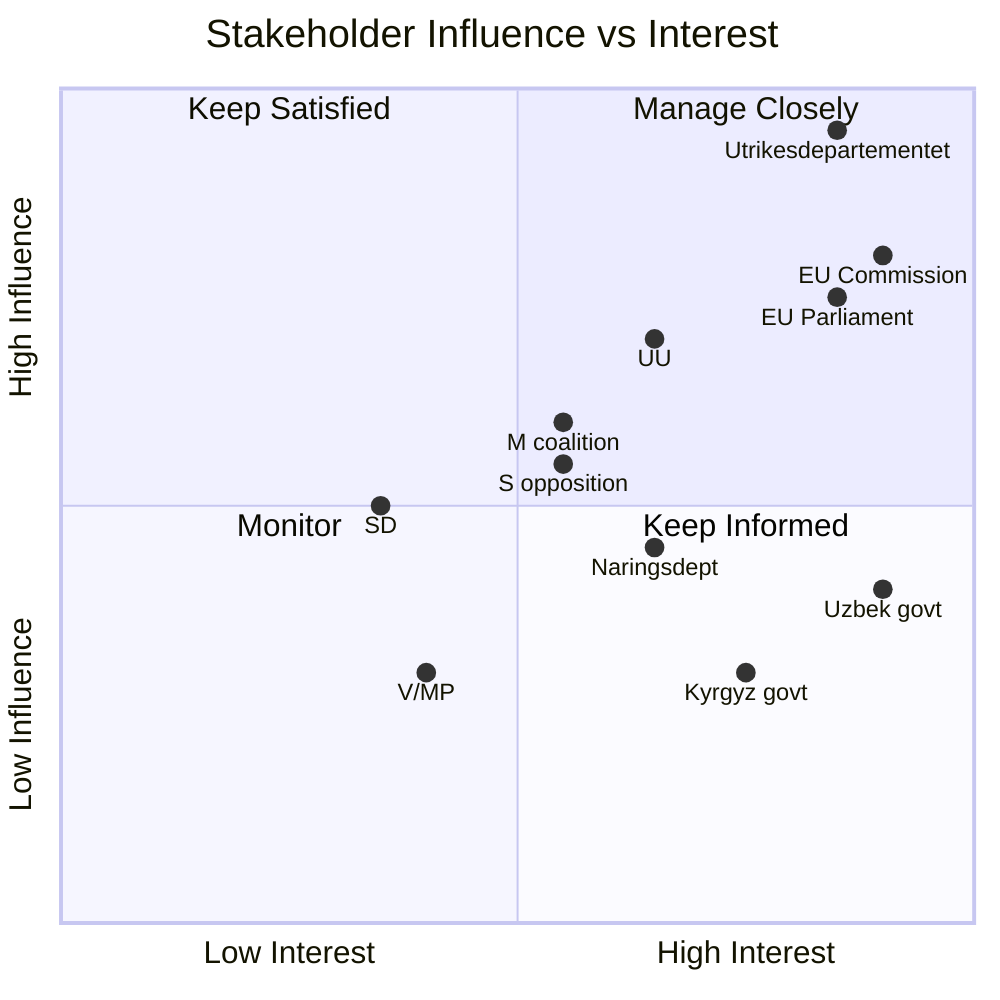

# Stakeholder Perspectives — Propositions 2026-05-06

**Framework**: Stakeholder mapping + interest-influence matrix

## Primary Stakeholders

### Swedish Government and Riksdag

| Actor | Interest | Influence | Position | Notes |
|-------|----------|-----------|---------|-------|
| Utrikesdepartementet | EU-CA strategy delivery; EPCA entry-into-force | Very High | Proposing | EU affairs division leads |
| Näringsdepartementet | Critical raw materials supply chain (Uzbekistan) | Medium | Supporting | LKAB, Boliden supply chain angle |
| Utrikesutskottet (UU) | Parliamentary oversight of treaties | High | Committee review | Joint hearing both EPCAs expected |
| M (coalition lead) | EU multilateralism; trade expansion | Medium | Strong support | Aligns with Tidö coalition EU stance |
| SD | Migration control provisions | Medium | Support + reservations | Will scrutinize mobility/readmission clauses |
| S | International solidarity; labour rights (ILO) | Medium | Support | May push stronger ILO conditionality |
| V | Human rights; labour rights; anti-authoritarianism | Medium-Low | Conditional | CA governance records a concern; no blocking |
| MP | Climate/environment; civil society | Low-Medium | Conditional | Will praise climate provisions |

### EU-Level Actors

| Actor | Interest | Position |
|-------|----------|---------|
| European Commission (DG NEAR/Trade) | EPCA entry-into-force for CA strategy | Active push for member state ratifications |
| European Parliament | HR compliance; trade provisions | Already ratified both EPCAs |
| EU Council | Completing mixed-agreement ratification process | Monitoring member state status |

### Central Asian States

| Actor | Interest | Position |
|-------|----------|---------|
| Kyrgyz Republic (Government) | EU partnership; reduced Russia/China dependency | Proponent — ratification urgency high |
| Uzbek Republic (Mirziyoyev government) | Western anchoring; investment, CRM partnerships | Strong proponent — reform branding |
| Russian Federation | Prevent EU CA integration | Antagonist — pressure on CA states without direct Riksdagen leverage |

## Influence-Interest Matrix

## Stakeholder Narrative Intelligence

**Uzbekistan's narrative** (Mirziyoyev): "EPCA confirms Uzbekistan's openness and reform path; signals to international investors that Uzbekistan is choosing Europe as primary partnership anchor." Risk: overstatement of internal reform progress.

**Russia's counter-narrative**: Not publicly stated but assessed as framing EPCAs as "foreign interference in Central Asian affairs" and "conditionality that violates sovereignty." Amplified through RU-aligned media in Kyrgyzstan (confirmed pattern — Admiralty [C3]).

**Swedish MFA narrative**: Routine EU treaty ratification; emphasis on trade facilitation and values-based partnership. Low public profile.

**V/MP potential critique**: "Sweden ratifies agreements with states that imprison journalists and restrict civil society." Correct but not blocking.
