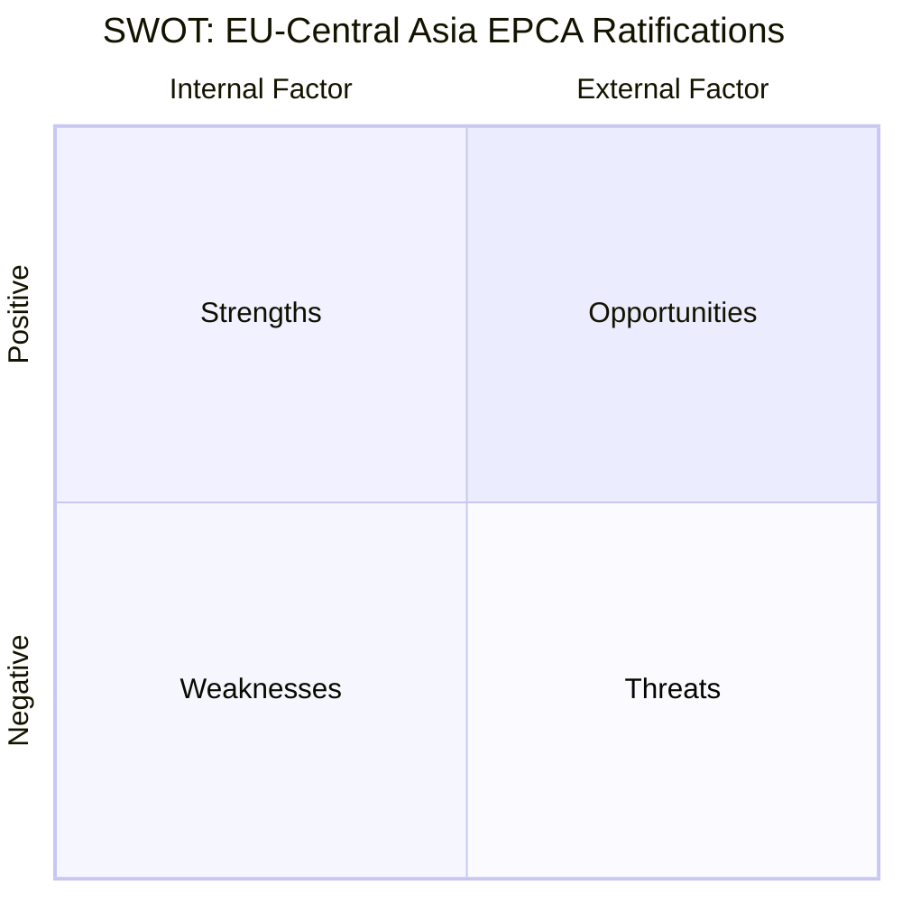

# SWOT Analysis — Propositions 2026-05-06

**Framework**: SWOT + TOWS + Cross-SWOT interference  
**Reference**: `political-swot-framework.md`  
**Scope**: EU-Central Asia EPCA ratifications (HD03248, HD03249)

## Primary SWOT

| STRENGTHS | WEAKNESSES |
|-----------|-----------|
| S1: Legally comprehensive framework (trade+HR+climate+digital+CRM) | W1: Full-text unavailable — scanned PDF limits parliamentary transparency |
| S2: Bipartisan EU treaty obligation — guaranteed passage | W2: Mixed-agreement implementation historically slow (shared competence) |
| S3: Critical raw materials access pathway (Uzbekistan) | W3: Prior voteringar data gap — 2025/26 UU not yet indexed |
| S4: Supports EU Global Gateway vs China Belt and Road | W4: Human rights record of both CA states weak vs EPCA commitments |
| S5: Sweden's Sida/Kommerskollegium programming enabled | W5: Limited Swedish domestic political engagement with CA policy |

| OPPORTUNITIES | THREATS |
|--------------|---------|
| O1: Uzbekistan CRM partnership — uranium, gold, lithium | T1: Russia pressure on Kyrgyzstan/Uzbekistan to slow EPCA implementation |
| O2: EU sanctions alignment provisions — controls Russian evasion | T2: Uzbekistan Andijan legacy — human rights clause enforcement failure |
| O3: Trans-Caspian corridor connectivity — reduces RU/CN chokepoints | T3: China BRI counter-offers to CA states |
| O4: Green tech export market for Swedish industry | T4: Democratic backsliding in Kyrgyzstan (2021 constitutional change) |
| O5: Model agreement for remaining CA partners | T5: Implementation fatigue — both EPCAs risk provisional status without full ratification by all 27 MS |

## TOWS Strategic Options

| Strategy | Approach |
|---------|---------|
| **S3+O1 (Maxi-Maxi)**: Uzbekistan CRM partnership | Activate EPCA CRM working group immediately post-ratification; Swedish participation in EU-UZ mineral survey programs |
| **W4+O1 (Mini-Maxi)**: Human rights improvement through engagement | Use EPCA HR dialogue mechanism to improve civil society space as condition of CRM cooperation activation |
| **S4+T1 (Maxi-Mini)**: EU connectivity vs Russia pressure | EPCA Trans-Caspian provisions reduce CA states' Russia dependency; EPCA is deterrent against Russian leverage |
| **W2+T5 (Mini-Mini)**: Implementation acceleration | Sweden to push EU Council for fast-track implementation protocols; provisional application for trade sections |

## Cross-SWOT Interference

**S2 ↔ W4 interference**: Guaranteed parliamentary passage DESPITE human rights weakness means EPCA is approved without conditionality leverage. Sweden should use committee hearing (T+30d) to insert specific HR milestone conditions into betänkande.

**O1 ↔ T2 interference**: CRM opportunity (O1) requires reliable Uzbekistan partner — but if Andijan-era human rights failures continue (T2), EU-UZ CRM cooperation may be politically blocked by EP. Monitor Uzbekistan human rights trajectory.
