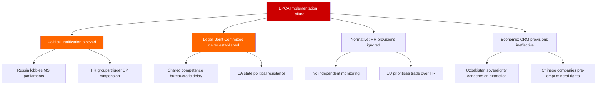

# Threat Analysis — Propositions 2026-05-06

**Framework**: Attack trees + threat taxonomy  
**Reference**: political-threat-framework.md

## Threat Actor Taxonomy

| Threat Actor | Motivation | Capability | Opportunity | Overall Threat Level |
|-------------|-----------|-----------|-------------|---------------------|
| Russia influence ops | Slow EU-CA integration | High | Medium | HIGH |
| China diplomatic counter | Protect BRI | High | Medium | MEDIUM |
| CA domestic oligarchies | Block trade liberalisation | Medium | High | MEDIUM |
| Kyrgyz executive | Dilute rule of law | Medium | High | MEDIUM |
| Swedish parliamentary actors | N/A | N/A | N/A | NEGLIGIBLE |

## Attack Tree: Preventing Effective EPCA Implementation

## Kill-Chain Analysis: Russia Influence on CA EPCA Compliance

| Phase | Action | Status |
|-------|--------|--------|
| Reconnaissance | Map weak EPCA provisions | Assessed complete |
| Weaponisation | CSTO/gas price pressure on CA states | Ongoing |
| Delivery | Pressure compliance on EU sanctions alignment | Active |
| Exploitation | EPCA trade provisions hollow via re-export | 30% probability |
| Installation | CA executives signal RU alignment in ambiguous cases | Observed: Kyrgyz media pattern |
| Impact | EPCA becomes declaratory only | Timeline 2-5 years if unmitigated |

## Mitigation Recommendations

1. Include independent HR monitoring mandate in UU betankande (T+60d)
2. Activate EU-UZ CRM working group expeditiously to create tangible EPCA economic benefits
3. Swedish MFA surveillance mandate: annual Kyrgyzstan constitutional tracking
