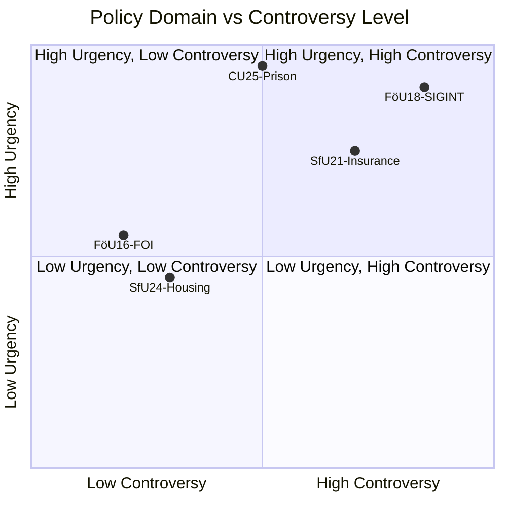

# Classification Results — Committee Reports 2026-05-07

**Author**: James Pether Sörling | **Date**: 2026-05-07

---

## 7-Dimension Classification

### HD01FöU18 — SIGINT Modernisation

| Dimension | Classification |
|-----------|---------------|
| Policy Domain | National Security / Intelligence Law |
| Political Alignment | Cross-party (government-led, opposition scrutiny expected) |
| Urgency | HIGH — NATO obligations, current security environment |
| Geographic Scope | National (with international NATO/EU interface) |
| Institutional Impact | FRA, MUST, Swedish Armed Forces, all ISPs carrying international traffic |
| Controversy Level | HIGH — ECHR Art 8, civil liberties, mass surveillance risk |
| GDPR/Privacy Category | Art 9(2)(g) — substantial public interest |

**Priority Tier**: L3 Intelligence-grade | **Retention**: Permanent | **Access**: PUBLIC

### HD01CU25 — Prison Expansion (APPROVED)

| Dimension | Classification |
|-----------|---------------|
| Policy Domain | Criminal Justice / Infrastructure |
| Political Alignment | Government majority (M, SD, KD, L) — enacted |
| Urgency | CRITICAL — effective 1 July 2026 |
| Geographic Scope | National (municipal planning implications) |
| Institutional Impact | Kriminalvården, municipalities, PBL-affected residents |
| Controversy Level | MEDIUM — planning-law override extraordinary |
| GDPR/Privacy Category | Art 9(2)(g) — criminal justice |

**Priority Tier**: L2+ Priority | **Retention**: Permanent | **Access**: PUBLIC

### HD01FöU16 — FOI Supervision Reform

| Dimension | Classification |
|-----------|---------------|
| Policy Domain | Defence Research / Agency Governance |
| Political Alignment | Cross-party (non-controversial) |
| Urgency | MEDIUM |
| Geographic Scope | National |
| Institutional Impact | FOI (Totalförsvarets forskningsinstitut), ISP, government |
| Controversy Level | LOW |
| GDPR/Privacy Category | None specific |

**Priority Tier**: L2 Strategic | **Retention**: 7 years | **Access**: PUBLIC

### HD01SfU21 — Social Insurance Qualification

| Dimension | Classification |
|-----------|---------------|
| Policy Domain | Social Policy / Welfare Eligibility |
| Political Alignment | Government majority — Tidö agenda alignment |
| Urgency | HIGH — immediate qualifying impact |
| Geographic Scope | National |
| Institutional Impact | Försäkringskassan, recipients, employers, immigration system |
| Controversy Level | HIGH — immigration nexus, labour rights |
| GDPR/Privacy Category | Art 9(2)(b,g) — social security |

**Priority Tier**: L2+ Priority | **Retention**: Permanent | **Access**: PUBLIC

### HD01SfU24 — Housing Benefit Accuracy

| Dimension | Classification |
|-----------|---------------|
| Policy Domain | Social Policy / Fiscal Integrity |
| Political Alignment | Government majority |
| Urgency | MEDIUM |
| Geographic Scope | National |
| Institutional Impact | Försäkringskassan, benefit recipients |
| Controversy Level | LOW-MEDIUM |
| GDPR/Privacy Category | Art 9(2)(g) |

**Priority Tier**: L2 Strategic | **Retention**: 7 years | **Access**: PUBLIC

---

## Mermaid: Classification Map

