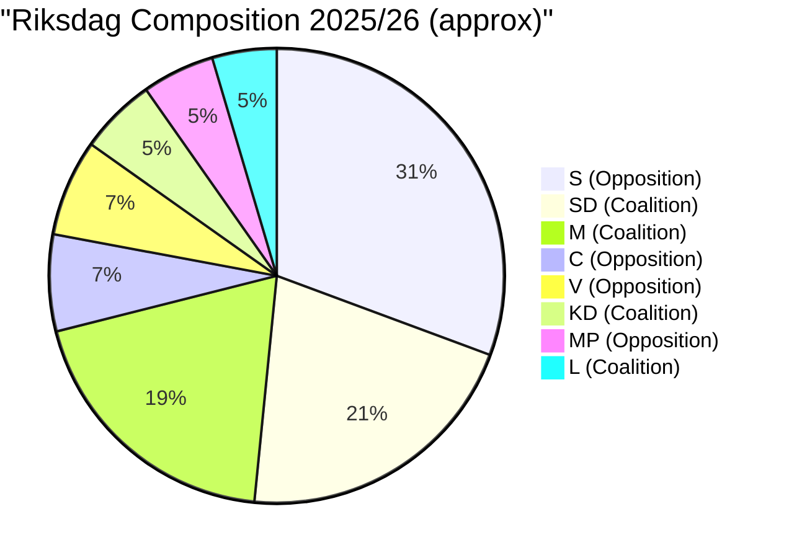

# Coalition Mathematics — Committee Reports 2026-05-07

**Author**: James Pether Sörling | **Date**: 2026-05-07

---

## Current Riksdag Arithmetic (2025/26)

| Party | Seats (approx) | Coalition |
|-------|---------------|-----------|
| S (Social Democrats) | 107 | Opposition |
| SD (Sweden Democrats) | 73 | Tidö coalition |
| M (Moderates) | 68 | Tidö coalition |
| C (Centre Party) | 24 | Opposition |
| V (Left Party) | 24 | Opposition |
| KD (Christian Democrats) | 19 | Tidö coalition |
| L (Liberals) | 16 | Tidö coalition |
| MP (Green Party) | 18 | Opposition |
| **Tidö total** | **176** | |
| **Opposition total** | **173** | |
| **Majority threshold** | **175** | |

*Seat counts are approximate based on 2022 election results and available MCP data [B2]*

---

## Passage Requirements for Key Documents

### FöU18 — SIGINT

**Required**: Simple majority (175+)
**Tidö coalition**: 176 — margin of 1 seat

**Risk**: If L-partiet (16 seats) defects entirely → 160 seats → law fails.
If L-partiet partial defection (5 seats) → 171 seats → requires S abstentions.

**Historical S position on intelligence legislation**: S has accepted intelligence capability expansion at critical security moments (post-FRA 2008, post-Estonia cyberattack precedents). In current NATO context, S is unlikely to vote actively against. The key question is whether S abstains or votes against.

**Most likely outcome**: FöU18 passes with amendments (L-partiet demands satisfied). Probability: 0.55 [B2].

### SfU21/SfU24 — Welfare

**Required**: Simple majority (175+)
**Tidö coalition**: 176 — sufficient

**No coalition fracture risk**: M, SD, KD strongly support. L may want minor amendments but will not defect.

**Most likely outcome**: Both measures pass. Probability: 0.90 [B1 — already in committee, coherent with coalition agenda].

### CU25 — Prison

**Already enacted**. Coalition mathematics moot.

---

## Mermaid: Coalition Stability

---

## Fragility Analysis

The Tidö coalition's 1-seat majority is structurally fragile. Three scenarios matter:

1. **L-partiet civil liberties demand on FöU18**: If L demands judicial pre-authorisation and government refuses, coalition fracture risk is real. However, given the September 2026 election, L is unlikely to trigger a coalition crisis on a single intelligence law.

2. **SD internal discipline**: SD has 73 seats and is the largest coalition partner. Any SD internal fracture (which has occurred historically) would be terminal for the coalition. No current fracture signals detected.

3. **Post-election coalition arithmetic**: If polls are accurate (SD+M likely largest bloc), the Tidö formula may continue post-September 2026. FöU18's passage would then be secured under a renewed mandate. [C2]

