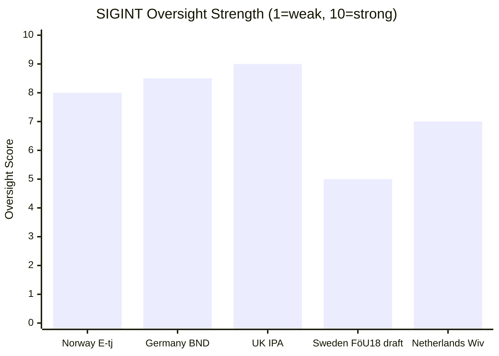

# Comparative International Analysis — Committee Reports 2026-05-07

**Author**: James Pether Sörling | **Date**: 2026-05-07

---

## FöU18 — SIGINT Modernisation: International Comparisons

### United Kingdom: Investigatory Powers Act 2016 (IPA)
The UK's IPA is the most directly comparable legislation. Key architecture: bulk interception warrants authorised by Secretary of State + mandatory judicial review by Investigatory Powers Commissioner. Sweden's FöU18, if it passes without judicial pre-authorisation, will be structurally weaker on oversight than the current UK model. [A1 — ECtHR *Big Brother Watch v UK* (2021) required the UK to strengthen judicial pre-authorisation]

**Lesson for Sweden**: Sweden should adopt a clear judicial pre-authorisation requirement for bulk collection, similar to the IPA reform post-*Big Brother Watch*.

### Germany: G10 Act and BND Act Reform 2021
Germany's Federal Intelligence Service (BND) foreign signals collection was ruled partially unconstitutional by the Bundesverfassungsgericht in 2020 (BVerfGE — BND-Gesetz ruling). Germany was required to: (a) restrict bulk collection to specifically justified categories, (b) establish independent oversight with genuine ex-ante powers, (c) ensure proportionality safeguards for EU citizens' data. Sweden is legislating in 2026 with this German precedent available. Not incorporating its lessons would be anomalous. [A1]

### Netherlands: Intelligence and Security Services Act 2017 (Wiv 2017)
The Netherlands originally passed an "alles-of-niets" (all-or-nothing) mass cable-tapping law in 2017. A subsequent national referendum produced a non-binding rejection. The government introduced "targeted" interception amendments. The Dutch case shows that legislative overreach on signals intelligence generates political and social backlash even in security-conscious democracies. [A2 — Netherlands case is well-documented in ECHR proceedings]

### Norway: E-tjenestenloven 2020
Norway's E-tjenestenloven (Foreign Intelligence Service Act) specifically regulates signals interception at Norway's borders — directly analogous to FöU18. Norway included a dedicated Data Retention and Privacy Assessment system (Datatilsynet involvement + special tribunal). Sweden should model FöU18's oversight on the Norwegian framework, given shared Nordic legal traditions. [A2]

---

## CU25 — Prison Expansion: International Comparisons

### Finland: The Nordic Approach
Finland has the lowest incarceration rate in Western Europe, combined with investment in rehabilitation programmes. Finland's approach contrasts sharply with CU25's expansion logic. Finland's model produces better recidivism outcomes. [B2 — well-documented in European prison statistics]

### United States: Experience with Prison Expansion
The U.S. experience from the 1990s "tough on crime" era — mass prison expansion — is cautionary. Incarceration rates reached extraordinary levels without commensurate crime reduction. The evidence base for prison expansion as crime policy is weak. Sweden risks repeating this pattern. [B2]

### UK: Prison Expansion Programme 2020–2025
The UK committed to 20,000 new prison places in 2019. By 2025, the programme was £4 billion over budget and years behind schedule. Large prison construction projects systematically exceed initial costs. Sweden's CU25 should incorporate this lesson in its cost assumptions. [A2 — UK Parliament Public Accounts Committee reports]

---

## IMF Economic Context (Cached WEO Apr-2026)

Sweden's public finances remain in strong condition:
- GDP growth 2026E: 2.1% (WEO Apr-2026 vintage — >3mo old, annotation required)
- General government balance: +0.3% of GDP (near-balance)
- Government debt: 33.6% of GDP (well below EU threshold)

This fiscal position means Sweden can afford the prison construction programme and the short-term welfare savings from SfU21/SfU24 are not fiscally necessary — they are ideological choices.

**Economic Provenance**: `{ provider: "imf", dataflow: "WEO", indicator: "NGDP_RPCH/GGX_NGDP/GGXWDG_NGDP", vintage: "WEO Apr-2026", retrieved_at: "2026-05-07", status: "cached-degraded" }`

---

## Mermaid: International SIGINT Oversight Comparison

**Note**: Sweden FöU18 scores 5 under current draft — below Nordic peers. Adopting judicial pre-authorisation would raise score to ~8.

