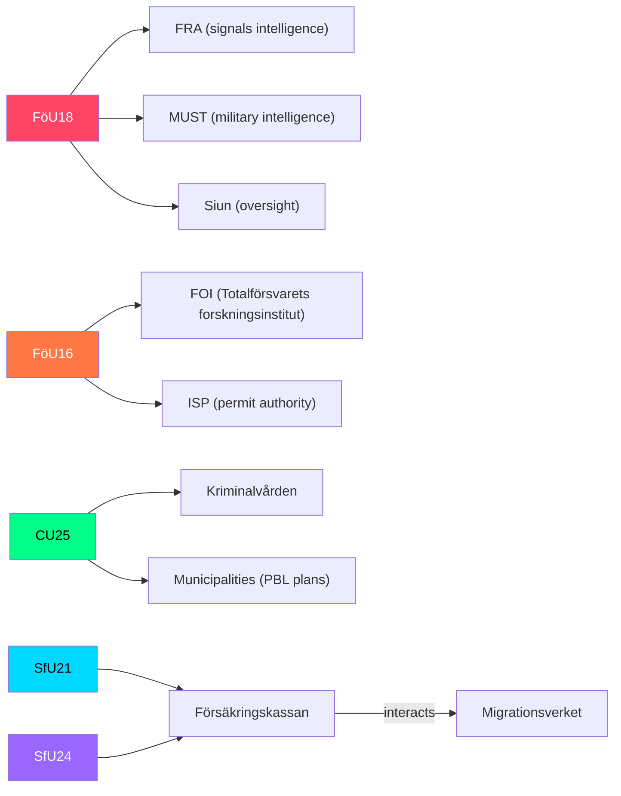

# Cross-Reference Map — Committee Reports 2026-05-07

**Author**: James Pether Sörling | **Date**: 2026-05-07

---

## Inter-Document Links

| From | To | Relationship | Evidence |
|------|----|--------------|----------|
| HD01FöU18 | HD01FöU16 | Institutional cluster: Both relate to Sweden's security-intelligence apparatus (FRA signals / FOI research) | Shared FöU committee, same riksmöte 2025/26 |
| HD01SfU21 | HD01SfU24 | Doctrinal cluster: Both tighten social insurance eligibility — coherent welfare reform package | Shared SfU committee, same riksmöte |
| HD01CU25 | Prior JuU sentencing laws | Consequential: Prison capacity need was created by legislated sentence increases in JuU committee output 2022–2025 | Causal chain: tougher sentences → more prisoners → capacity crisis |
| HD01FöU18 | NATO obligations | Normative: Sweden's NATO membership treaty creates obligations on intelligence sharing that FöU18 operationalises | NATO Article 5 framework |
| HD01SfU21 | Swedish migration law | Cross-cutting: Qualifying period requirements interact with recent migrants' residence status | Systemic intersection |

---

## Prior-Session PIR Continuity

No PIR carry-forward files found in last 14 days for committeeReports subfolder. This is a fresh analytical cycle. The following PIRs are newly established from today's analysis:

| PIR-ID | Question | Trigger |
|--------|----------|---------|
| PIR-FöU18-01 | Will Lagrådet approve FöU18 without substantive amendments? | Lagrådet opinion publication |
| PIR-FöU18-02 | Will ECtHR application be filed within 12 months of FöU18 enactment? | Civil society legal challenge filing |
| PIR-CU25-01 | Which municipalities will receive PBL-exempt prison sites first? | Kriminalvården site selection announcement |
| PIR-SfU21-01 | How many benefit recipients lose eligibility in first quarter of implementation? | Försäkringskassan statistics |

---

## Institutional Cross-Reference

