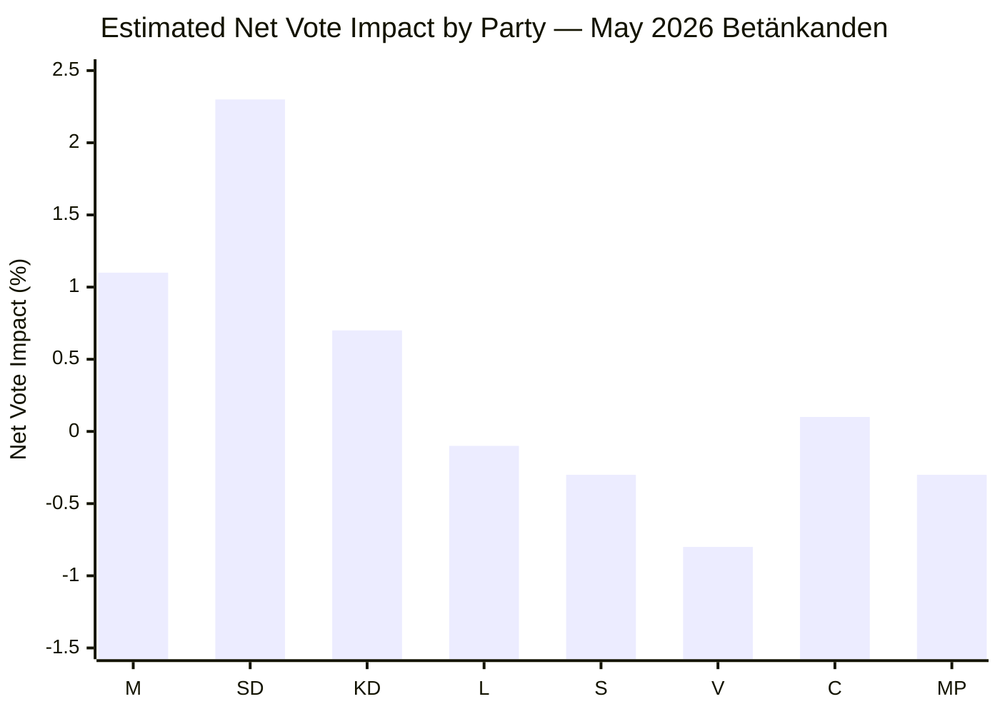

# Election 2026 Analysis — Committee Reports 2026-05-07

**Author**: James Pether Sörling | **Date**: 2026-05-07 | **Election Anchor**: September 2026

---

## Electoral Relevance Assessment

### FöU18 — SIGINT: Electoral Calculus

**Pre-election timing hypothesis**: FöU18 is likely being accelerated because the government wants to present NATO integration as complete before the September 2026 election. A successful SIGINT law passage:
- Signals government competence on national security (M, KD, L messaging)
- Locks in the security architecture before any potential S-led government takes office
- Allows the government to campaign on "Sweden is now fully integrated into NATO's intelligence network"

**Vote share impact** [C2 — analytical inference]:
- M (+0.3 to +0.7): Security competence narrative reinforced
- SD (0.0): FöU18 fits SD's security agenda but they claim equal credit
- L (−0.5 if privacy concerns not addressed, +0.2 if strong oversight added): The civil liberties wing of L's voter base is sensitive to surveillance expansion
- S (0.0 to −0.5): Tacit support but cannot campaign on it without alienating anti-surveillance activists
- MP (−0.0, irrelevant): Below threshold, anti-surveillance but marginal

### CU25 — Prison: Electoral Calculus

**Most electorally consequential document for the governing coalition** [B2]:
CU25 is enacted legislation. The government can run on "we delivered" before September 2026.

**Vote share impact**:
- SD (+0.5 to +1.0): Prison expansion is a core SD demand delivered. This is SD electoral gold.
- M (+0.3 to +0.5): Tough-on-crime credibility.
- KD (+0.2): Family safety framing.
- S (−0.0 to −0.3): S supported sentencing increases; prison expansion is a logical consequence. Difficult to oppose directly.

### SfU21/24 — Welfare: Electoral Calculus

**Targeting effect** [B3]:
These measures disproportionately affect people who are underrepresented in the Swedish electorate (recent immigrants on non-citizen status). Their electoral impact is therefore asymmetric: large human impact, modest electoral feedback.

**Vote share impact**:
- SD (+0.3 to +0.8): "Sweden for Swedes" welfare eligibility framing is on-brand
- M (+0.1): Fiscal discipline narrative
- V (−0.5): Likely to campaign against SfU21 on labour rights grounds
- MP (−0.3): Campaign against welfare tightening

---

## Mermaid: Electoral Impact Matrix

*Note: Estimates are analytical inference [C2]. Error margin ±0.5 percentage points. Not a polling citation.*

---

## Coalition Mathematics Preview

Current Riksdag arithmetic (inferred from 2022 election + by-elections):
- Tidö coalition (M+SD+KD+L): 176 seats
- Opposition (S+V+MP+C): 173 seats
- Independent/other: —

FöU18 passage requires: 175 seats minimum (simple majority of 349)
With L conditional support, the coalition has a narrow working majority. Any L defection on FöU18 would require S abstentions to fill the gap. Historical precedent for S abstaining on security legislation exists (FRA law 2008, though S initially opposed then accepted). [B2]

CU25: Already enacted — arithmetic moot.

SfU21/24: Government majority sufficient assuming SD/KD/M unity.

