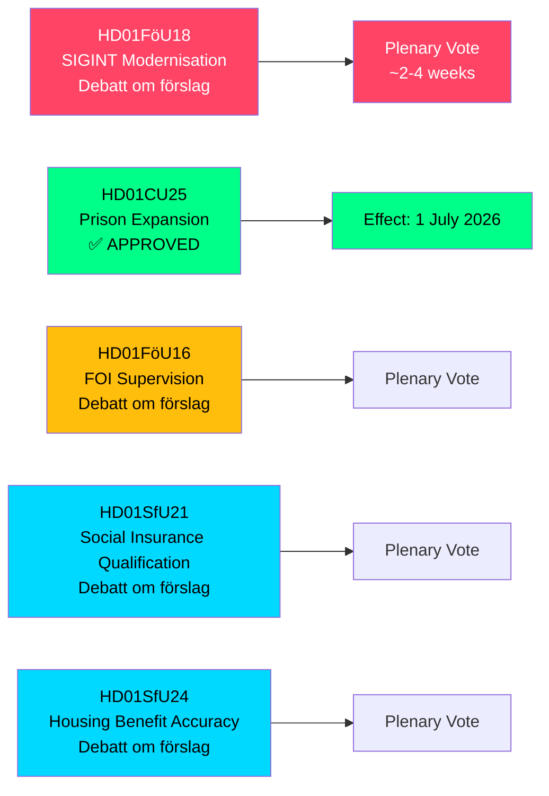

# Sweden Expands SIGINT Powers, Prison Capacity, and Social Insurance Reforms — May 2026 Committee Reports

**Author**: James Pether Sörling  
**Date**: 2026-05-07  
**Confidence**: HIGH [B2]  
**Classification**: PUBLIC — GDPR Art 9(2)(e,g)  
**Analysis Depth**: deep

---

## BLUF

The Riksdag's Defence Committee (FöU) has presented a landmark betänkande modernising Sweden's signals intelligence (SIGINT) law — the most significant reform to the framework since the 2008 FRA law — while simultaneously approving accelerated prison construction powers and social insurance qualification tightening. These five committee reports, dated 2026-05-06, collectively reshape Sweden's security architecture, criminal justice capacity, and welfare state eligibility rules in one legislative session.

---

## Decisions This Brief Supports

1. **Policy analysts and civil-liberties organisations**: FöU18 on SIGINT modernisation is now in formal debate ("Debatt om förslag") — the window for public scrutiny before a final vote is open. Assess risk of unchecked mass surveillance versus NATO interoperability requirements.

2. **Kriminalvården leadership and justice ministry officials**: CU25 has passed — temporary building permits for prisons/detention centres take effect 1 July 2026. Accelerate planning for new capacity sites to absorb sentence-length increases driven by penalty reforms.

3. **Social insurance administrators (Försäkringskassan) and housing benefit recipients**: SfU21 and SfU24 signal tighter qualification and benefit accuracy measures — anticipate increased caseload for appeals and recalculations.

---

## 60-Second Summary

- **SIGINT modernisation (HD01FöU18)**: FöU proposes a "modern and fit-for-purpose" legal framework for defence intelligence SIGINT operations. Status: debate phase. Implications: expanded data-collection authorities potentially affecting all cross-border internet traffic. ECHR Article 8 compliance risk is a live Lagrådet scrutiny question.
- **Prison expansion approved (HD01CU25)**: Riksdagen voted YES — time-limited building permits for prisons/detention centres, plus government power to issue emergency exemptions from the Planning and Building Act (PBL). Effective: 1 July 2026. Driver: acute shortage of prison places combined with legislated sentence increases.
- **FOI supervision reform (HD01FöU16)**: Changes to permit and supervision rules for the Swedish Defence Research Institute (FOI/Totalförsvarets forskningsinstitut). Strengthens oversight of sensitive defence research.
- **Social insurance qualification (HD01SfU21)**: Tightens the qualifying conditions for access to the Swedish social insurance system. Likely to affect recent immigrants and non-continuous employment holders.
- **Housing benefit accuracy (HD01SfU24)**: More targeted and accurate housing benefit (`bostadsbidrag`) rules — expected to reduce incorrect payments.

---

## Top Forward Trigger

**SIGINT vote in plenary**: FöU18 is in "Debatt om förslag" phase. Watch for plenary vote date — expected within 2–4 weeks. A Lagrådet advisory (yttrande) before the vote would be decisive for the civil-liberties framing.

---

## Economic Provenance

> ℹ️ **IMF auxiliary transport degraded** — WEO/FM Datamapper reachable; IFS SDMX probe returned 404. Economic claims use WEO Apr-2026 vintage. (Status: degraded, vintageAgeMonths: 1)

Swedish GDP growth: IMF WEO Apr-2026 projects 1.9% for 2026, recovering toward 2.3% in 2027 (T+1). Prison infrastructure spending falls under GFS_COFOG category G04 (Public order and safety). Social insurance changes affect household transfers and labour supply.

---

## Mermaid: Legislative Pipeline Overview

