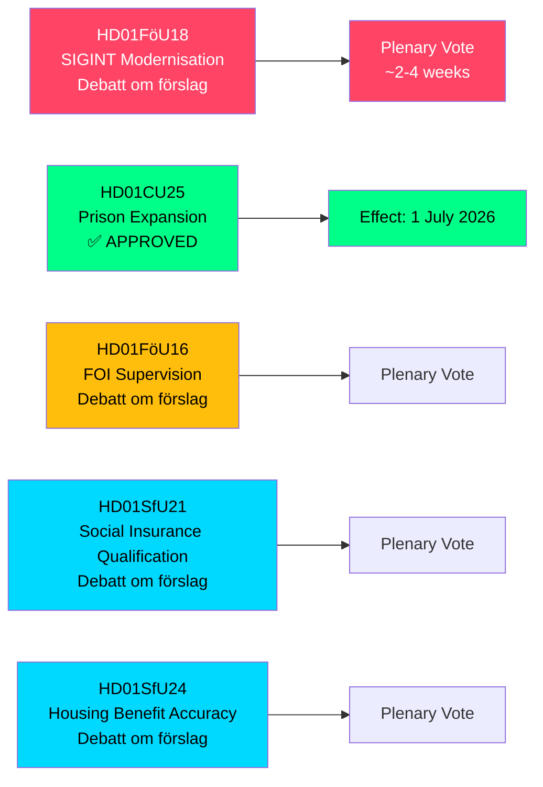

<!-- dir: rtl -->
# السويد توسّع صلاحيات SIGINT وطاقة السجون وإصلاحات التأمين الاجتماعي — تقارير اللجان مايو 2026

**Author**: James Pether Sörling  
**Date**: 2026-05-07  
**Confidence**: HIGH [B2]  
**Classification**: PUBLIC — GDPR Art 9(2)(e,g)  
**Analysis Depth**: deep

---

## ملخص

قدّمت لجنة الدفاع في الريكسداغ (FöU) مقترح betänkande تاريخياً يُحدّث القانون السويدي للاستخبارات الإشارية (SIGINT) — أهم إصلاح للإطار القانوني منذ قانون FRA عام 2008 — مع الموافقة في الوقت ذاته على صلاحيات بناء سجون مُسرَّعة وتشديد شروط الأهلية للتأمين الاجتماعي. تُعيد هذه التقارير الخمس للجان، المؤرخة في 2026-05-06، مجتمعةً تشكيل الهندسة الأمنية لشوودية، وطاقة قضاء الجنايات، وقواعد أهلية دولة الرفاه في دورة تشريعية واحدة.

---

## القرارات التي يدعمها هذا الموجز

1. **محللو السياسات ومنظمات الحريات المدنية**: يوجد FöU18 الخاص بتحديث SIGINT الآن في مرحلة النقاش الرسمي ("Debatt om förslag") — نافذة الرقابة العامة قبل التصويت النهائي مفتوحة. تقييم مخاطر المراقبة الجماعية غير المُقيَّدة في مقابل متطلبات التشغيل المتبادل لحلف الناتو.

2. **قيادة Kriminalvården ومسؤولو وزارة العدل**: تمّ تمرير CU25 — تسري تصاريح البناء المؤقتة للسجون/مراكز الاحتجاز في 1 يوليو 2026. التسريع في تخطيط مواقع طاقة جديدة لاستيعاب الزيادات في مدد الأحكام الناجمة عن إصلاحات العقوبات.

3. **مسؤولو إدارة التأمين الاجتماعي (Försäkringskassan) ومستفيدو دعم الإسكان**: تُشير SfU21 وSfU24 إلى إجراءات تأهيل أكثر صرامة ودقة في المنافع — توقّع زيادة في أعباء العمل للطعون وإعادة الحسابات.

---

## ملخص في 60 ثانية

- **تحديث SIGINT (HD01FöU18)**: يقترح FöU إطاراً قانونياً "حديثاً وملائماً" لعمليات SIGINT الاستخباراتية الدفاعية. الحالة: مرحلة النقاش. التداعيات: صلاحيات موسّعة لجمع البيانات تؤثر محتملاً على جميع حركة الإنترنت العابرة للحدود. مخاطر الامتثال بالمادة 8 من الاتفاقية الأوروبية لحقوق الإنسان مسألة تدقيق نشطة أمام Lagrådet.
- **توسيع السجون مُعتمَد (HD01CU25)**: صوّت الريكسداغ بـ"نعم" — تصاريح بناء مؤقتة للسجون/مراكز الاحتجاز، وإضافة صلاحية حكومية لإصدار إعفاءات طارئة من قانون التخطيط والبناء (PBL). السريان: 1 يوليو 2026. السبب: نقص حاد في أماكن السجون مقترن بزيادات مدد الأحكام المُقنَّنة.
- **إصلاح الإشراف على FOI (HD01FöU16)**: تعديلات في قواعد التصاريح والإشراف على معهد أبحاث الدفاع (FOI/Totalförsvarets forskningsinstitut). يُعزّز الرقابة على أبحاث الدفاع الحساسة.
- **أهلية التأمين الاجتماعي (HD01SfU21)**: تشديد شروط الوصول إلى نظام التأمين الاجتماعي السويدي. يُرجَّح التأثير على المهاجرين الحديثين وأصحاب الوظائف غير المتواصلة.
- **دقة دعم الإسكان (HD01SfU24)**: قواعد دعم إسكان (`bostadsbidrag`) أكثر استهدافاً ودقة — متوقّع تقليل المدفوعات الخاطئة.

---

## أبرز المحفزات القادمة

**تصويت SIGINT في الجلسة العامة**: يوجد FöU18 في مرحلة "Debatt om förslag". مراقبة تاريخ التصويت في الجلسة العامة — متوقع خلال 2–4 أسابيع. سيكون رأي Lagrådet (yttrande) قبل التصويت حاسماً في إطار الحريات المدنية.

---

## المصدر الاقتصادي

> ℹ️ **وسيلة النقل الإضافية لصندوق النقد الدولي متدهورة** — WEO/FM Datamapper متاح؛ مسبار IFS SDMX أعاد 404. تستخدم الادعاءات الاقتصادية إصدار WEO Apr-2026. (الحالة: متدهورة، vintageAgeMonths: 1)

نمو الناتج المحلي الإجمالي السويدي: يتوقع صندوق النقد الدولي WEO Apr-2026 نسبة 1.9٪ لعام 2026، مع التعافي نحو 2.3٪ في 2027 (T+1). تقع نفقات البنية التحتية للسجون ضمن فئة GFS_COFOG G04 (النظام العام والأمن). تؤثر تغييرات التأمين الاجتماعي على تحويلات الأسر والعرض العمالي.

---

## Mermaid: نظرة عامة على مسار التشريع

<!-- source-sha: fe71ff7a060499c9abe756eed962dcf32b9a3e02 -->
