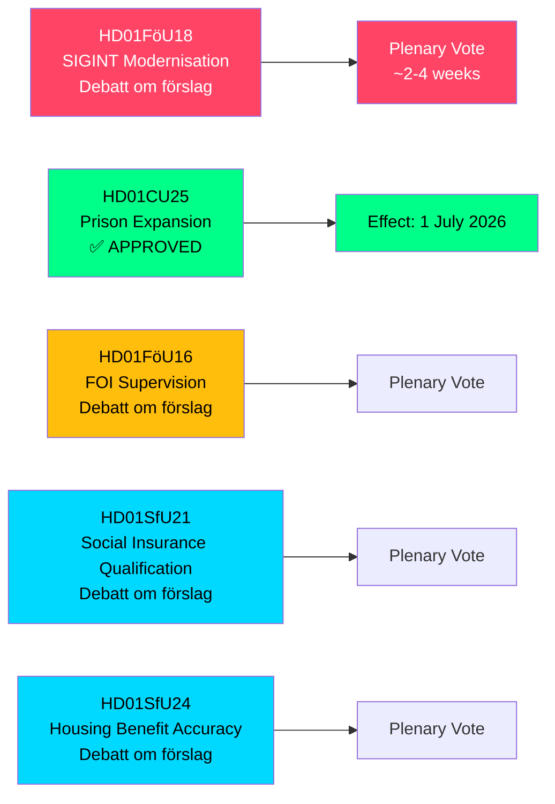

# Sverige udvider SIGINT-beføjelser, fængselskapacitet og socialforsikringsreformer — maj 2026 udvalgsrapporter

**Author**: James Pether Sörling  
**Date**: 2026-05-07  
**Confidence**: HIGH [B2]  
**Classification**: PUBLIC — GDPR Art 9(2)(e,g)  
**Analysis Depth**: deep

---

## KORT SAMMENFATNING

Riksdagens Forsvarsudvalg (FöU) har fremlagt et banebrydende betänkande, der moderniserer Sveriges lov om signalefterforskning (SIGINT) — den mest betydningsfulde reform af rammen siden FRA-loven fra 2008 — mens det samtidig godkendte accelererede beføjelser til fængselsbyggeri og stramning af kvalificeringsbetingelserne for socialforsikring. Disse fem udvalgsrapporter, dateret 2026-05-06, omformer samlet Sveriges sikkerhedsarkitektur, strafferetskapacitet og velfærdsstatens adgangsbetingelser i én lovgivningssession.

---

## Beslutninger dette notat understøtter

1. **Politikanalytikere og borgerrettighedsorganisationer**: FöU18 om SIGINT-modernisering er nu i formel debat ("Debatt om förslag") — vinduet for offentlig granskning inden den endelige afstemning er åbent. Vurder risikoen ved ukontrolleret masseovervågning over for NATOs krav om interoperabilitet.

2. **Kriminalvårdens ledelse og justitsministeriets embedsmænd**: CU25 er vedtaget — midlertidige byggetilladelser til fængsler/detentionscentre træder i kraft 1. juli 2026. Fremskynde planlægningen af nye kapacitetssteder for at absorbere straffelængdeforøgelser som følge af strafferetlige reformer.

3. **Socialforsikringsadministratorer (Försäkringskassan) og boligydelsesmodtagere**: SfU21 og SfU24 signalerer strammere kvalificerings- og ydelsesnøjagtighedsforanstaltninger — forvent øget sagsmængde til klager og genberegninger.

---

## Resumé i 60 sekunder

- **SIGINT-modernisering (HD01FöU18)**: FöU foreslår en "moderne og formålstjenlig" retslig ramme for forsvarsefterretningens SIGINT-operationer. Status: debatfase. Implikationer: udvidede dataindsamlingsbeføjelser, der potentielt berører al grænseoverskridende internettrafik. ECHR artikel 8-overholdelserisiko er et aktivt Lagrådet-kontrolspørgsmål.
- **Fængselsudvidelse godkendt (HD01CU25)**: Riksdagen stemte JA — tidsbegrænsede byggetilladelser til fængsler/detentionscentre, plus regeringens beføjelse til at udstede nødundtagelser fra Plan- og Byggeloven (PBL). Ikrafttræden: 1. juli 2026. Driver: akut mangel på fængselspladser kombineret med lovfæstede strafskærpelser.
- **FOI-tilsynsreform (HD01FöU16)**: Ændringer i tilladelse og tilsynsregler for Totalförsvarets forskningsinstitut (FOI/FOI). Styrker tilsynet med følsom forsvarsforskning.
- **Socialforsikringskvalificering (HD01SfU21)**: Stramning af kvalificeringsbetingelserne for adgang til det svenske socialforsikringssystem. Sandsynligvis til at påvirke nylige immigranter og indehavere af ikke-kontinuerlig beskæftigelse.
- **Boligydelsesnøjagtighed (HD01SfU24)**: Mere målrettede og nøjagtige boligydelsesregler (`bostadsbidrag`) — forventet at reducere fejludbetalinger.

---

## Vigtigste fremtidige udløser

**SIGINT-afstemning i plenum**: FöU18 er i "Debatt om förslag"-fasen. Hold øje med datoen for plenarafstemning — forventet inden for 2–4 uger. En Lagrådet-rådgivning (yttrande) inden afstemningen ville være afgørende for borgerrettighedsindramningen.

---

## Økonomisk oprindelse

> ℹ️ **IMF-hjælpetransport degraderet** — WEO/FM Datamapper nåbar; IFS SDMX-sonde returnerede 404. Økonomiske påstande anvender WEO Apr-2026-årgång. (Status: degraderet, vintageAgeMonths: 1)

Svensk BNP-vækst: IMF WEO Apr-2026 projicerer 1,9 % for 2026, med genopretning mod 2,3 % i 2027 (T+1). Fængselsinfrastrukturudgifter falder under GFS_COFOG kategori G04 (offentlig orden og sikkerhed). Socialforsikringsændringer påvirker husholdningsoverførsler og arbejdsudbud.

---

## Mermaid: Lovgivningsprocessoversigt

<!-- source-sha: fe71ff7a060499c9abe756eed962dcf32b9a3e02 -->
