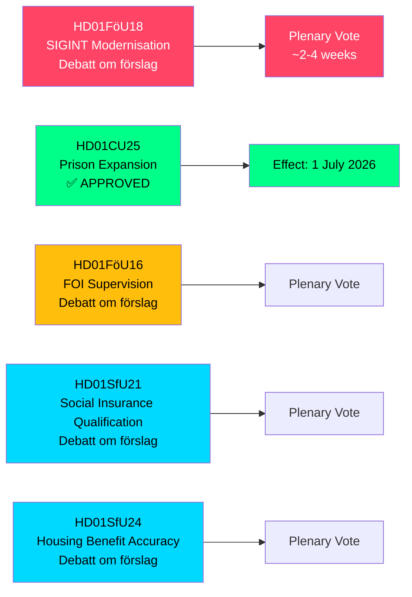

# Schweden erweitert SIGINT-Befugnisse, Gefängniskapazität und Sozialversicherungsreformen — Ausschussberichte Mai 2026

**Author**: James Pether Sörling  
**Date**: 2026-05-07  
**Confidence**: HIGH [B2]  
**Classification**: PUBLIC — GDPR Art 9(2)(e,g)  
**Analysis Depth**: deep

---

## ZUSAMMENFASSUNG

Der Verteidigungsausschuss des Riksdag (FöU) hat ein wegweisendes betänkande vorgelegt, das Schwedens Gesetz über Signalaufklärung (SIGINT) modernisiert — die bedeutendste Reform des Rahmens seit dem FRA-Gesetz von 2008 — und gleichzeitig beschleunigte Gefängnisbaukompetenzen sowie eine Verschärfung der Qualifikationsbedingungen für die Sozialversicherung genehmigt. Diese fünf Ausschussberichte vom 2026-05-06 gestalten gemeinsam Schwedens Sicherheitsarchitektur, strafjustizielle Kapazität und Anspruchsregeln des Wohlfahrtsstaates in einer einzigen Gesetzgebungssitzung um.

---

## Entscheidungen, die diese Kurzzusammenfassung unterstützt

1. **Politikanalysten und Bürgerrechtsorganisationen**: FöU18 zur SIGINT-Modernisierung befindet sich jetzt in formeller Debatte ("Debatt om förslag") — das Fenster für öffentliche Kontrolle vor der endgültigen Abstimmung ist offen. Bewerten Sie das Risiko unkontrollierter Massenüberwachung gegenüber NATOs Interoperabilitätsanforderungen.

2. **Kriminalvårdens Führung und Beamte des Justizministeriums**: CU25 ist verabschiedet — befristete Baugenehmigungen für Gefängnisse/Abschiebehaftzentren treten am 1. Juli 2026 in Kraft. Beschleunigen Sie die Planung neuer Kapazitätsstandorte, um die durch Strafrechtsreformen bedingten Straflängenerhöhungen aufzufangen.

3. **Sozialversicherungsadministratoren (Försäkringskassan) und Wohngeldbezieher**: SfU21 und SfU24 signalisieren strengere Qualifizierungs- und Leistungsgenauigkeitsmaßnahmen — erwarten Sie eine erhöhte Fallzahl bei Widersprüchen und Neuberechnungen.

---

## 60-Sekunden-Zusammenfassung

- **SIGINT-Modernisierung (HD01FöU18)**: Der FöU schlägt einen "modernen und zwecktauglichen" Rechtsrahmen für SIGINT-Operationen des Nachrichtendienstes der Streitkräfte vor. Status: Debattephase. Auswirkungen: erweiterte Datenerhebungskompetenzen, die potenziell den gesamten grenzüberschreitenden Internetverkehr betreffen. EMRK Artikel 8 Compliance-Risiko ist eine aktuell offene Lagrådets-Prüfungsfrage.
- **Gefängniserweiterung genehmigt (HD01CU25)**: Der Riksdag stimmte JA — befristete Baugenehmigungen für Gefängnisse/Abschiebehaftzentren sowie Regierungsbefugnis zur Erteilung von Notfallausnahmen vom Bau- und Planungsgesetz (PBL). Wirksamkeit: 1. Juli 2026. Treiber: akuter Mangel an Gefängnisplätzen kombiniert mit gesetzlich verankerten Straflängenerhöhungen.
- **FOI-Aufsichtsreform (HD01FöU16)**: Änderungen der Genehmigungs- und Aufsichtsregeln für das Forschungsinstitut des Gesamtverteidigung (FOI/Totalförsvarets forskningsinstitut). Stärkt die Aufsicht über sensible Verteidigungsforschung.
- **Sozialversicherungsqualifizierung (HD01SfU21)**: Verschärft die Qualifikationsbedingungen für den Zugang zum schwedischen Sozialversicherungssystem. Wahrscheinlich werden jüngste Einwanderer und Inhaber nicht-kontinuierlicher Beschäftigungsverhältnisse betroffen.
- **Wohngeldgenauigkeit (HD01SfU24)**: Zielgerichtetere und genauere Wohngeldregeln (`bostadsbidrag`) — erwartet werden reduzierte Fehlzahlungen.

---

## Wichtigster kommender Auslöser

**SIGINT-Abstimmung im Plenum**: FöU18 befindet sich in der "Debatt om förslag"-Phase. Verfolgen Sie das Datum der Plenarsitzungsabstimmung — voraussichtlich innerhalb von 2–4 Wochen. Eine Lagrådets-Stellungnahme (yttrande) vor der Abstimmung wäre entscheidend für die zivilrechtliche Rahmung.

---

## Wirtschaftliche Herkunft

> ℹ️ **IMF-Hilfstransport degradiert** — WEO/FM Datamapper erreichbar; IFS SDMX-Sonde gab 404 zurück. Wirtschaftliche Behauptungen verwenden WEO Apr-2026-Jahrgang. (Status: degradiert, vintageAgeMonths: 1)

Schwedisches BIP-Wachstum: IMF WEO Apr-2026 prognostiziert 1,9 % für 2026, mit Erholung auf 2,3 % im Jahr 2027 (T+1). Gefängnisinfrastrukturausgaben fallen unter GFS_COFOG-Kategorie G04 (öffentliche Ordnung und Sicherheit). Sozialversicherungsänderungen beeinflussen Haushaltsgeldtransfers und Arbeitsangebot.

---

## Mermaid: Übersicht der Legislativpipeline

<!-- source-sha: fe71ff7a060499c9abe756eed962dcf32b9a3e02 -->
