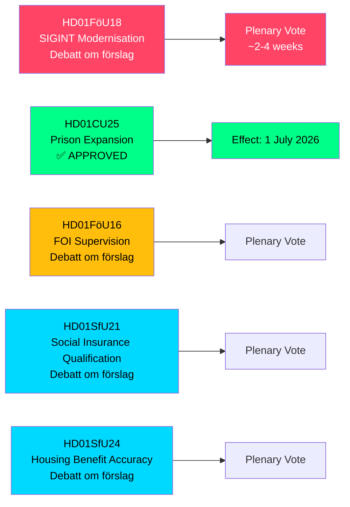

# Suecia amplía poderes SIGINT, capacidad penitenciaria y reformas del seguro social — Informes de comités mayo 2026

**Author**: James Pether Sörling  
**Date**: 2026-05-07  
**Confidence**: HIGH [B2]  
**Classification**: PUBLIC — GDPR Art 9(2)(e,g)  
**Analysis Depth**: deep

---

## RESUMEN

La Comisión de Defensa del Riksdag (FöU) ha presentado un betänkande histórico que moderniza la ley sueca de inteligencia de señales (SIGINT) — la reforma más significativa del marco desde la ley FRA de 2008 — aprobando simultáneamente poderes acelerados para la construcción penitenciaria y el endurecimiento de las condiciones de acceso al seguro social. Estos cinco informes de comités, fechados el 2026-05-06, reconfiguran colectivamente la arquitectura de seguridad sueca, la capacidad de justicia penal y las normas de elegibilidad del Estado de bienestar en una única sesión legislativa.

---

## Decisiones que apoya este informe

1. **Analistas de políticas y organizaciones de libertades civiles**: FöU18 sobre la modernización SIGINT se encuentra ahora en debate formal ("Debatt om förslag") — el período de escrutinio público antes de la votación final está abierto. Evalúe el riesgo de vigilancia masiva sin control frente a los requisitos de interoperabilidad de la OTAN.

2. **Dirección de la Kriminalvården y funcionarios del ministerio de justicia**: CU25 ha sido aprobado — los permisos de construcción temporales para prisiones/centros de detención entran en vigor el 1 de julio de 2026. Acelerar la planificación de nuevos sitios de capacidad para absorber los aumentos en la duración de las penas impulsados por las reformas penales.

3. **Administradores del seguro social (Försäkringskassan) y beneficiarios de subsidios de vivienda**: SfU21 y SfU24 señalan medidas más estrictas de calificación y precisión de prestaciones — anticipe una mayor carga de trabajo en apelaciones y recálculos.

---

## Resumen en 60 segundos

- **Modernización SIGINT (HD01FöU18)**: FöU propone un marco jurídico "moderno y adecuado" para las operaciones SIGINT de inteligencia de defensa. Estado: fase de debate. Implicaciones: poderes ampliados de recopilación de datos que potencialmente afectan todo el tráfico de Internet transfronterizo. El riesgo de cumplimiento del artículo 8 del CEDH es una cuestión activa de escrutinio del Lagrådet.
- **Expansión penitenciaria aprobada (HD01CU25)**: El Riksdag votó SÍ — permisos de construcción temporales para prisiones/centros de detención, más poder gubernamental para emitir exenciones de emergencia de la Ley de Planificación y Construcción (PBL). Efectivo: 1 de julio de 2026. Motivo: escasez aguda de plazas penitenciarias combinada con aumentos de penas de prisión establecidos por ley.
- **Reforma de supervisión del FOI (HD01FöU16)**: Cambios en las reglas de permisos y supervisión del Instituto de Investigación para la Defensa (FOI/Totalförsvarets forskningsinstitut). Fortalece la supervisión de la investigación de defensa sensible.
- **Calificación del seguro social (HD01SfU21)**: Endurece las condiciones de acceso al sistema de seguro social sueco. Es probable que afecte a inmigrantes recientes y a titulares de empleos no continuos.
- **Precisión del subsidio de vivienda (HD01SfU24)**: Normas de subsidio de vivienda (`bostadsbidrag`) más específicas y precisas — se espera reducir los pagos incorrectos.

---

## Principal detonante próximo

**Votación SIGINT en el pleno**: FöU18 se encuentra en la fase "Debatt om förslag". Vigilar la fecha de la votación plenaria — se espera en 2–4 semanas. Un dictamen del Lagrådet (yttrande) antes de la votación sería decisivo para el encuadramiento de las libertades civiles.

---

## Procedencia económica

> ℹ️ **Transporte auxiliar del FMI degradado** — WEO/FM Datamapper accesible; sonda IFS SDMX devolvió 404. Las afirmaciones económicas utilizan el vintage WEO Apr-2026. (Estado: degradado, vintageAgeMonths: 1)

Crecimiento del PIB sueco: el FMI WEO Apr-2026 proyecta 1,9 % para 2026, con recuperación hacia 2,3 % en 2027 (T+1). Los gastos en infraestructura penitenciaria caen bajo la categoría GFS_COFOG G04 (orden público y seguridad). Los cambios en el seguro social afectan las transferencias a los hogares y la oferta laboral.

---

## Mermaid: Descripción general del proceso legislativo

<!-- source-sha: fe71ff7a060499c9abe756eed962dcf32b9a3e02 -->
