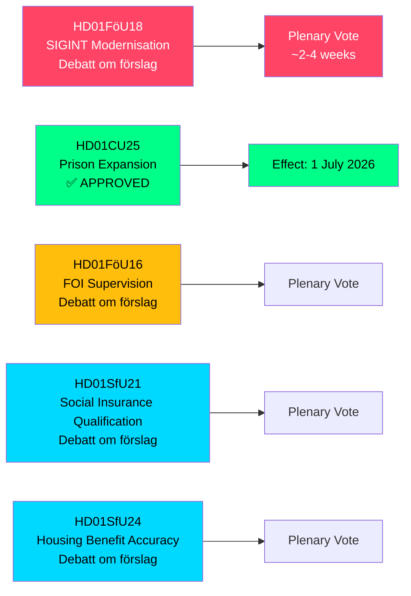

# Ruotsi laajentaa SIGINT-valtuuksia, vankilakapasiteettia ja sosiaalivakuutusuudistuksia — toukokuu 2026 valiokuntamietinnöt

**Author**: James Pether Sörling  
**Date**: 2026-05-07  
**Confidence**: HIGH [B2]  
**Classification**: PUBLIC — GDPR Art 9(2)(e,g)  
**Analysis Depth**: deep

---

## LYHYESTI

Riksdagenin puolustusvaliokunnan (FöU) on esittänyt merkittävän betänkanden, joka modernisoi Ruotsin signaalitiedustelulakia (SIGINT) — merkittävin uudistus kehykseen sitten vuoden 2008 FRA-lain — hyväksyessään samalla nopeutetut valtuudet vankiloiden rakentamiseen ja sosiaalivakuutuksen pätevyysehtojen tiukentamiseen. Nämä viisi valiokuntamietintöä, päivätty 2026-05-06, muokkaavat yhdessä Ruotsin turvallisuusarkkitehtuuria, rikoslainkäyttökapasiteettia ja hyvinvointivaltion kelpoisuussääntöjä yhdessä lainsäädäntöistunnossa.

---

## Päätökset, joita tämä tiedote tukee

1. **Politiikka-analyytikot ja kansalaisvapauksien järjestöt**: FöU18 SIGINT-modernisointiasta on nyt virallisessa väittelyssä ("Debatt om förslag") — ikkuna julkiseen tarkasteluun ennen lopullista äänestystä on auki. Arvioi hallitsemattoman massakelvalvonnan riski NATOn yhteentoimivuusvaatimusten suhteen.

2. **Kriminalvårdenin johto ja oikeusministeriön virkamiehet**: CU25 on hyväksytty — määräaikaiset rakennusluvat vankiloille/säilöönottokeskuksille tulevat voimaan 1. heinäkuuta 2026. Nopeuta uusien kapasiteettipaikkojen suunnittelua ottaaksesi vastaan rangaistusuudistusten aiheuttamat tuomioajan pidennykset.

3. **Sosiaalivakuutushallintoviranomaiset (Försäkringskassan) ja asumistuen saajat**: SfU21 ja SfU24 merkitsevät tiukempia pätevyys- ja etuustarkkuustoimenpiteitä — odota lisääntynyttä asiamäärää valituksissa ja uudelleenlaskelmissa.

---

## 60 sekunnin yhteenveto

- **SIGINT-modernisointi (HD01FöU18)**: FöU ehdottaa "modernia ja tarkoituksenmukaista" oikeudellista kehystä puolustustiedustelun SIGINT-operaatioille. Tila: väittelyvaihe. Vaikutukset: laajennetut tiedonkeruuvaltuudet, jotka mahdollisesti vaikuttavat kaikkeen rajat ylittävään internetliikenteeseen. ECHR 8 artiklan noudattamisriski on aktiivinen Lagrådets-tarkastuskysymys.
- **Vankilalaajennus hyväksytty (HD01CU25)**: Riksdagen äänesti KYLLÄ — määräaikaiset rakennusluvat vankiloille/säilöönottokeskuksille sekä hallituksen valta myöntää hätäpoikkeuksia rakennus- ja kaavoituslain (PBL) soveltamisesta. Voimaantulo: 1. heinäkuuta 2026. Syy: akuutti vankilapaikkojen puute yhdistettynä lainsäätämisiin tuomioiden korotuksiin.
- **FOI-valvontauudistus (HD01FöU16)**: Muutokset Puolustusvoimien tutkimuslaitoksen (FOI/Totalförsvarets forskningsinstitut) lupa- ja valvontasääntöihin. Vahvistaa arkaluonteisen puolustustutkimuksen valvontaa.
- **Sosiaalivakuutuksen pätevyys (HD01SfU21)**: Tiukentaa pääsyehtoja Ruotsin sosiaalivakuutusjärjestelmään. Todennäköisesti vaikuttaa äskettäin maahanmuuttaneisiin ja epäjatkuvassa työsuhteessa oleviin.
- **Asumistuen tarkkuus (HD01SfU24)**: Kohdennetummat ja tarkemmat asumistukisäännöt (`bostadsbidrag`) — odotetaan vähentävän virheellisiä maksuja.

---

## Tärkein tuleva laukaisin

**SIGINT-äänestys täysistunnossa**: FöU18 on "Debatt om förslag"-vaiheessa. Seuraa täysistuntoäänestyksen päivämäärää — odotetaan 2–4 viikon sisällä. Lagrådets-neuvoa (yttrande) ennen äänestystä olisi ratkaiseva kansalaisvapauksien kehystämisen kannalta.

---

## Taloudellinen lähde

> ℹ️ **IMF:n apuliikenne heikentynyt** — WEO/FM Datamapper tavoitettavissa; IFS SDMX-koettimen palautti 404. Taloudelliset väitteet käyttävät WEO Apr-2026-vuosikertaa. (Status: heikentynyt, vintageAgeMonths: 1)

Ruotsin BKT-kasvu: IMF WEO Apr-2026 ennustaa 1,9 % vuodelle 2026 ja palautumisen 2,3 %:iin vuonna 2027 (T+1). Vankilainfrastruktuurimenot kuuluvat GFS_COFOG-luokkaan G04 (yleinen järjestys ja turvallisuus). Sosiaalivakuutusmuutokset vaikuttavat kotitalouksien siirtoihin ja työvoimatarjontaan.

---

## Mermaid: Lainsäädäntöprosessin yleiskatsaus

<!-- source-sha: fe71ff7a060499c9abe756eed962dcf32b9a3e02 -->
