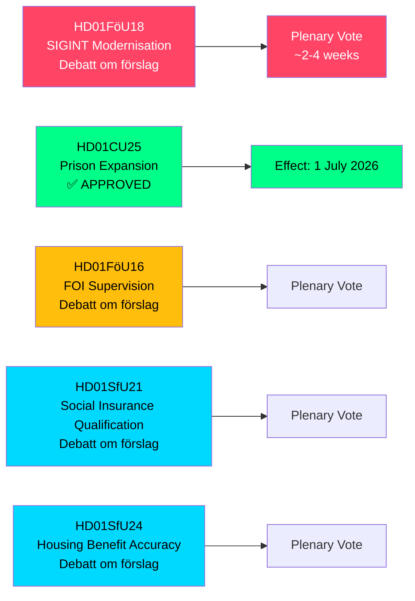

# La Suède étend ses pouvoirs SIGINT, sa capacité pénitentiaire et ses réformes d'assurance sociale — Rapports de comités mai 2026

**Author**: James Pether Sörling  
**Date**: 2026-05-07  
**Confidence**: HIGH [B2]  
**Classification**: PUBLIC — GDPR Art 9(2)(e,g)  
**Analysis Depth**: deep

---

## RÉSUMÉ

La commission de la défense du Riksdag (FöU) a présenté un betänkande historique modernisant la loi suédoise sur le renseignement d'origine électromagnétique (SIGINT) — la réforme la plus significative du cadre depuis la loi FRA de 2008 — tout en approuvant simultanément des pouvoirs accélérés de construction pénitentiaire et un resserrement des conditions d'accès à l'assurance sociale. Ces cinq rapports de commissions, datés du 2026-05-06, remodèlent collectivement l'architecture sécuritaire suédoise, la capacité de justice pénale et les règles d'éligibilité à l'État-providence en une seule session législative.

---

## Décisions que ce résumé appuie

1. **Analystes politiques et organisations de défense des libertés civiles**: FöU18 sur la modernisation SIGINT est désormais en débat formel ("Debatt om förslag") — la fenêtre de contrôle public avant le vote final est ouverte. Évaluer le risque de surveillance de masse incontrôlée face aux exigences d'interopérabilité de l'OTAN.

2. **Direction de la Kriminalvården et fonctionnaires du ministère de la justice**: CU25 a été adopté — des permis de construction temporaires pour prisons/centres de détention entrent en vigueur le 1er juillet 2026. Accélérer la planification de nouveaux sites de capacité pour absorber les augmentations de durée de peine entraînées par les réformes pénales.

3. **Administrateurs de l'assurance sociale (Försäkringskassan) et bénéficiaires d'allocations logement**: SfU21 et SfU24 signalent des mesures de qualification plus strictes et de précision des prestations — anticipez une charge accrue pour les recours et les recalculs.

---

## Résumé en 60 secondes

- **Modernisation SIGINT (HD01FöU18)**: Le FöU propose un cadre juridique "moderne et adapté" pour les opérations SIGINT du renseignement de défense. Statut : phase de débat. Implications : pouvoirs de collecte de données étendus pouvant affecter l'ensemble du trafic Internet transfrontalier. Le risque de conformité à l'article 8 de la CEDH est une question de contrôle active du Lagrådet.
- **Expansion pénitentiaire approuvée (HD01CU25)**: Le Riksdag a voté OUI — permis de construction temporaires pour prisons/centres de détention, plus pouvoir gouvernemental d'accorder des dérogations d'urgence à la loi sur la planification et la construction (PBL). Entrée en vigueur : 1er juillet 2026. Moteur : pénurie aiguë de places de prison combinée à des augmentations de durée de peine légalement prévues.
- **Réforme de la supervision du FOI (HD01FöU16)**: Modifications des règles d'autorisation et de supervision pour l'Institut de recherche pour la défense (FOI/Totalförsvarets forskningsinstitut). Renforce la supervision de la recherche de défense sensible.
- **Qualification à l'assurance sociale (HD01SfU21)**: Resserre les conditions d'accès au système d'assurance sociale suédois. Susceptible d'affecter les immigrants récents et les détenteurs d'emplois non continus.
- **Précision des allocations logement (HD01SfU24)**: Règles d'allocation logement (`bostadsbidrag`) plus ciblées et précises — réduction attendue des paiements incorrects.

---

## Principal déclencheur à venir

**Vote SIGINT en séance plénière**: FöU18 est en phase "Debatt om förslag". Surveiller la date du vote en séance plénière — attendu dans 2 à 4 semaines. Un avis du Lagrådet (yttrande) avant le vote serait décisif pour le cadrage des libertés civiles.

---

## Provenance économique

> ℹ️ **Transport auxiliaire FMI dégradé** — WEO/FM Datamapper accessible ; sonde IFS SDMX retournée 404. Les affirmations économiques utilisent le millésime WEO Apr-2026. (Statut : dégradé, vintageAgeMonths: 1)

Croissance du PIB suédois : le FMI WEO Apr-2026 projette 1,9 % pour 2026, avec reprise vers 2,3 % en 2027 (T+1). Les dépenses en infrastructures pénitentiaires relèvent de la catégorie GFS_COFOG G04 (ordre public et sécurité). Les modifications de l'assurance sociale affectent les transferts aux ménages et l'offre de travail.

---

## Mermaid : Aperçu du pipeline législatif

<!-- source-sha: fe71ff7a060499c9abe756eed962dcf32b9a3e02 -->
