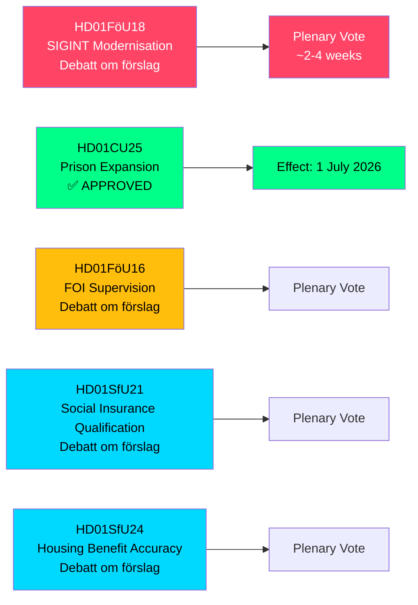

<!-- dir: rtl -->
# שוודיה מרחיבה סמכויות SIGINT, כושר הכלא ורפורמות הביטוח הלאומי — דוחות ועדות מאי 2026

**Author**: James Pether Sörling  
**Date**: 2026-05-07  
**Confidence**: HIGH [B2]  
**Classification**: PUBLIC — GDPR Art 9(2)(e,g)  
**Analysis Depth**: deep

---

## סיכום

ועדת ההגנה של הריקסדאג (FöU) הגישה betänkande פורץ דרך המחדש את חוק המודיעין הסיגנלי (SIGINT) של שוודיה — הרפורמה המשמעותית ביותר למסגרת מאז חוק FRA משנת 2008 — תוך אישור בו-זמנית של סמכויות בנייה מואצות לבתי סוהר והידוק תנאי הזכאות לביטוח הלאומי. חמשת דוחות הוועדות הללו, מתוארכים ל-2026-05-06, מעצבים מחדש במשותף את ארכיטקטורת הביטחון של שוודיה, כושר אכיפת החוק הפלילי וכללי הזכאות למדינת הרווחה במסגרת מושב חקיקתי אחד.

---

## החלטות שמסמך זה תומך בהן

1. **אנליסטי מדיניות וארגוני חירויות אזרחיות**: FöU18 בנושא מודרניזציה של SIGINT נמצא כעת בדיון רשמי ("Debatt om förslag") — חלון המעקב הציבורי לפני ההצבעה הסופית פתוח. הערך את הסיכון של פיקוח המוני בלתי מבוקר מול דרישות יכולת הפעולה ההדדית של נאט"ו.

2. **הנהלת Kriminalvården ופקידי משרד המשפטים**: CU25 אושר — היתרי בנייה זמניים לבתי סוהר/מרכזי מעצר נכנסים לתוקף ב-1 ביולי 2026. זרז את תכנון אתרי קיבולת חדשים לספיגת הארכות תקופות המאסר הנגזרות מרפורמות עונשין.

3. **מנהלי ביטוח לאומי (Försäkringskassan) ומקבלי סיוע בשכר דירה**: SfU21 ו-SfU24 מסמנים אמצעי כשירות ודיוק הטבות מחמירים יותר — צפה עומס מוגבר בערעורים ובחישובים מחדש.

---

## סיכום ב-60 שניות

- **מודרניזציה של SIGINT (HD01FöU18)**: FöU מציע מסגרת משפטית "מודרנית ומתאימה למטרה" לפעולות SIGINT של מודיעין ההגנה. סטטוס: שלב דיון. השלכות: סמכויות איסוף נתונים מורחבות העשויות להשפיע על כל תנועת האינטרנט החוצה גבולות. סיכון עמידה בסעיף 8 של ECHR הוא שאלת ביקורת פעילה של Lagrådet.
- **הרחבת בתי סוהר אושרה (HD01CU25)**: הריקסדאג הצביע בעד — היתרי בנייה זמניים לבתי סוהר/מרכזי מעצר, בתוספת סמכות ממשלתית להעניק פטורים חירומיים מחוק תכנון ובנייה (PBL). תחילת תוקף: 1 ביולי 2026. הגורם: מחסור חריף במקומות כליאה בשילוב עם הארכות תקופות מאסר שנחקקו.
- **רפורמת פיקוח FOI (HD01FöU16)**: שינויים בכללי היתרים ופיקוח על מכון המחקר לביטחון (FOI/Totalförsvarets forskningsinstitut). מחזק את הפיקוח על מחקר הגנה רגיש.
- **כשירות ביטוח לאומי (HD01SfU21)**: מהדק את תנאי הגישה למערכת הביטוח הלאומי השוודית. צפוי להשפיע על מהגרים חדשים ועל בעלי תעסוקה לא-רציפה.
- **דיוק סיוע בשכר דירה (HD01SfU24)**: כללים ממוקדים ומדויקים יותר לסיוע בשכר דירה (`bostadsbidrag`) — צפויה הפחתה בתשלומים שגויים.

---

## הטריגר הקרוב החשוב ביותר

**הצבעת SIGINT במליאה**: FöU18 נמצא בשלב "Debatt om förslag". עקוב אחר מועד ההצבעה במליאה — צפוי תוך 2–4 שבועות. חוות דעת של Lagrådet (yttrande) לפני ההצבעה תהיה מכרעת לניסוח זכויות האזרח.

---

## מקור כלכלי

> ℹ️ **הובלת העזר של קרן המטבע הבינלאומית נחלשה** — WEO/FM Datamapper נגיש; בדיקת IFS SDMX החזירה 404. הטענות הכלכליות משתמשות בגרסת WEO Apr-2026. (סטטוס: נחלש, vintageAgeMonths: 1)

צמיחת תמ"ג שוודי: IMF WEO Apr-2026 חוזה 1.9% לשנת 2026, עם התאוששות ל-2.3% ב-2027 (T+1). הוצאות תשתית בתי סוהר נכנסות תחת קטגוריית GFS_COFOG G04 (סדר ציבורי ובטחון). שינויים בביטוח הלאומי משפיעים על העברות משקי בית ועל היצע העבודה.

---

## Mermaid: סקירת צינור החקיקה

<!-- source-sha: fe71ff7a060499c9abe756eed962dcf32b9a3e02 -->
