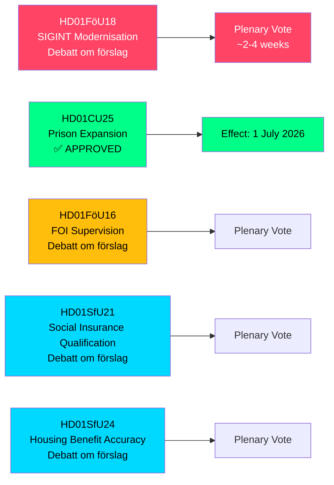

# スウェーデン、SIGINT権限・刑務所収容能力・社会保険改革を拡大 — 2026年5月委員会報告

**Author**: James Pether Sörling  
**Date**: 2026-05-07  
**Confidence**: HIGH [B2]  
**Classification**: PUBLIC — GDPR Art 9(2)(e,g)  
**Analysis Depth**: deep

---

## 要約

スウェーデン国会（Riksdag）の国防委員会（FöU）は、2008年FRA法以来最も重要な改革となるスウェーデンの信号情報（SIGINT）法を近代化する画期的なbetänkandeを提出し、同時に刑務所建設の加速権限と社会保険の資格要件の厳格化を承認した。2026-05-06付けのこれら5つの委員会報告は、1つの立法会期でスウェーデンの安全保障アーキテクチャ、刑事司法能力、福祉国家の適格性規則を一括して再編する。

---

## このブリーフが支援する決定事項

1. **政策アナリストおよび市民自由権団体**: SIGINT近代化に関するFöU18は現在、正式な討論段階（"Debatt om förslag"）にある — 最終投票前の公開審査の窓口は開かれている。NATOの相互運用性要件に対する大規模監視のリスクを評価すること。

2. **Kriminalvården幹部および法務省当局者**: CU25が可決された — 刑務所・拘置所の仮設建設許可が2026年7月1日に発効する。刑事改革によって生じた刑期延長分を吸収するため、新規収容施設の計画を早急に進めること。

3. **社会保険行政担当者（Försäkringskassan）および住宅手当受給者**: SfU21とSfU24は、より厳しい資格要件と給付精度措置を示唆している — 不服申立および再計算の増加を見込むこと。

---

## 60秒サマリー

- **SIGINT近代化（HD01FöU18）**: FöUは国防情報のSIGINT業務向けの「近代的かつ目的適合型」法的枠組みを提案。状況：討論段階。影響：国境を越えるすべてのインターネットトラフィックに潜在的に影響する拡大されたデータ収集権限。ECHR第8条の遵守リスクはLagrådetsの現行審査事項。
- **刑務所拡張承認（HD01CU25）**: Riksdagenは賛成票を投じた — 刑務所・拘置所の期間限定建設許可に加え、建設・計画法（PBL）の緊急免除を政府が発令する権限。発効：2026年7月1日。要因：刑事改革による刑期延長と相まった刑務所不足の深刻化。
- **FOI監督改革（HD01FöU16）**: 総合防衛研究所（FOI/Totalförsvarets forskningsinstitut）の許可・監督規則の変更。機密防衛研究への監督を強化。
- **社会保険資格（HD01SfU21）**: スウェーデン社会保険制度へのアクセス資格要件を厳格化。最近の移民や断続的雇用者に影響する可能性が高い。
- **住宅手当精度（HD01SfU24）**: より的を絞った正確な住宅手当（`bostadsbidrag`）規則 — 誤支給の削減が期待される。

---

## 最重要の今後のトリガー

**本会議でのSIGINT投票**: FöU18は"Debatt om förslag"段階にある。本会議投票日程に注目 — 2〜4週間以内の見込み。投票前のLagrådet意見書（yttrande）は市民的自由のフレーミングにとって決定的となる。

---

## 経済データの出典

> ℹ️ **IMF補助輸送が劣化** — WEO/FM Datamapper到達可能；IFS SDMXプローブが404を返した。経済的主張はWEO Apr-2026ヴィンテージを使用。（状態：劣化、vintageAgeMonths: 1）

スウェーデンGDP成長率：IMF WEO Apr-2026は2026年に1.9%、2027年（T+1）には2.3%への回復を予測。刑務所インフラ支出はGFS_COFOG区分G04（公共秩序と安全）に該当。社会保険の変更は家計移転と労働供給に影響する。

---

## Mermaid: 立法パイプラインの概要

<!-- source-sha: fe71ff7a060499c9abe756eed962dcf32b9a3e02 -->
