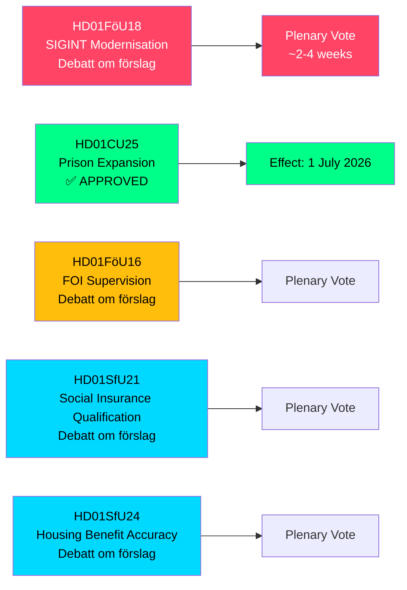

# 스웨덴, SIGINT 권한·교도소 수용 능력·사회보험 개혁 확대 — 2026년 5월 위원회 보고서

**Author**: James Pether Sörling  
**Date**: 2026-05-07  
**Confidence**: HIGH [B2]  
**Classification**: PUBLIC — GDPR Art 9(2)(e,g)  
**Analysis Depth**: deep

---

## 요약

스웨덴 의회(Riksdag) 국방위원회(FöU)는 2008년 FRA법 이후 가장 중요한 개혁인 스웨덴 신호정보(SIGINT)법을 현대화하는 획기적인 betänkande를 제출하는 동시에, 교도소 건설 가속 권한 및 사회보험 자격 요건 강화를 승인했다. 2026-05-06자 이들 5개 위원회 보고서는 한 입법 회기 내에 스웨덴의 안보 아키텍처, 형사 사법 역량, 복지 국가 자격 규정을 전반적으로 재편한다.

---

## 이 브리핑이 지원하는 결정

1. **정책 분석가 및 시민 자유 단체**: SIGINT 현대화에 관한 FöU18은 현재 공식 토론("Debatt om förslag") 단계에 있다 — 최종 투표 전 공개 심사의 창이 열려 있다. NATO 상호운용성 요건 대비 통제되지 않는 대규모 감시 위험을 평가할 것.

2. **Kriminalvården 지도부 및 법무부 관리**: CU25가 통과되었다 — 교도소·구치소에 대한 임시 건축 허가가 2026년 7월 1일 발효된다. 형사 개혁으로 인한 형기 연장을 수용하기 위해 신규 수용 시설 계획을 가속화할 것.

3. **사회보험 담당자(Försäkringskassan) 및 주거수당 수급자**: SfU21과 SfU24는 더 엄격한 자격 및 급여 정확성 조치를 시사한다 — 이의 신청 및 재산정 업무량 증가에 대비할 것.

---

## 60초 요약

- **SIGINT 현대화(HD01FöU18)**: FöU는 국방 정보 SIGINT 운용을 위한 "현대적이고 목적에 적합한" 법적 프레임워크를 제안. 상태: 토론 단계. 시사점: 모든 국경을 초월한 인터넷 트래픽에 잠재적으로 영향을 미치는 확대된 데이터 수집 권한. ECHR 제8조 준수 위험은 Lagrådet의 현안 심사 문제.
- **교도소 확장 승인(HD01CU25)**: 의회 찬성 투표 — 교도소·구치소에 대한 기한부 건축 허가와 계획건축법(PBL) 긴급 면제 발령 정부 권한 부여. 발효: 2026년 7월 1일. 원인: 형사 개혁으로 인한 형기 연장과 맞물린 심각한 교도소 부족.
- **FOI 감독 개혁(HD01FöU16)**: 총합방위연구소(FOI/Totalförsvarets forskningsinstitut) 허가·감독 규정 변경. 민감한 국방 연구에 대한 감독 강화.
- **사회보험 자격(HD01SfU21)**: 스웨덴 사회보험 시스템 접근 자격 요건 강화. 최근 이민자 및 비연속 고용자에 영향을 미칠 가능성이 높음.
- **주거수당 정확성(HD01SfU24)**: 더 표적화되고 정확한 주거수당(`bostadsbidrag`) 규정 — 부당 지급 감소 기대.

---

## 주요 향후 트리거

**본회의 SIGINT 투표**: FöU18은 "Debatt om förslag" 단계에 있다. 본회의 투표 일정에 주목 — 2–4주 내 예정. 투표 전 Lagrådet 의견서(yttrande)는 시민 자유 프레이밍에 결정적이 될 것.

---

## 경제 데이터 출처

> ℹ️ **IMF 보조 전송 저하** — WEO/FM Datamapper 접근 가능; IFS SDMX 프로브가 404를 반환. 경제적 주장은 WEO Apr-2026 빈티지를 사용. (상태: 저하, vintageAgeMonths: 1)

스웨덴 GDP 성장률: IMF WEO Apr-2026은 2026년 1.9%를 예측하며, 2027년(T+1)에는 2.3%로 회복될 전망. 교도소 인프라 지출은 GFS_COFOG 범주 G04(공공 질서 및 안전)에 해당. 사회보험 변경은 가계 이전과 노동 공급에 영향을 미침.

---

## Mermaid: 입법 파이프라인 개요

<!-- source-sha: fe71ff7a060499c9abe756eed962dcf32b9a3e02 -->
