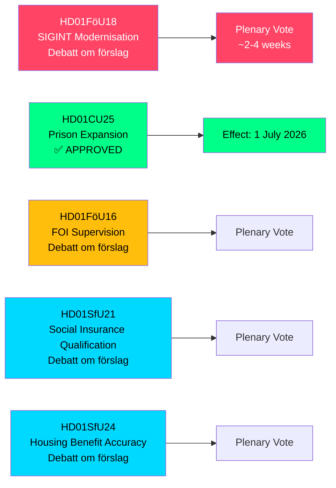

# Zweden breidt SIGINT-bevoegdheden, gevangeniscapaciteit en sociale verzekeringshervormingen uit — Commissierapporten mei 2026

**Author**: James Pether Sörling  
**Date**: 2026-05-07  
**Confidence**: HIGH [B2]  
**Classification**: PUBLIC — GDPR Art 9(2)(e,g)  
**Analysis Depth**: deep

---

## SAMENVATTING

De Defensiecommissie van de Riksdag (FöU) heeft een baanbrekend betänkande gepresenteerd dat de Zweedse wet op signaalintelligentie (SIGINT) moderniseert — de meest ingrijpende hervorming van het kader sinds de FRA-wet van 2008 — en tegelijkertijd versnelde bevoegdheden voor gevangenisbouw en aanscherping van de kwalificatievoorwaarden voor sociale verzekering heeft goedgekeurd. Deze vijf commissierapporten, gedateerd 2026-05-06, hervormen gezamenlijk Zwedens veiligheidsarchitectuur, strafrechtscapaciteit en toelatingsregels van de verzorgingsstaat in één wetgevingszitting.

---

## Beslissingen die dit overzicht ondersteunt

1. **Beleidsanalisten en burgerrechtenorganisaties**: FöU18 over SIGINT-modernisering bevindt zich nu in formeel debat ("Debatt om förslag") — het venster voor publieke controle vóór de eindstemming is open. Beoordeel het risico van ongecontroleerde massasurveillance versus NATOs interoperabiliteitsvereisten.

2. **De leiding van Kriminalvården en functionarissen van het ministerie van justitie**: CU25 is aangenomen — tijdelijke bouwvergunningen voor gevangenissen/detentiecentra treden in werking op 1 juli 2026. Versnel de planning van nieuwe capaciteitslocaties om de door strafrechthervormingen veroorzaakte strafverlengingen op te vangen.

3. **Sociale verzekeringsadministrators (Försäkringskassan) en ontvangers van woonsubsidie**: SfU21 en SfU24 signaleren strengere kwalificerings- en uitkeringsnauwkeuringsmaatregelen — verwacht een hogere caseload voor bezwaren en herberekeningen.

---

## Samenvatting in 60 seconden

- **SIGINT-modernisering (HD01FöU18)**: FöU stelt een "modern en doeltreffend" juridisch kader voor voor SIGINT-operaties van defensieinlichtingen. Status: debatfase. Implicaties: uitgebreide gegevensverzamelingsbevoegdheden die mogelijk alle grensoverschrijdend internetverkeer raken. Nalevingsrisico van EVRM Artikel 8 is een actieve Lagrådet-toetsingskwestie.
- **Gevangenisuitbreiding goedgekeurd (HD01CU25)**: De Riksdag stemde JA — tijdelijke bouwvergunningen voor gevangenissen/detentiecentra, plus regeringsbevoegdheid voor noodvrijstellingen van de Wet ruimtelijke ordening en bouw (PBL). Inwerkingtreding: 1 juli 2026. Aanleiding: acute tekort aan gevangenisplaatsen gecombineerd met wettelijk vastgelegde strafverhogingen.
- **FOI-toezichtshervorming (HD01FöU16)**: Wijzigingen in vergunning- en toezichtsregels voor het Instituut voor Defensieonderzoek (FOI/Totalförsvarets forskningsinstitut). Versterkt het toezicht op gevoelig defensieonderzoek.
- **Kwalificatie sociale verzekering (HD01SfU21)**: Verscherpt de kwalificatievoorwaarden voor toegang tot het Zweedse sociale verzekeringssysteem. Zal waarschijnlijk recente immigranten en houders van niet-doorlopende dienstverbanden treffen.
- **Nauwkeurigheid woonsubsidie (HD01SfU24)**: Meer gerichte en nauwkeurige woonsubsidieregels (`bostadsbidrag`) — verwacht worden minder onjuiste betalingen.

---

## Belangrijkste aankomende trigger

**SIGINT-stemming in plenaire vergadering**: FöU18 bevindt zich in de "Debatt om förslag"-fase. Let op de datum van de plenaire stemming — verwacht binnen 2–4 weken. Een Lagrådet-advies (yttrande) vóór de stemming zou beslissend zijn voor de burgerrechtelijke framing.

---

## Economische herkomst

> ℹ️ **IMF-hulptransport gedegradeerd** — WEO/FM Datamapper bereikbaar; IFS SDMX-sonde retourneerde 404. Economische beweringen gebruiken WEO Apr-2026-jaargang. (Status: gedegradeerd, vintageAgeMonths: 1)

Zweedse bbp-groei: IMF WEO Apr-2026 projecteert 1,9 % voor 2026, met herstel naar 2,3 % in 2027 (T+1). Gevangenisinfrastructuuruitgaven vallen onder GFS_COFOG-categorie G04 (openbare orde en veiligheid). Wijzigingen in de sociale verzekering beïnvloeden huishoudenstransfers en arbeidsaanbod.

---

## Mermaid: Overzicht wetgevingspijplijn

<!-- source-sha: fe71ff7a060499c9abe756eed962dcf32b9a3e02 -->
