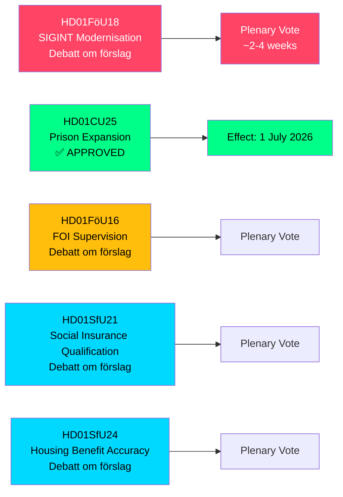

# Sverige utvider SIGINT-fullmakter, fengselskapasitet og trygdereformer — mai 2026 komitérapporter

**Author**: James Pether Sörling  
**Date**: 2026-05-07  
**Confidence**: HIGH [B2]  
**Classification**: PUBLIC — GDPR Art 9(2)(e,g)  
**Analysis Depth**: deep

---

## KORTFATTET

Riksdagens forsvarskomité (FöU) har fremlagt et banebrytende betänkande som moderniserer Sveriges lov om signaletterforskning (SIGINT) — den mest betydningsfulle reformen av rammeverket siden FRA-loven fra 2008 — mens den samtidig godkjente akselererte fengselskonstruksjonsfullmakter og innstramming av kvalifikasjonsbetingelsene for trygd. Disse fem komitérapportene, datert 2026-05-06, omformer til sammen Sveriges sikkerhetsarkitektur, strafferettslig kapasitet og velferdsstatsregelverk i én lovgivningssesjon.

---

## Beslutninger dette brifingen støtter

1. **Policyanalytikere og sivil-frihetsorganisasjoner**: FöU18 om SIGINT-modernisering er nå i formell debatt ("Debatt om förslag") — vinduet for offentlig granskning før endelig avstemning er åpent. Vurder risikoen ved ukontrollert masseovervåking mot NATOs krav om interoperabilitet.

2. **Kriminalvårdens ledelse og justisdepartementets embetsmenn**: CU25 er vedtatt — midlertidige byggetillatelser for fengsler/interneringssentre trer i kraft 1. juli 2026. Fremskynde planlegging av nye kapasitetssteder for å absorbere straffetidsøkninger drevet av straffereformer.

3. **Trygdeadministratorer (Försäkringskassan) og boligstøttemottakere**: SfU21 og SfU24 signalerer strengere kvalifiserings- og ytelsesnøyaktighetstiltak — forvent økt saksmengde for klager og omberegninger.

---

## 60-sekunders oppsummering

- **SIGINT-modernisering (HD01FöU18)**: FöU foreslår et "moderne og formålstjenlig" rettslig rammeverk for forsvarsettretningens SIGINT-operasjoner. Status: debattfase. Implikasjoner: utvidede datainnsamlingsfullmakter som potensielt påvirker all grenseoverskridende internettrafikk. ECHR artikkel 8-overholdelsesrisiko er et levende Lagrådet-kontrollspørsmål.
- **Fengselsutvidelse godkjent (HD01CU25)**: Riksdagen stemte JA — tidsbegrensede byggetillatelser for fengsler/interneringssentre, pluss regjeringens makt til å utstede nødunntak fra Plan- og bygningsloven (PBL). Ikrafttredelse: 1. juli 2026. Driver: akut mangel på fengselsplasser kombinert med lovfestede straffeskjerpelser.
- **FOI-tilsynsreform (HD01FöU16)**: Endringer i tillatelse og tilsynsregler for Totalförsvarets forskningsinstitut (FOI). Styrker tilsynet med sensitiv forsvarsforskning.
- **Trygdekvalifisering (HD01SfU21)**: Strammer kvalifiseringsbetingelsene for tilgang til det svenske trygdesystemet. Sannsynlig å påvirke nyere innvandrere og innehavere av ikke-kontinuerlig sysselsetting.
- **Boligstøttenøyaktighet (HD01SfU24)**: Mer målrettede og nøyaktige boligstøtteregler (`bostadsbidrag`) — forventet å redusere feilutbetalinger.

---

## Viktigste fremtidige utløser

**SIGINT-avstemning i plenum**: FöU18 er i "Debatt om förslag"-fasen. Følg med på datoen for plenaravstemning — forventet innen 2–4 uker. Et Lagrådet-råd (yttrande) før avstemningen ville være avgjørende for de sivile rettighetenes innrammingen.

---

## Økonomisk kilde

> ℹ️ **IMF-hjelpetransport degradert** — WEO/FM Datamapper nåbar; IFS SDMX-sonde returnerte 404. Økonomiske påstander bruker WEO Apr-2026-årgång. (Status: degradert, vintageAgeMonths: 1)

Svensk BNP-vekst: IMF WEO Apr-2026 projiserer 1,9 % for 2026, med gjenoppretting mot 2,3 % i 2027 (T+1). Fengselsinfrastrukturutgifter faller under GFS_COFOG kategori G04 (offentlig orden og sikkerhet). Trygdeendringer påvirker husholdsoverføringer og arbeidstilbud.

---

## Mermaid: Lovgivningsprosessoversikt

<!-- source-sha: fe71ff7a060499c9abe756eed962dcf32b9a3e02 -->
