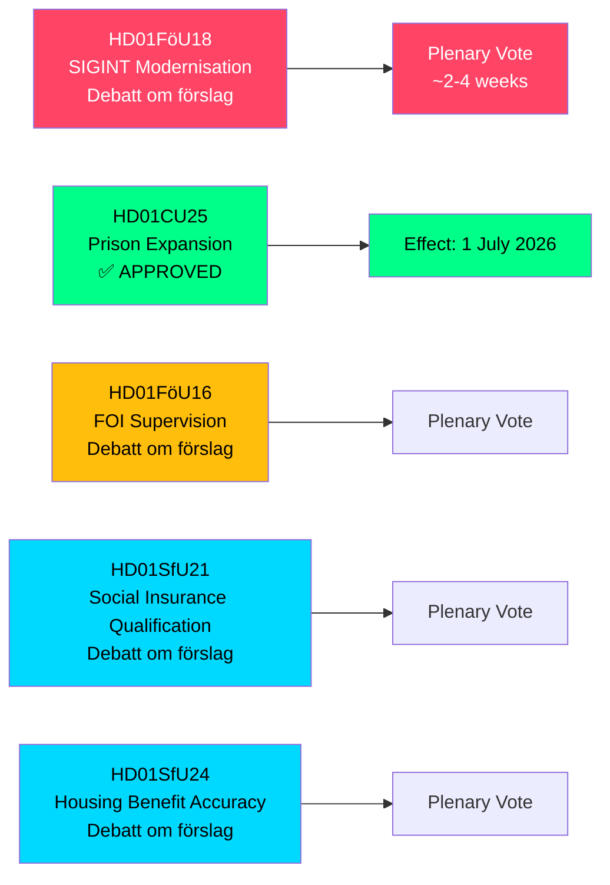

# Sverige utökar SIGINT-befogenheter, fängelsekapacitet och socialförsäkringsreformer — maj 2026 utskottsbetänkanden

**Author**: James Pether Sörling  
**Date**: 2026-05-07  
**Confidence**: HIGH [B2]  
**Classification**: PUBLIC — GDPR Art 9(2)(e,g)  
**Analysis Depth**: deep

---

## KORTFATTNING

Riksdagens försvarsutskott (FöU) har presenterat ett banbrytande betänkande som moderniserar Sveriges signalspaningslag (SIGINT) — den mest betydande reformen av ramverket sedan 2008 års FRA-lag — och godkände samtidigt accelererade befogenheter för fängelsebyggande och skärpta kvalifikationsvillkor för socialförsäkring. Dessa fem utskottsbetänkanden, daterade 2026-05-06, omformar sammantaget Sveriges säkerhetsarkitektur, straffrättsliga kapacitet och välfärdsstatens behörighetsregler i en enda lagstiftningssession.

---

## Beslut som detta underlag stödjer

1. **Policyanalytiker och medborgerliga fri- och rättighetsorganisationer**: FöU18 om SIGINT-modernisering är nu i formell debatt ("Debatt om förslag") — fönstret för offentlig granskning före omröstning är öppet. Bedöm risken med okontrollerad massövervakning mot NATOs krav på interoperabilitet.

2. **Kriminalvårdens ledning och justitiedepartementets tjänstemän**: CU25 har passerat — tidsbegränsade bygglov för fängelser/häkten träder i kraft 1 juli 2026. Påskynda planering av nya kapacitetsplatser för att absorbera strafflängdsökningar drivna av straffreformer.

3. **Socialförsäkringsadministratörer (Försäkringskassan) och bostadsbidragstagare**: SfU21 och SfU24 signalerar stramare kvalificerings- och bidragsnoggrannhetskrav — förvänta ökad ärendemängd för överklaganden och omräkningar.

---

## 60-sekunders sammanfattning

- **SIGINT-modernisering (HD01FöU18)**: FöU föreslår ett "modernt och ändamålsenligt" rättsligt ramverk för försvarsunderrättelsetjänstens SIGINT-verksamhet. Status: debattfas. Implikationer: utvidgade datainsamlingsbehörigheter som potentiellt påverkar all gränsöverskridande internettrafik. ECHR artikel 8-efterlevnadsrisk är en levande Lagrådetgranskningsfråga.
- **Fängelseexpansion godkänd (HD01CU25)**: Riksdagen röstade JA — tidsbegränsade bygglov för fängelser/häkten, plus regeringsmakt att utfärda nöddispenser från Plan- och bygglagen (PBL). Träder i kraft: 1 juli 2026. Drivkraft: akut brist på fängelseplatser kombinerat med lagstiftade straffskärpningar.
- **FOI-tillsynsreform (HD01FöU16)**: Ändringar i tillstånds- och tillsynsregler för Totalförsvarets forskningsinstitut (FOI). Stärker tillsynen av känslig försvarsforskning.
- **Socialförsäkringskvalificering (HD01SfU21)**: Skärper villkoren för tillgång till det svenska socialförsäkringssystemet. Sannolikt att påverka nyanlända och innehavare av icke-kontinuerliga anställningar.
- **Bostadsbidragsnoggrannhet (HD01SfU24)**: Mer riktade och exakta regler för bostadsbidrag (`bostadsbidrag`) — förväntas minska felaktiga utbetalningar.

---

## Viktigaste kommande utlösare

**SIGINT-omröstning i kammaren**: FöU18 är i "Debatt om förslag"-fasen. Bevaka datumet för kammaromröstning — förväntas inom 2–4 veckor. Ett Lagrådetsyttrande före omröstningen skulle vara avgörande för den medborgerliga rättighetsinriktningen.

---

## Ekonomisk källa

> ℹ️ **IMF:s hjälptransport degraderad** — WEO/FM Datamapper nåbar; IFS SDMX-sondage returnerade 404. Ekonomiska påståenden använder WEO Apr-2026-årgång. (Status: degraderad, vintageAgeMonths: 1)

Svensk BNP-tillväxt: IMF WEO Apr-2026 projicerar 1,9 % för 2026, med återhämtning mot 2,3 % 2027 (T+1). Fängelseinfrastrukturutgifter faller under GFS_COFOG kategori G04 (allmän ordning och säkerhet). Förändringar i socialförsäkringen påverkar hushållsöverföringar och arbetskraftsutbud.

---

## Mermaid: Lagstiftningsprocessöversikt

<!-- source-sha: fe71ff7a060499c9abe756eed962dcf32b9a3e02 -->
