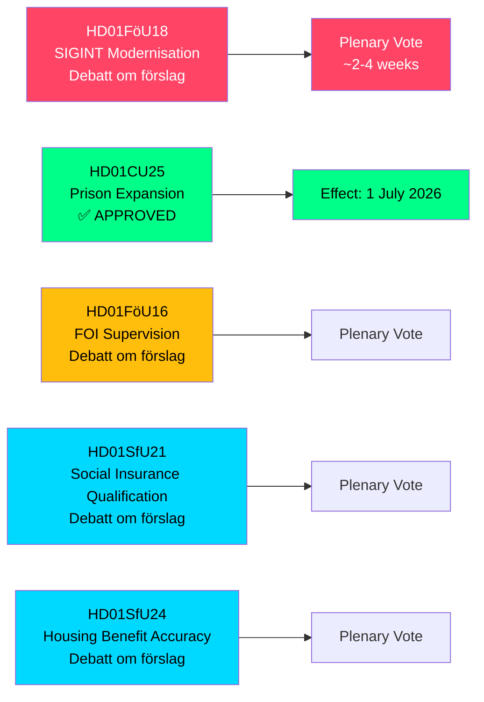

# 瑞典扩大SIGINT权限、监狱容量和社会保险改革 — 2026年5月委员会报告

**Author**: James Pether Sörling  
**Date**: 2026-05-07  
**Confidence**: HIGH [B2]  
**Classification**: PUBLIC — GDPR Art 9(2)(e,g)  
**Analysis Depth**: deep

---

## 摘要

瑞典议会（Riksdag）国防委员会（FöU）提交了一份具有里程碑意义的betänkande，对瑞典信号情报（SIGINT）法律进行现代化改革——这是自2008年FRA法以来对该框架最重大的改革——同时批准了加快监狱建设的权力并收紧了社会保险资格条件。这五份委员会报告（日期为2026-05-06）在一次立法会议中共同重塑了瑞典的安全架构、刑事司法能力和福利国家资格规则。

---

## 本简报支持的决策

1. **政策分析师和公民自由组织**: 关于SIGINT现代化的FöU18目前处于正式辩论阶段（"Debatt om förslag"）——最终投票前的公众监督窗口已开放。评估不受控大规模监控与北约互操作性要求之间的风险。

2. **Kriminalvården领导层和司法部官员**: CU25已通过——监狱/拘留中心的临时建筑许可于2026年7月1日生效。加快新增容量地点的规划，以吸收刑事改革带来的刑期延长。

3. **社会保险管理人员（Försäkringskassan）和住房补贴受益人**: SfU21和SfU24预示着更严格的资格认定和福利准确性措施——预期上诉和重新计算的工作量将增加。

---

## 60秒摘要

- **SIGINT现代化（HD01FöU18）**: FöU提议为国防情报SIGINT行动建立"现代化且切实可行"的法律框架。状态：辩论阶段。影响：扩大的数据收集权限可能影响所有跨境互联网流量。ECHR第8条合规风险是Lagrådet的现行审查问题。
- **监狱扩建获批（HD01CU25）**: 议会投票赞成——监狱/拘留中心的限时建筑许可，以及政府发布《规划建筑法》（PBL）紧急豁免的权力。生效：2026年7月1日。原因：监狱位置严重短缺，加上法定刑期延长。
- **FOI监督改革（HD01FöU16）**: 对瑞典国防研究总局（FOI/Totalförsvarets forskningsinstitut）许可和监督规则的变更。加强对敏感国防研究的监督。
- **社会保险资格（HD01SfU21）**: 收紧进入瑞典社会保险体系的资格条件。可能影响近期移民和非连续就业者。
- **住房补贴准确性（HD01SfU24）**: 更具针对性和准确性的住房补贴（`bostadsbidrag`）规则——预计减少错误支付。

---

## 最重要的前瞻性触发因素

**全体会议SIGINT投票**: FöU18处于"Debatt om förslag"阶段。关注全体会议投票日期——预计在2–4周内。投票前的Lagrådet咨询意见（yttrande）将对公民自由框架具有决定性意义。

---

## 经济数据来源

> ℹ️ **IMF辅助传输降级** — WEO/FM Datamapper可访问；IFS SDMX探针返回404。经济主张使用WEO Apr-2026年份数据。（状态：降级，vintageAgeMonths: 1）

瑞典GDP增长：IMF WEO Apr-2026预测2026年增长1.9%，2027年（T+1）恢复至2.3%。监狱基础设施支出属于GFS_COFOG类别G04（公共秩序与安全）。社会保险变更影响家庭转移支付和劳动供给。

---

## Mermaid: 立法流程概览

<!-- source-sha: fe71ff7a060499c9abe756eed962dcf32b9a3e02 -->
