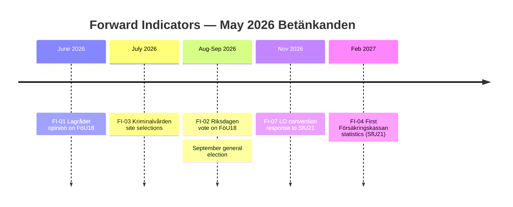

# Forward Indicators — Committee Reports 2026-05-07

**Author**: James Pether Sörling | **Date**: 2026-05-07

---

## Tier 1: Definitive Indicators (high probability, near-term)

| Indicator | Description | Expected | Significance |
|-----------|-------------|----------|--------------|
| FI-01 | Lagrådet opinion on FöU18 published | T+30d (Jun 2026) | Will determine amendment requirements; critical for FöU18 passage |
| FI-02 | Riksdagen vote on FöU18 | T+60–90d (Jul–Sep 2026) | Confirms passage, majority size, L-partiet position |
| FI-03 | Kriminalvården site selection announcement | T+60–120d (Jul–Sep 2026) | Identifies municipalities at risk; triggers local political responses |
| FI-04 | First Försäkringskassan statistics on SfU21 | T+6–9mo (Nov 2026 – Feb 2027) | Reveals actual vs projected benefit eligibility change |

---

## Tier 2: Conditional Indicators (depends on Scenario B/C outcomes)

| Indicator | Description | Trigger Condition | Significance |
|-----------|-------------|-------------------|--------------|
| FI-05 | ECtHR interim measures application filed | Civil society legal challenge (Scenario C) | Escalates FöU18 to European human rights agenda |
| FI-06 | Mark- och miljödomstolen challenge filed | Municipal resistance to CU25 PBL exemption | Delays prison construction 12–24 months |
| FI-07 | LO statement on SfU21 | LO convention vote (autumn 2026) | Signals trade union electoral mobilisation strategy |
| FI-08 | Parliamentary question to Försvarsminister on FöU18 oversight | L-partiet oversight demand | Tests coalition discipline on civil liberties |

---

## Tier 3: Economic Indicators (IMF/SCB Context)

| Indicator | Source | Current Value | Trigger Threshold |
|-----------|--------|---------------|-------------------|
| Sweden GDP Growth | WEO Apr-2026 (cached B2*) | 2.1% 2026E | Below 0%: fiscal pressure on prison programme |
| Unemployment Rate | WEO Apr-2026 (cached) | ~8.5% (2025 estimate) | Above 10%: SfU21 benefit cliff disproportionately activated |
| General Govt Balance | WEO Apr-2026 | +0.3% of GDP | Below -2%: political pressure to delay CU25 capex |

*WEO Apr-2026 vintage >3 months old. Annotation required. Provider: IMF. Degraded-fetch status.*

---

## PIR Roll-Forward Schedule

| PIR-ID | Next Review | Watch Condition |
|--------|-------------|-----------------|
| PIR-FöU18-01 | 2026-06-07 | Lagrådet opinion — watch riksdagen.se judicial review announcements |
| PIR-FöU18-02 | 2026-10-07 | ECtHR application — watch Centrum för rättvisa press releases |
| PIR-CU25-01 | 2026-08-07 | Site selection — watch Kriminalvården press office |
| PIR-SfU21-01 | 2026-11-07 | Benefit statistics — watch Försäkringskassan monthly reports |

---

## Mermaid: Forward Indicator Timeline

