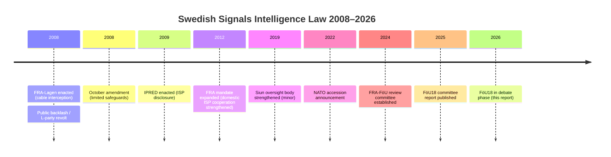

# Historical Parallels — Committee Reports 2026-05-07

**Author**: James Pether Sörling | **Date**: 2026-05-07

---

## FöU18 SIGINT — Historical Parallels

### Parallel 1: FRA-Lagen (2008) — The Founding Trauma

**Event**: The Swedish Riksdag passed the FRA law (lagen om signalspaning i försvarsunderrättelseverksamheten) on 18 June 2008 by a margin of 143 votes against 138. The law permitted FRA to conduct cable interception of all international electronic communications crossing Sweden's borders.

**Political consequences**: Massive public backlash. The Swedish blogosphere mobilised against "the wiretap law." The governing Alliance coalition faced internal crisis — FP (now L) had multiple MPs vote against, KD had waverers. Prime Minister Reinfeldt was forced to promise amendments. A revised law was passed in October 2008 with limited additional safeguards.

**Relevance to FöU18**: FöU18 is explicitly the next step in the same legislative lineage — it's the third major update to the FRA framework. The 2008 dynamics (L-party civil liberties wing, public mobilisation, last-minute coalition crisis) are liable to repeat. [A2 — well-documented Swedish political history]

### Parallel 2: IPRED (2009) — Internet Surveillance by Back Door

The IPRED law (Intellectual Property Rights Enforcement Directive) passed in 2009 and allowed rights holders to demand ISP disclosure of file-sharer identities. Significant reduction in BitTorrent traffic immediately followed. The law was challenged but upheld. It established a precedent for ISP facilitation of surveillance.

**Relevance**: FöU18 builds on the ISP infrastructure relationship that IPRED and the FRA law established. Sweden's ISPs have been providing routing data and wiretap capacity for over a decade. FöU18 is a logical evolution in this ecosystem. [A2]

---

## CU25 Prison — Historical Parallels

### Parallel 1: "1980s Welfare State Retreat" (Feldt Reforms)

Not a direct parallel, but Kjell-Olof Feldt's 1982–1990 welfare retrenchment under S provides the template for how welfare policy can shift dramatically under fiscal pressure — and then become entrenched. CU25 and SfU21/24 together constitute the Tidö government's equivalent: a structural shift in who is included in the Swedish welfare state.

### Parallel 2: UK Prison Expansion 1990s (Howard's "Prison Works" Speech)

Michael Howard's 1993 "prison works" speech and the subsequent UK prison expansion created a structural dependency on incarceration that has persisted for 30 years. The UK prison population doubled between 1993 and 2023. The same lock-in dynamic is a risk for Sweden post-CU25. [B2]

---

## SfU21/24 Welfare — Historical Parallels

### Parallel 1: Norwegian Welfare Tightening (2015)

Following the 2015 migration crisis, Norway significantly tightened social insurance qualifying requirements for recent arrivals. The Norwegian model is now being explicitly cited in Swedish Tidö government documentation as a template. SfU21 is Sweden's version of the Norwegian tightening. [B2 — policy diffusion in Nordic context]

### Parallel 2: UK Universal Credit Qualifying Periods

The UK's Universal Credit system introduced qualifying periods and waiting times from its 2013 rollout. Evidence showed disproportionate impact on workers with interrupted employment histories and recent migrants. Swedish SfU21 faces identical dynamics with the same structural populations. [B2]

---

## Timeline: Swedish Surveillance Law Evolution

