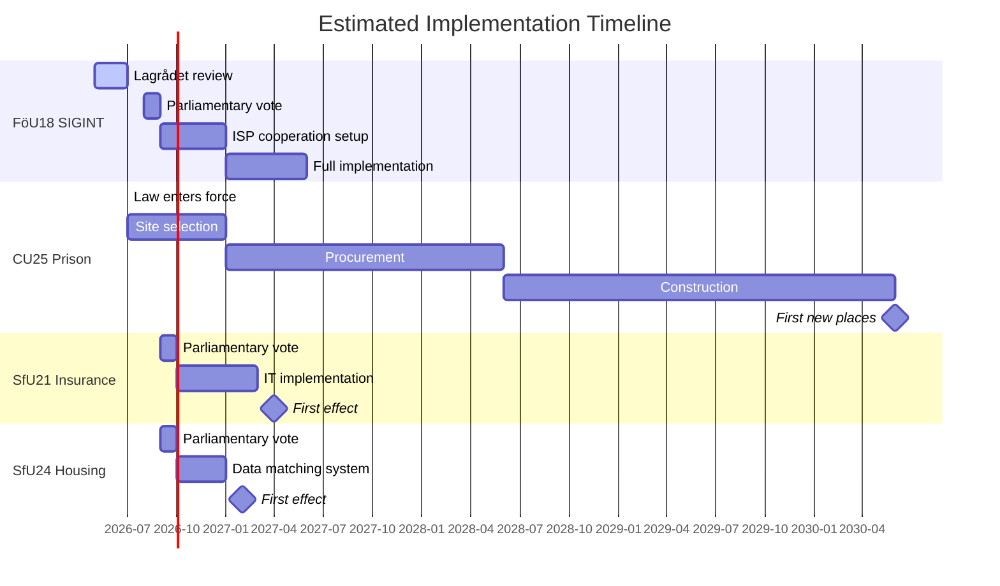

# Implementation Feasibility — Committee Reports 2026-05-07

**Author**: James Pether Sörling | **Date**: 2026-05-07

---

## FöU18 — SIGINT: Implementation Feasibility

### Technical Feasibility: HIGH [B2]
FRA already has the technical infrastructure from the FRA law 2008 onwards. ISPs already provide cable access. The new law primarily expands the *legal* envelope for existing technical capability. No major new infrastructure investment required.

### Legal/Regulatory Feasibility: MEDIUM [B2]
Subject to Lagrådet review. Implementing regulations must be developed. ISP cooperation framework must be updated. Siun must receive additional resources to fulfil expanded oversight mandate. Timeline: 6–12 months for full implementation.

### Organisational Feasibility: HIGH
FRA, MUST, and the ISP community have operated under analogous provisions since 2008. Institutional memory and capability are present.

### Risk: Lagrådet amendments may extend timeline.

---

## CU25 — Prison Expansion: Implementation Feasibility

### Technical Feasibility: MEDIUM-HIGH [B1]
Kriminalvården has construction expertise and an established contractor network. However, Swedish construction capacity is constrained (post-2022 housing market slowdown). Finding available construction workforce may be challenging.

### Legal/Regulatory Feasibility: MEDIUM [B2]
PBL override powers are new and untested. The first time Kriminalvården invokes CU25's PBL exemption, municipalities will likely challenge in mark- och miljödomstolen (Environmental and Land Court). Even if the exemption is legally sound, litigation adds 12–24 months.

### Financial Feasibility: MEDIUM [B3 — full-text-fallback; cost not confirmed]
Prison construction costs in Sweden are estimated at SEK 400–700 million per standard facility (based on Kriminalvården published cost estimates in prior years). For 500–1,000 new places, the total cost could reach SEK 2–5 billion. The fiscal envelope is available (Sweden debt at 33.6% of GDP) but political prioritisation against other infrastructure needs must be demonstrated.

### Timeline to First New Places: 2028–2030 (best case)
Even under CU25's accelerated framework, planning, procurement, and construction realistically delivers first new places in 2028 at earliest. The law is enacted 1 July 2026; site selection takes 6–12 months; procurement 12–18 months; construction 24–36 months.

### Risk: [HIGH] Cost overruns — UK prison programme was £4B over budget. Sweden should expect 20–40% cost overrun based on public sector construction benchmarks.

---

## SfU21 — Social Insurance: Implementation Feasibility

### Administrative Feasibility: MEDIUM [B3]
Försäkringskassan will need to update its IT systems and benefit calculation algorithms to implement new qualifying rules. The agency has a mixed track record on IT implementations (several delays in prior years).

### Timeline: 2027 Q1 likely actual start
Law may pass 2026 but Försäkringskassan typically requires 12–18 months to implement systemic changes.

### Risk: [MEDIUM] IT implementation delays; challenge from trade unions at Arbetsdomstolen.

---

## SfU24 — Housing Benefit: Implementation Feasibility

### Administrative Feasibility: HIGH [B3]
Housing benefit accuracy improvements are primarily about data matching with other agencies (SCB, Skatteverket). This is less complex than SfU21's eligibility restructuring. Feasibility is high.

### Timeline: 2026–2027 (relatively rapid)

---

## Mermaid: Implementation Timeline

