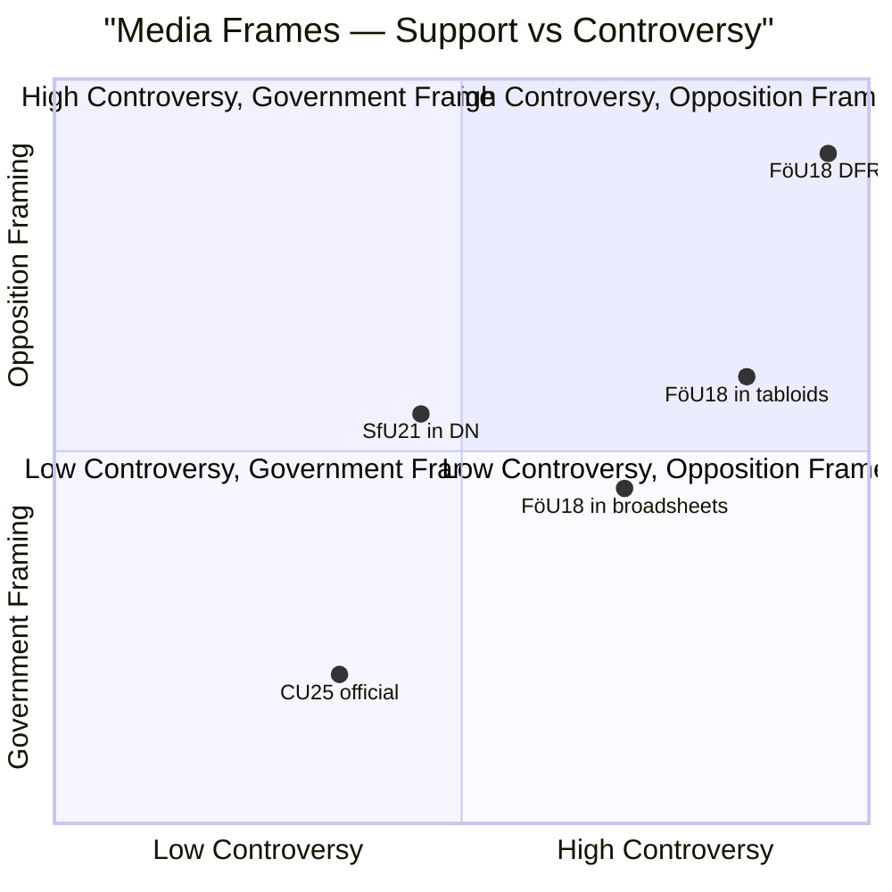

# Media Framing Analysis — Committee Reports 2026-05-07

**Author**: James Pether Sörling | **Date**: 2026-05-07

---

## Government Framing

### FöU18 Official Frame: "NATO Security Architecture Completion"
The government's preferred framing is that FöU18 is a technical necessity following NATO accession. The frame emphasises:
- "Sweden meets NATO standards" — interoperability narrative
- "Modern legal framework" — replaces outdated FRA law provisions
- "Strengthened oversight" — points to Siun expansion as sufficient safeguard
- "Common security" — appeal to collective defence

**Predicted language**: "Sweden is now a full partner in NATO's signals intelligence network. This law ensures our allies can rely on us and we can rely on them." — expected from Ulf Kristersson or Peter Hultqvist equivalent. [C2 — predicted framing]

### CU25 Official Frame: "Delivering on Public Safety"
- "More prison places = safer Sweden"
- "Criminals cannot hide behind planning bureaucracy"
- "Kriminalvården can now do its job"
- Pre-election: "We promised, we delivered"

### SfU21/24 Official Frame: "Sustainable Welfare"
- "Work should always pay"
- "Benefits for those who need them" (implies current recipients don't)
- "Fiscal responsibility"

---

## Opposition Framing

### S-Partiet Likely Counter-Frame (FöU18)
Social Democrats will struggle to oppose directly (security consensus). Expected: "We support Sweden's security but demand stronger privacy safeguards." Unlikely to activate media coverage given S ambivalence.

### V/MP Counter-Frame (All Documents)
- V: "Attack on the working class" (SfU21); "Government criminality surveillance" (FöU18)
- MP: "Mass surveillance" (FöU18); "Building prisons instead of communities" (CU25)

---

## Predicted Swedish Media Coverage

### DN/SvD (mainstream broadsheets)
- FöU18: Lead story, news analysis on ECHR risks, likely editorial support for NATO integration while demanding oversight improvements
- CU25: Brief coverage (enacted law, not contested)
- SfU21/24: Below the fold, welfare beat

### Aftonbladet/Expressen (tabloids)
- CU25: "FLER FÄNGELSEPLATSER — NU" (positive) — tabloid-friendly concrete action
- FöU18: "SVERIGE AVLYSSNAR ALLT" — more likely hostile framing
- SfU21/24: Human interest angles on affected individuals

### Digital/Podcast (DFRI, Bahnhof blog, surveillance-aware media)
- FöU18: Extensive critical coverage, ECtHR precedent articles
- Likely to run side-by-side comparison with 2008 FRA-lagen backlash

---

## Mermaid: Media Frame Positioning

