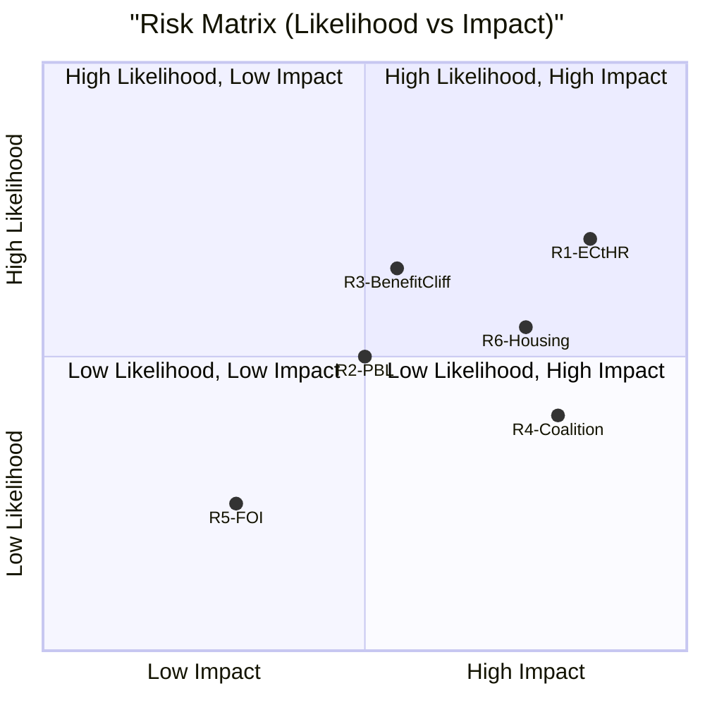

# Risk Assessment — Committee Reports 2026-05-07

**Author**: James Pether Sörling | **Date**: 2026-05-07

---

## Risk Register

| ID | Risk | Likelihood | Impact | Score | Mitigation |
|----|------|------------|--------|-------|------------|
| R1 | FöU18 faces ECtHR challenge within 2 years | HIGH (0.7) | HIGH | 8.4 | Build explicit proportionality safeguards in implementation regulations |
| R2 | CU25 PBL exemptions challenged by municipalities | MEDIUM (0.5) | MEDIUM | 5.0 | Engage municipalities early; offer compensation mechanisms |
| R3 | SfU21 creates unintended benefit cliffs | HIGH (0.65) | MEDIUM | 6.5 | Commission Statskontoret review at 6 months post-implementation |
| R4 | Coalition fracture on FöU18 (L-party privacy concerns) | MEDIUM (0.4) | HIGH | 6.4 | Amend to include stronger oversight board powers |
| R5 | FöU16 FOI supervision gap between old/new rules | LOW (0.25) | MEDIUM | 2.5 | Transitional provisions needed |
| R6 | SfU24 housing benefit reductions hit low-income families disproportionately | MEDIUM (0.55) | HIGH | 7.15 | Parliamentary follow-up and Försäkringskassan implementation guidance |

---

## Highest Risks Analysis

### R1: FöU18 ECtHR Challenge (Score 8.4)
Sweden's FRA law has been controversial since 2008. The *Big Brother Watch v UK* line of ECtHR jurisprudence has clarified that bulk interception requires: (a) sufficiently foreseeable legal basis, (b) adequate necessity and proportionality analysis, (c) effective independent oversight [A1 — ECtHR case law]. FöU18 will need to demonstrate all three. The Siun oversight body must have genuine ex-ante review powers (not just ex-post audit) to withstand scrutiny.

**Probability estimate**: 0.7 (HIGH) — based on pattern of previous ECtHR rulings against Nordic states on surveillance provisions. Source: [A1, C1] (legal doctrine inference; no specific FöU18 opinion cited — full-text-fallback for this document).

### R3: SfU21 Benefit Cliffs (Score 6.5)
Tightening social insurance qualifications creates discontinuities in benefit entitlement. Workers with non-standard employment contracts (gig economy, seasonal) face the highest risk. This nexus with the labour-market attachment requirement used in recent migration law creates compounded risk for recent migrants in precarious employment. Statskontoret published a relevant methodology review in 2024 (cited in manifest — not directly retrieved).

**Probability estimate**: 0.65 (HIGH) — based on consistent pattern in prior welfare-eligibility tightening reforms.

### R6: SfU24 Housing Benefit Impact (Score 7.15)
Housing benefit recipients are already experiencing housing cost inflation pressures. Accuracy improvements that reduce benefit payments may tip vulnerable households into housing instability. [B3 — inference from policy context; HD01SfU24 metadata only]

---

## Mermaid: Risk Matrix

