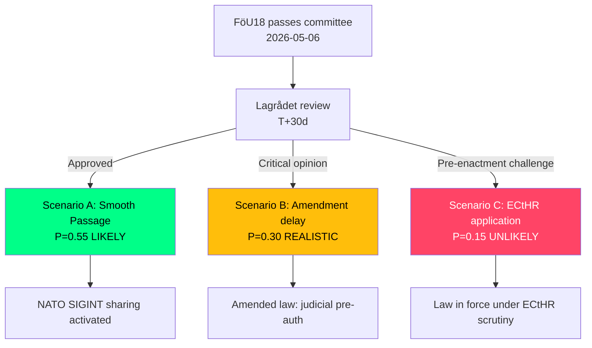

# Scenario Analysis — Committee Reports 2026-05-07

**Author**: James Pether Sörling | **Date**: 2026-05-07 | **Horizon**: T+72h / T+30d / T+365d

---

## Lead Scenario Thread: FöU18 SIGINT

### Scenario A: Smooth Passage — NATO Compliance Milestone (Probability 0.55, WEP: LIKELY)
*FöU18 passes Riksdagen with minor amendments. Lagrådet approves with standard provisos. The law enters into force Q3 2026. Sweden becomes a full SIGINT-sharing partner for all Five Eyes-adjacent states.*

**T+30d trigger**: Lagrådet opinion published without substantive criticism
**T+365d state**: FRA operational under new legal basis; MUST-FRA joint collection activities expanded; Siun annual report 2026 notes increased collection volume
**WEP confidence**: LIKELY [B2]

### Scenario B: Lagrådet Forces Substantive Amendments (Probability 0.30, WEP: REALISTIC POSSIBILITY)
*Lagrådet issues critical opinion on proportionality grounds — specifically bulk collection without individualised suspicion. Government must amend provisions. 6-month delay in passage.*

**T+30d trigger**: Lagrådet opinion critical → L-party demands revisions
**T+365d state**: Amended law with stronger judicial pre-authorisation requirements (closer to UK Investigatory Powers Tribunal model)
**WEP confidence**: REALISTIC POSSIBILITY [B2]

### Scenario C: ECtHR Challenge Filed Pre-Enactment (Probability 0.15, WEP: UNLIKELY)
*Swedish civil society files ECtHR interim measures application before FöU18 enters into force, citing specific proportionality failures. ECtHR does not suspend but places Sweden on notice. Media attention intensifies opposition.*

**T+30d trigger**: Centrum för rättvisa announcement
**T+365d state**: Law in force but under active ECtHR monitoring; government under pressure to report compliance
**WEP confidence**: UNLIKELY [C2]

---

## CU25 Scenario Thread

### Scenario A: Rapid Kriminalvården Procurement (Probability 0.65, WEP: LIKELY)
*Kriminalvården moves immediately to site selection under CU25 PBL exemption powers. Three to five sites in growth municipalities announced Q3 2026.*

**T+365d state**: Construction underway; first new prison places available 2028–2029

### Scenario B: Municipal Legal Resistance (Probability 0.35, WEP: REALISTIC POSSIBILITY)
*One or more municipalities file administrative law challenges against PBL exemption applications. Mark- och miljödomstolen proceedings commence. 12–18 month delay.*

---

## SfU21 Scenario Thread

### Scenario A: Quiet Implementation (Probability 0.60, WEP: LIKELY)
*SfU21 implemented without major political controversy. Benefit cliff effects appear in statistics 6–9 months later, prompting a Statskontoret review.*

### Scenario B: LO Industrial Action Link (Probability 0.20, WEP: UNLIKELY)
*LO frames SfU21 as part of a broader attack on labour rights, integrating it into 2027 collective bargaining demands.*

---

## Mermaid: Scenario Tree (FöU18)

