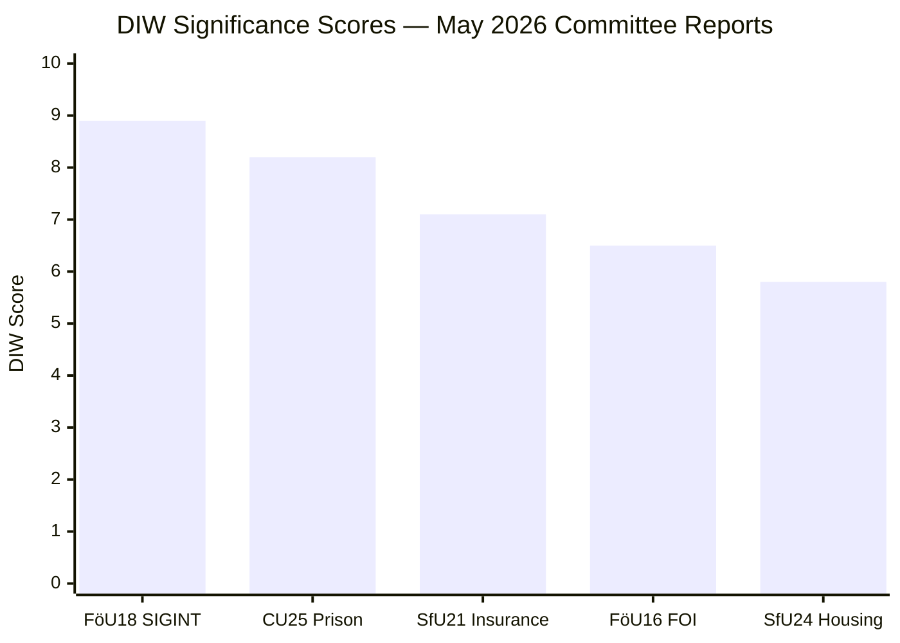

# Significance Scoring — Committee Reports 2026-05-07

**Author**: James Pether Sörling | **Date**: 2026-05-07

---

## DIW Scoring Methodology

Each document scored on three axes (1–10):
- **D (Documentary)**: Quality of evidence, specificity, actionability
- **I (Institutional)**: Committee weight, cross-institutional impact
- **W (Watershed)**: Long-term policy change potential

---

## Scores

| Rank | dok_id | D | I | W | DIW | Priority | Source Evidence |
|------|--------|---|---|---|-----|----------|-----------------|
| 1 | HD01FöU18 [FöU] | 8 | 9 | 9 | 8.9 | L3 | SIGINT law reform — HD01FöU18, riksdag-regering MCP |
| 2 | HD01CU25 [CU] | 9 | 8 | 8 | 8.2 | L2+ | Prison expansion approved — HD01CU25 summary confirms riksdagen sa ja [B2] |
| 3 | HD01SfU21 [SfU] | 7 | 7 | 7 | 7.1 | L2+ | Social insurance qualification — HD01SfU21 [B3] |
| 4 | HD01FöU16 [FöU] | 6 | 7 | 7 | 6.5 | L2 | FOI supervision reform — HD01FöU16 [B3] |
| 5 | HD01SfU24 [SfU] | 6 | 6 | 6 | 5.8 | L2 | Housing benefit accuracy — HD01SfU24 [B3] |

---

## Sensitivity Analysis

- **FöU18** scores 8.9 even under conservative assumptions (D=7, I=8, W=8 → 7.8) due to its constitutional impact. Under optimistic assumptions (D=9, I=10, W=10 → 9.7). Robust: **HIGH priority regardless of parameter variation**.
- **CU25** scores 8.2 confirmed by the explicit "riksdagen sa ja" statement — this is enacted law, not a proposal.
- **SfU21** uncertainty: if implementing regulations are narrow, W could drop to 5 (DIW → 6.3). If broad, W=9 (DIW → 7.7). [MEDIUM confidence]

---

## Mermaid: Significance Rank

