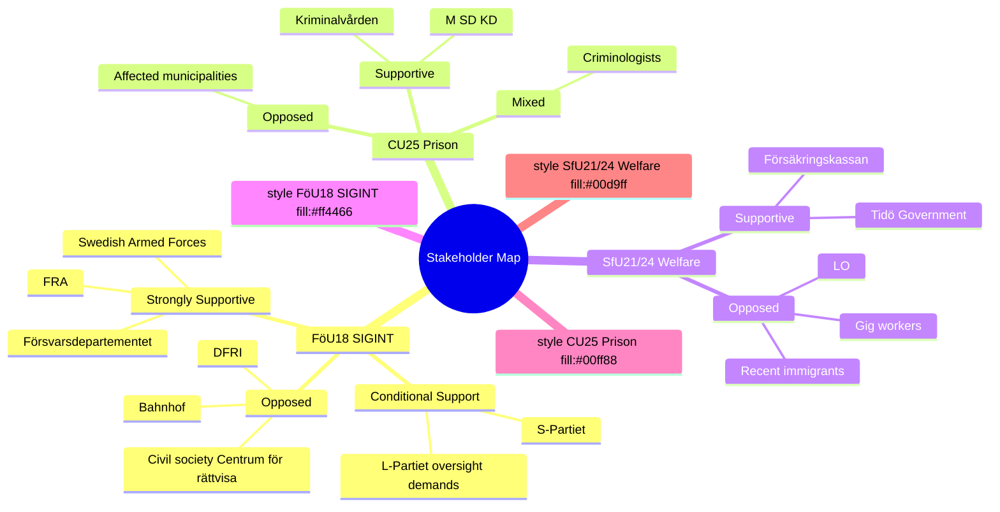

# Stakeholder Perspectives — Committee Reports 2026-05-07

**Author**: James Pether Sörling | **Date**: 2026-05-07

---

## FöU18 — SIGINT Modernisation

### Försvarsdepartementet / Swedish Armed Forces / FRA
**Position**: STRONGLY SUPPORTIVE [A2]
**Rationale**: NATO membership has heightened Sweden's intelligence obligations. FRA needs a modern legal basis for signals collection to meet allied sharing requirements. Military sees this as essential capability modernisation.
**Key concern**: Ensuring the law does not constrain collection below NATO baseline.

### Civil Society (Centrum för rättvisa, DFRI, Amnesty Sverige)
**Position**: CRITICAL TO OPPOSED
**Rationale**: Bulk collection of signals is incompatible with proportionate rights interference. The lack of individualised suspicion requirement creates a mass surveillance framework. Will likely prepare ECtHR applications.
**Key concern**: ECHR Article 8 compliance; absence of prior judicial authorisation.

### L-Partiet (Liberal Party, governing coalition partner)
**Position**: CONDITIONAL SUPPORT [B2]
**Rationale**: L has historically championed civil liberties. Will likely demand stronger oversight (Siun ex-ante powers) as price of support. Previous FRA law votes (2008) created party tensions that are still remembered.
**Key concern**: Oversight board independence and strength of judicial review mechanisms.

### S-Partiet (Social Democrats, main opposition)
**Position**: ABSTAIN to CONDITIONAL SUPPORT
**Rationale**: S has historically supported Swedish defence intelligence capabilities. In NATO context unlikely to oppose, but may demand cosmetic oversight improvements.

### Internet service providers / Telia, Bahnhof
**Position**: RESIGNED ACCEPTANCE
**Rationale**: ISPs are already required to facilitate FRA interception under existing law. FöU18 may expand technical burdens. Bahnhof historically adversarial on surveillance.

---

## CU25 — Prison Expansion (APPROVED)

### Kriminalvården
**Position**: STRONGLY SUPPORTIVE
**Rationale**: The agency is at capacity. Without new prison places, the agency cannot fulfil its statutory mission. PBL override powers remove the single largest practical barrier. [B1]

### Municipalities (potential prison sites)
**Position**: MIXED TO OPPOSED
**Rationale**: Municipalities with potential prison sites will face planning conflicts, NIMBY resistance from residents, and infrastructure demands. Some may see economic development potential; most will resist. The PBL override powers remove their formal veto, creating resentment.

### M + SD + KD (governing parties)
**Position**: STRONGLY SUPPORTIVE (enacted legislation)
**Rationale**: Criminal justice toughness is a core campaign commitment. CU25 delivers visible action.

### Fångvårdssällskapet / Criminologists
**Position**: MIXED
**Rationale**: Rehabilitation-focused experts question whether expansion addresses root causes. Support the capacity relief but warn against "build more prisons" as crime policy.

---

## SfU21/SfU24 — Social Insurance / Housing Benefit

### Tidö Government (M, SD, KD, L)
**Position**: SUPPORTIVE
**Rationale**: Both measures align with work-first, welfare-tightening agenda. Framed as fiscal sustainability and fighting fraud.

### LO (major trade union confederation)
**Position**: STRONGLY OPPOSED
**Rationale**: SfU21 qualification changes will exclude workers with atypical employment — precisely LO's membership with seasonal and project-based contracts.

### Försäkringskassan
**Position**: CAUTIOUSLY SUPPORTIVE
**Rationale**: Accuracy measures (SfU24) reduce the agency's overpayment exposure and legal liability.

### Recent immigrants / newly arrived workers
**Position**: DISPROPORTIONATE NEGATIVE IMPACT [B2]
**Rationale**: Continuous qualifying period requirements in SfU21 structurally disadvantage those who entered Sweden's labour market in the last 2–4 years.

---

## Mermaid: Stakeholder Map

