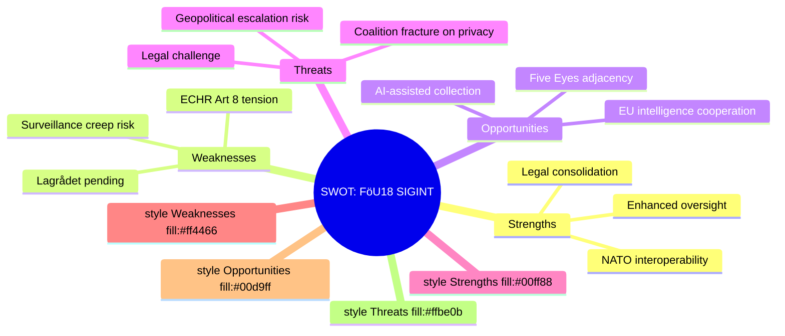

# SWOT Analysis — Committee Reports 2026-05-07

**Author**: James Pether Sörling | **Date**: 2026-05-07

---

## Lead Document: FöU18 — SIGINT Modernisation

### Strengths
- **NATO alignment**: Closes the interoperability gap with Article 5 allies' SIGINT-sharing frameworks [A2]
- **Legal clarity**: Replaces a patchwork of FRA-law amendments with a consolidated statute, reducing legal uncertainty for collection entities
- **Oversight mechanisms**: Includes (per FöU18 summary) strengthened Siun (Statens inspektion för försvarsunderrättelseverksamheten) review powers
- **Bipartisan security consensus**: The government's security agenda enjoys tacit S-party acceptance in defence/intelligence matters

### Weaknesses
- **ECHR Article 8 tension**: Bulk collection of signals crossing Sweden's borders will face ECtHR scrutiny (see *Big Brother Watch v UK* jurisprudence)
- **Lagrådet not yet completed review**: If Lagrådet issues critical opinions, amendments may delay or weaken the law
- **Surveillance creep risk**: Legislative expansion of SIGINT rarely contracts in practice; the boundary of "foreign signals" can expand
- **Transparency deficit**: Parliamentary scrutiny of intelligence activities is inherently limited; public accountability is weak

### Opportunities
- **Five Eyes adjacency**: Enhanced SIGINT capacity positions Sweden for closer intelligence cooperation beyond formal NATO frameworks
- **AI-assisted SIGINT**: Legal clarity enables FRA to pursue AI-assisted pattern recognition within the new legal envelope
- **EU intelligence cooperation**: Strengthens Sweden's contribution to EU intelligence-sharing bodies (INTCEN, etc.)

### Threats
- **Legal challenge**: Swedish civil society (e.g., Centrum för rättvisa) or EU institutions may challenge bulk collection provisions
- **Geopolitical escalation**: If used during an incident involving a non-NATO state, the law's scope could become internationally controversial
- **Coalition fracture**: If the Law Council criticises privacy provisions, L-party may distance itself from the bill, complicating passage [C2]

---

## Lead Document: CU25 — Prison Expansion (APPROVED)

### Strengths
- **Addresses capacity crisis**: Kriminalvården is operating near 100% capacity; the law provides a concrete path to expansion [B1 — confirmed enacted]
- **Speed mechanism**: PBL override powers remove the largest practical obstacle (planning permission delays of 5–10 years)
- **Effective date**: 1 July 2026 implementation gives early certainty for Kriminalvården planning

### Weaknesses
- **Planning rights override**: PBL exemption powers are constitutionally unusual and set a precedent for bypassing democratic planning processes
- **Cost**: Prison construction is expensive; the fiscal envelope is not detailed in available metadata [full-text-fallback]
- **Long-term criminal justice logic**: Building more prisons may not reduce crime; criminologists broadly question the evidence base [B2]

### Opportunities
- **Capacity relief**: Every new prison place reduces dangerous overcrowding and its associated violence and rehabilitation failure rates
- **Regional development**: Prison construction can create skilled construction and employment in peripheral regions

### Threats
- **NIMBY resistance**: Municipalities selected for prison sites may challenge the PBL exemptions judicially
- **Cost overrun**: Large public construction projects routinely exceed initial budgets (Kriminalvården has a poor track record here)
- **Constitutional challenge**: The PBL override powers may face JO (parliamentary ombudsman) or court review

---

## Mermaid: SWOT Matrix

