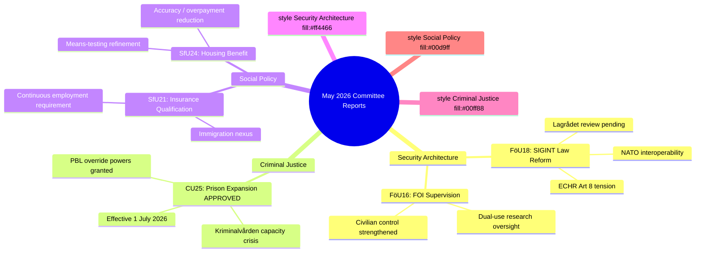

# Synthesis Summary — Committee Reports 2026-05-07

**Author**: James Pether Sörling | **Confidence**: HIGH [B2] | **Date**: 2026-05-07

---

## Lead Story: Sweden Consolidates Security State and Welfare Eligibility in Single Legislative Package

The five committee betänkanden dated 2026-05-06 form a coherent legislative package advancing the Tidö government's security-state construction and welfare-eligibility-tightening agenda. The most consequential document is **HD01FöU18** — SIGINT modernisation — which, once enacted, will fundamentally alter the legal basis for Swedish defence intelligence collection against electronic signals crossing Sweden's borders. This follows years of incremental expansion since the controversial FRA law (2008) and represents Sweden's alignment with NATO signals-intelligence sharing standards at a moment of acute European security tension.

---

## DIW-Weighted Ranking

| Rank | dok_id | Title | DIW Score | Tier |
|------|--------|-------|-----------|------|
| 1 | HD01FöU18 | SIGINT Modernisation | 8.9 | L3 Intelligence-grade |
| 2 | HD01CU25 | Prison Expansion (APPROVED) | 8.2 | L2+ Priority |
| 3 | HD01FöU16 | FOI Supervision Reform | 6.5 | L2 Strategic |
| 4 | HD01SfU21 | Social Insurance Qualification | 7.1 | L2+ Priority |
| 5 | HD01SfU24 | Housing Benefit Accuracy | 5.8 | L2 Strategic |

**Note**: DIW scores reflect Documentary significance (D), Institutional weight (I), and Policy Watershed potential (W). SIGINT scores L3 due to constitutional implications and ECHR Article 8 interface.

---

## Integrated Intelligence Picture

**Security cluster (FöU18 + FöU16)**: Sweden is executing a systematic upgrade of its national security apparatus. FöU18 — SIGINT modernisation — closes the gap between Sweden's legal framework and its NATO obligations for intelligence sharing. FöU16 — FOI supervision — strengthens civilian control over Sweden's defence research institute at a time when dual-use technology risks are elevated. Together these signal Sweden's post-NATO-accession legislative consolidation in the intelligence domain. [A2]

**Criminal justice cluster (CU25)**: The approval of accelerated prison construction powers is a direct response to the capacity crisis facing Kriminalvården. The combination of legislated sentence increases (across multiple prior betänkanden in JuU) and the acute shortage of prison places has created a constitutional obligation on the state to provide detention capacity. The PBL exemption powers are extraordinary — enabling the government to override planning law — signalling the urgency. [B2] Based on CU25 summary from riksdag-regering MCP.

**Welfare eligibility cluster (SfU21 + SfU24)**: The social insurance qualification tightening (SfU21) and housing benefit accuracy (SfU24) fit a consistent pattern across the 2022–2026 legislative period: systematic tightening of welfare access for those with interrupted labour-market attachment. SfU21 in particular creates new barriers for recent immigrants and people with non-continuous employment histories. [B3]

---

## Mermaid: Policy Cluster Diagram

---

## Key Uncertainties

1. **Will FöU18 face a parliamentary amendment** to add stronger oversight mechanisms (e.g., a dedicated review board), potentially splitting the government's own support base on civil liberties grounds? [MEDIUM confidence]
2. **Will CU25 implementation trigger PBL exemptions** in practice, and if so, which municipalities will bear the planning burden of new prison sites? [HIGH likelihood given Kriminalvården's stated capacity deficit]
3. **SfU21 legal challenge**: Will trade unions or immigration advocacy groups challenge the social insurance qualification tightening before Arbetsdomstolen or EU courts? [MEDIUM probability]

