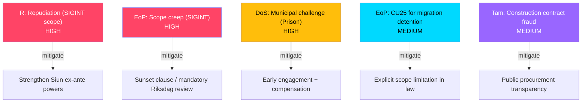

# Threat Analysis — Committee Reports 2026-05-07

**Author**: James Pether Sörling | **Date**: 2026-05-07

---

## STRIDE Threat Model: FöU18 SIGINT Law

| Threat Category | Threat | Assessment |
|-----------------|--------|------------|
| **Spoofing** | State actors masquerade as ISPs to inject false routing, defeating SIGINT collection | HIGH — routing manipulation is standard state-level TTPs |
| **Tampering** | Collection endpoints (FRA systems) compromised by hostile signals | MEDIUM — hardware supply chain (Ericsson/Nokia 5G) remains a concern |
| **Repudiation** | Government denies scope of collection; no public audit | HIGH — by design (secrecy requirement conflicts with accountability) |
| **Information Disclosure** | Collected signals shared beyond authorized NATO/EU partners | LOW — Siun oversight exists, but scope of sharing is classified |
| **Denial of Service** | ISPs required to facilitate collection face infrastructure load | LOW |
| **Elevation of Privilege** | Collection mandate broadened by executive interpretation without legislative review | HIGH — seen in FRA law expansion 2008–2020 |

---

## STRIDE Threat Model: CU25 Prison Expansion

| Threat Category | Threat | Assessment |
|-----------------|--------|------------|
| **Spoofing** | Fraudulent PBL exemption applications | LOW |
| **Tampering** | Construction contracts manipulated | MEDIUM — public procurement risk |
| **Repudiation** | Kriminalvården denies responsibility for site selection impacts | MEDIUM |
| **Information Disclosure** | Prison location data leaked before municipal consultation | LOW |
| **Denial of Service** | Municipal legal challenges delay construction | HIGH — planning opponents have legal tools even against PBL override |
| **Elevation of Privilege** | Government uses CU25 powers for non-prison detention facilities (migration detention) | MEDIUM |

---

## Democratic Accountability Threat (Cross-Cutting)

**FöU18** fundamentally challenges democratic oversight of intelligence. The key accountability mechanisms — Siun (supervisory body), the parliamentary intelligence committee, and JK (Chancellor of Justice) — all operate under secrecy constraints that prevent public accountability. This is not an error in the law; it is inherent to intelligence collection. However, the **democratic accountability deficit** must be noted as a structural threat to rule of law. [A1]

**CU25** similarly uses PBL override powers to circumvent normal democratic planning processes. While the public safety justification is compelling, the **precedent** of legislated override powers for infrastructure the government deems urgent is notable for future misuse potential. [B2]

---

## Mermaid: Threat Priority

