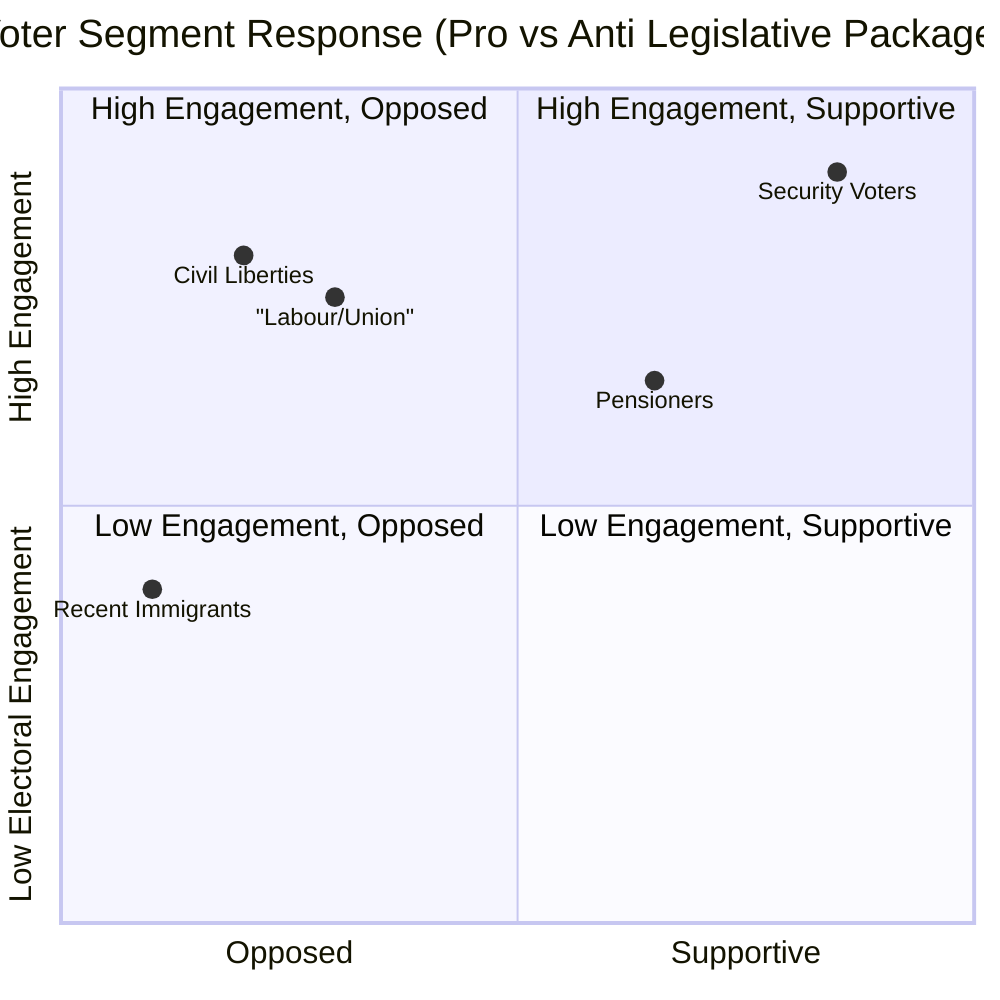

# Voter Segmentation — Committee Reports 2026-05-07

**Author**: James Pether Sörling | **Date**: 2026-05-07

---

## Segmentation Framework

Segments drawn from SCB demographic data and Riksdag election analysis. [B2 — SCB population data; voter alignment inference C2]

---

## Segment 1: Security-Oriented Voters (M/KD/SD core)

**Profile**: Working-age men and women in suburban/rural areas; prioritise crime, immigration, national security
**Size**: ~35% of electorate [B2 — approximate]

**Response to FöU18**: Positive. Security competence narrative. Minimal concern for civil liberties implications.
**Response to CU25**: STRONGLY POSITIVE. Prison expansion is their #1 demand.
**Response to SfU21/24**: Positive. Welfare-eligibility tightening aligns with work-first values.

---

## Segment 2: Civil Liberties / Tech-Aware Voters (L partial, S urban, MP)

**Profile**: Educated urban professionals, 25–45; high internet literacy; concerned about digital rights and surveillance
**Size**: ~12–15% of electorate

**Response to FöU18**: NEGATIVE. This segment reads ECtHR cases and DFRI reports. FöU18 without judicial pre-authorisation will mobilise this group.
**Response to CU25**: Ambivalent. Support capacity needs but concerned about planning override.
**Response to SfU21/24**: Negative. Social justice concerns.

---

## Segment 3: Labour-Attached Low/Middle Income (S/V core)

**Profile**: Trade union members, public sector workers, 35–65; prioritise wages, welfare, housing
**Size**: ~28% of electorate

**Response to FöU18**: Indifferent. Security issues are not their primary lens.
**Response to CU25**: Ambivalent. Support public safety; concerned about cost relative to other priorities.
**Response to SfU21/24**: NEGATIVE. SfU21 directly affects workers with non-continuous employment (seasonal, gig). LO will mobilise this segment against SfU21.

---

## Segment 4: Recent Immigrants / Newly Naturalized Citizens

**Profile**: Arrived Sweden post-2015; concentrated in large cities; diverse employment patterns
**Size**: ~8–10% of electorate (voting-eligible subset)

**Response to SfU21**: STRONGLY NEGATIVE. Direct impact on benefit eligibility.
**Response to CU25**: Negative (disproportionate incarceration rate concern).
**Response to FöU18**: Concerned (surveillance of communication with country of origin).

---

## Segment 5: Pensioners (65+)

**Profile**: Retired, suburban/rural; prioritise healthcare, pensions, safety
**Size**: ~22% of electorate

**Response to CU25**: Positive. Physical safety concerns prioritised.
**Response to SfU21/24**: Indifferent (not affected personally; fiscal sustainability concerns resonant).
**Response to FöU18**: Largely indifferent.

---

## Mermaid: Segment Response Heat Map

