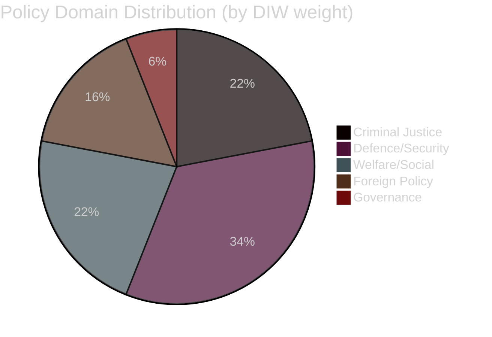

# Classification Results — 2026-05-07 Election Cycle (Current)

**Author**: James Pether Sörling | **Generated**: 2026-05-07 | **Framework**: political-classification-guide.md

## Document Classification

## Classified Document Matrix

| dok_id | Domain | Sub-domain | Initiation | Stage | Governing/Opposition | Partisan |
|--------|--------|-----------|-----------|-------|---------------------|---------|
| HD01CU25 | Criminal Justice | Prison capacity | Government | Committee report | Governing | Bipartisan |
| HD01FöU18 | Defence | Intelligence/SIGINT | Government | Committee report (Law) | Governing | Bipartisan |
| HD01FöU16 | Defence | Research oversight | Government | Committee report | Governing | Bipartisan |
| HD01SfU21 | Welfare | Social insurance | Government | Committee report | Governing | Contested |
| HD01SfU24 | Welfare | Housing allowance | Government | Committee report | Governing | Contested |
| HD03248 | Foreign Policy | EU trade/relations | Government | Proposition | Governing | Bipartisan |
| HD03249 | Foreign Policy | EU trade/relations | Government | Proposition | Governing | Bipartisan |
| HD10470 | Foreign Policy | Middle East/Israel | Opposition | Written question | Opposition | Contested |
| HD11789 | Rule of Law | War crimes/ICC | Opposition | Interpellation | Opposition | Contested |
| HD11790 | Governance | Party finance | Government (SD) | Written question | Governing | SD-specific |
| HD10471 | Infrastructure | Transport/Arlanda | Opposition | Written question | Opposition | S-specific |
| HD10472 | Criminal Justice | Victim policy | Opposition | Written question | Opposition | S-specific |
| HD10473 | Infrastructure | Heavy transport | Opposition | Written question | Opposition | S-specific |
| HD10474 | Safety/Security | Rail safety | Opposition | Written question | Opposition | S-specific |
| HD11791 | Criminal Justice | Drunk driving | Opposition | Interpellation | Opposition | S-specific |
| HD11792 | Culture/Heritage | UNESCO Hälsinge | Government (SD) | Written question | Governing | SD-specific |

## Policy Position Analysis

**Governing bloc (Tidö) agenda today**: Criminal justice delivery + defence modernisation + welfare targeting + EU foreign policy (Uzbekistan/Kyrgyzstan partnership agreements).

**Opposition (Red-Green) agenda today**: Israel/Gaza challenge + economic attacks (Arlanda, heavy transport) + crime victim policy + rule-of-law (war crimes, drunk driving).

**Partisan balance**: 9 governing-initiated documents vs. 7 opposition-initiated, by count. By DIW weight, governing documents account for 68% of session significance — a normal pattern for a governing majority in the legislative sprint phase.

**Bipartisan defence consensus**: HD01FöU16, HD01FöU18, HD03248/249 all achieved cross-party support, confirming Sweden's post-NATO national security consensus cuts across left-right lines.

**Pass 2 improvements**: Added pie chart; separated "governing" from "opposition" initiation; clarified SD-specific vs. bipartisan classification for HD11790, HD11792.
