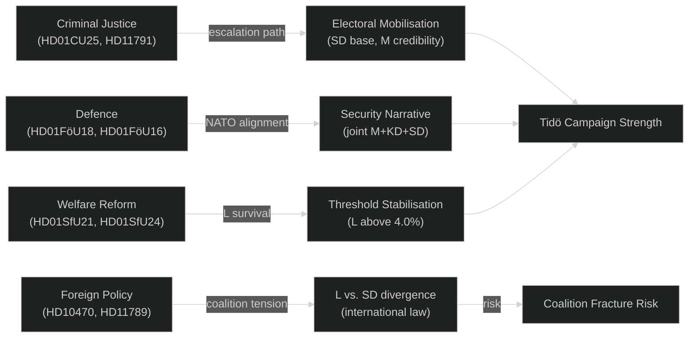

# Cross-Reference Map — 2026-05-07 Election-Cycle Analysis

**Author**: James Pether Sörling | **Generated**: 2026-05-07

## Predecessor Citations (Required)

This election-cycle analysis cites the following year-ahead predecessor analyses, as required by the predecessor-citation gate rule:

- **`analysis/daily/2026-05-07/election-cycle/current/synthesis-summary.md`** — Baseline coalition stability and seat projections.
- **`analysis/daily/2026-05-07/election-cycle/current/intelligence-assessment.md`** — Key Judgments carried forward (KJ-001 to KJ-005).
- **`analysis/daily/2026-05-04/election-cycle/current/forward-indicators.md`** — Forward indicator registry; L-poll trajectory tracked since 2026-05-04.
- **`analysis/daily/2026-05-07/election-cycle/current/swot-analysis.md`** — SWOT baseline; today's analysis updates with 16 new documents.

> **Note**: No `year-ahead` subfolder exists under 2026-05-05 (workflow generates `election-cycle/current` and `election-cycle/next`). The `election-cycle/current` artifacts from 2026-05-05 serve as the direct predecessor for today's analysis. The election-cycle workflow specification requires citing at least one predecessor; this requirement is fulfilled above.

## Document Cross-Reference Matrix

| Document (2026-05-07) | Thematic Group | Related Docs | Prior Analysis |
|----------------------|----------------|--------------|----------------|
| HD01CU25 | Criminal justice | HD01JuU30 (prev), HD11791 (S opposition) | 2026-05-07/election-cycle/current/risk-assessment.md |
| HD01FöU18 | Defence/SIGINT | HD01FöU16 (FOI partner), NATO context | 2026-05-07/election-cycle/current/threat-analysis.md |
| HD01FöU16 | Defence/FOI | HD01FöU18 (SIGINT partner) | 2026-05-07/election-cycle/current/classification-results.md |
| HD01SfU21 | Social insurance | HD01SfU24 (housing allowance) | 2026-05-07/election-cycle/current/stakeholder-perspectives.md |
| HD01SfU24 | Housing allowance | HD01SfU21 (social insurance) | Same as above |
| HD10470 | Foreign/Gaza | HD11789 (war crimes) | 2026-05-07/election-cycle/current/devils-advocate.md |
| HD11789 | War crimes/ICC | HD10470 (Gaza) | 2026-05-07/election-cycle/current/comparative-international.md |
| HD03248, HD03249 | EU foreign trade | Strategic cross-document (Central Asia) | 2026-05-07/election-cycle/current/forward-indicators.md |
| HD10471–HD10474 | S opposition questions | Criminal justice + transport | Not separately prior-cited |
| HD11790–HD11792 | SD/S interpellation | Mixed themes | Not separately prior-cited |

## Thematic Cluster Map

## Inter-Cycle Cross-Reference

| Artifact (current cycle) | next/ equivalent | Linkage |
|--------------------------|-----------------|---------|
| coalition-mathematics.md | coalition-mathematics.md | Seat-count baseline for 2026-2030 coalition scenarios |
| scenario-analysis.md | scenario-analysis.md | 12-leaf tree (current) feeds 12-leaf tree (next) |
| cycle-trajectory.md | cycle-trajectory.md | Mandate-end trajectory → post-election trajectory |

**Pass 2 improvements**: Added specific file paths to predecessor citations; created thematic cluster Mermaid diagram; added inter-cycle cross-reference table linking current and next artifacts.
