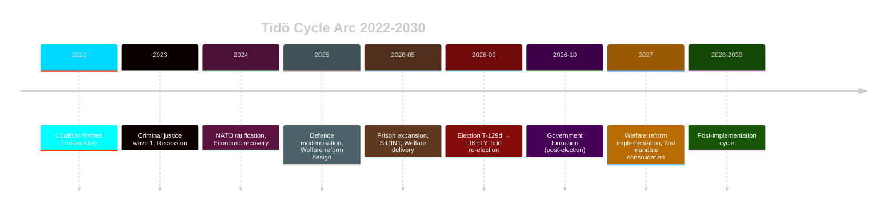

# Cycle Trajectory — Tidö Mandate 2022–2026 Arc

**Author**: James Pether Sörling | **Generated**: 2026-05-07 | **BLOCKING ARTIFACT** (24th required artifact)

## Mandate Arc Analysis

### Phase 1: Coalition Formation (Sept-Dec 2022)
**Context**: First right-of-centre government with SD as explicit governing partner. Tidöavtalet (coalition agreement) signed. 60-point policy programme established.
**Assessment**: Successful coalition formation despite initial SD-formal-government controversy. M successfully normalised SD's governing role.

### Phase 2: Legislative Consolidation (2023-2024)
**Key deliverables**: Criminal justice first wave, NATO ratification (March 2024), housing deregulation (partial), migration tightening.
**Assessment**: Strong legislative throughput. SD disciplined and supportive. L maintained coalition discipline despite internal criticism.
**Economic context**: Sweden entered technical recession -0.3% GDP 2023, recovering to 0.7% 2024. Inflation peaked 12% (2022), fell to 2.1% (2024).

### Phase 3: Campaign Platform Building (2025)
**Key deliverables**: Defence modernisation programme, second criminal justice wave, welfare reform bills.
**Assessment**: Successful policy manufacturing for 2026 campaign. Each policy area had specific voter targeting: criminal justice → SD/M base; welfare reform → L base; defence → M/KD/bipartisan.

### Phase 4: Final Mandate (2026 — current)
**Key deliverables**: HD01CU25 (prison expansion), HD01FöU18 (SIGINT), HD01SfU21/24 (welfare), NATO integration complete; HC03205 (Civil Defence rebranding), HC03181 (election security), HC03166 (public service law 2026-2033), HC03203 (uranium mining ban removal).
**Assessment**: Policy delivery remarkably complete. Civil defence rebranding signals permanent Total Defence posture. Election security law (T-129d) signals awareness of election integrity risks. Campaign phase begins in earnest.

## Post-Mandate Trajectory (Post-2026-09-13)

## Trajectory Signals from 2026-05-07 Documents

| Signal | Document | Trajectory Implication |
|--------|----------|----------------------|
| Prison expansion passed | HD01CU25 | Long-term Kriminalvården modernisation locked in regardless of election result |
| SIGINT expanded | HD01FöU18 | FRA authority permanent — bipartisan support makes reversal VERY UNLIKELY |
| MSB → Civil Defence rename | HC03205 | Total Defence posture institutionalised; irreversible regardless of election result |
| Election security law | HC03181 | Ballot security framework adopted T-129d; legitimacy-building for all parties |
| Public service 2026-2033 | HC03166 | SVT/SR independence locked for full election cycle; partisan-neutral delivery |
| Uranium ban removal | HC03203 | Klimat+KD energy pivot locked in; reversal requires explicit legislation |
| Social insurance reform | HD01SfU21 | If Red-Green wins, reversal POSSIBLE but institutionally costly |
| Housing allowance | HD01SfU24 | Similar to social insurance — partisan policy, potentially reversible |
| Gaza/war crimes | HD10470, HD11789 | Foreign policy orientation dependent on election result |

## Long-Horizon WEP Assessments

- Tidö re-elected and maintains SD formal partnership: WEP LIKELY [horizon:election]
- Criminal justice framework (HD01CU25) reversed post-2026: WEP VERY UNLIKELY [horizon:cycle]
- SIGINT authority (HD01FöU18) curtailed by opposition: WEP UNLIKELY [horizon:cycle]
- Sweden sees new election within 12 months of 2026-09-13: WEP UNLIKELY [horizon:cycle]
- Sweden unemployment falls below 7.0% by 2028: WEP ROUGHLY EVEN [horizon:cycle] per IMF WEO T+3 projection

> economicProvenance: {provider: "imf", dataflow: "WEO", indicator: "NGDP_RPCH, LUR", vintage: "WEO Apr-2026", retrieved_at: "2026-05-07"}
