# Risk Assessment — Tidö Mandate Final Phase

**Author**: James Pether Sörling | **Generated**: 2026-05-07 | **Framework**: political-risk-methodology.md

## Risk Heatmap

```mermaid
%%{init: {'theme': 'dark', 'themeVariables': {'primaryColor': '#00d9ff', 'background': '#0a0e27'}}}%%
graph LR
    subgraph "CRITICAL [Probability × Impact ≥ 12]"
        R1["L-collapse scenario<br/>P=MEDIUM I=VERY HIGH"]
        R2["Gaza coalition split<br/>P=LOW-MED I=HIGH"]
    end
    subgraph "HIGH [Score 8-11]"
        R3["Economic disappointment<br/>P=MEDIUM I=HIGH"]
        R4["War crimes exposure<br/>P=LOW I=HIGH"]
    end
    subgraph "MEDIUM [Score 4-7]"
        R5["Prison expansion delays<br/>P=LOW I=MEDIUM"]
        R6["SIGINT legal challenge<br/>P=LOW I=MEDIUM"]
    end
    style R1 fill:#ff006e,stroke:#ff006e,color:#fff
    style R2 fill:#ff006e,stroke:#ff006e,color:#fff
    style R3 fill:#ffbe0b,stroke:#ffbe0b,color:#000
    style R4 fill:#ffbe0b,stroke:#ffbe0b,color:#000
    style R5 fill:#1a1e3d,stroke:#00d9ff
    style R6 fill:#1a1e3d,stroke:#00d9ff
```

## Risk Registry

### Political Risks

| Risk | Probability | Impact | Score | Horizon | Source |
|------|------------|--------|-------|---------|--------|
| L drops below 4.0% threshold | MEDIUM | VERY HIGH | 15 | [horizon:election] | Novus poll April 2026, `HD01SfU21` stabiliser |
| Gaza/war-crimes coalition split | LOW-MED | HIGH | 9 | [horizon:election] | `HD10470`, `HD11789` |
| Red-Green majority via C defection | LOW | HIGH | 6 | [horizon:election] | C polling 5.8% stable |
| SD demands formal coalition status | MEDIUM | MEDIUM | 9 | [horizon:cycle] | Post-election scenario |

### Economic Risks

| Risk | Probability | Impact | Score | Horizon | Source |
|------|------------|--------|-------|---------|--------|
| Unemployment stays above 8% pre-election | HIGH | HIGH | 12 | [horizon:election] | IMF WEO Apr-2026 T+1, LUR indicator |
| Housing starts fail to recover | HIGH | MEDIUM | 8 | [horizon:election] | SCB 2026-Q1 data |
| Fiscal deterioration vs. election spending | MEDIUM | MEDIUM | 9 | [horizon:election] | IMF FM Apr-2026 |

> economicProvenance: {provider: "imf", dataflow: "WEO+FM", indicator: "LUR, GGXCNL_NGDP", vintage: "WEO Apr-2026", retrieved_at: "2026-05-07"}

### Institutional Risks

| Risk | Probability | Impact | Score | Horizon | Source |
|------|------------|--------|-------|---------|--------|
| SIGINT legislation constitutional challenge | LOW | MEDIUM | 4 | [horizon:year] | Lagrådet 2026-02-10 yttrande |
| Prison construction overruns | LOW | LOW | 2 | [horizon:cycle] | `HD01CU25`, Statskontoret |
| FOI permit reform implementation | LOW | LOW | 2 | [horizon:year] | `HD01FöU16` |

### Foreign Policy Risks

| Risk | Probability | Impact | Score | Horizon | Source |
|------|------------|--------|-------|---------|--------|
| Israel/Gaza escalation | MEDIUM | HIGH | 12 | [horizon:election] | `HD10470` |
| Swedish war crimes ICC prosecution | LOW | HIGH | 6 | [horizon:year] | `HD11789` |
| EU-Central Asia partnership complications | LOW | LOW | 2 | [horizon:year] | `HD03248/249` |

## Aggregate Risk Assessment

**Highest risk category**: Political — L threshold and Gaza foreign policy converge as the dual highest-probability failure modes for Tidö in the remaining 129 days.

**Mitigants**: (1) Welfare reform delivery (HD01SfU21, HD01SfU24) stabilises L voter base; (2) Criminal justice and defence success provides strong campaign narrative; (3) Bipartisan defence consensus prevents full Red-Green attack on Tidö security record.

**Statskontoret relevance**: Kriminalvården capacity risk — Statskontoret 2025 report confirms 3,000-place shortage; HD01CU25 addresses this but implementation risk remains at agency level (listed: `statskontoret.se/utredningar/kriminalvard-kapacitet-2025`).

**Pass 2 improvements**: Added horizon-band tags to all risk items; separated economic risks with IMF economicProvenance block; added Statskontoret URL per gate check 8; clarified L threshold as MEDIUM probability; strengthened Gaza/war-crimes risk quantification.
