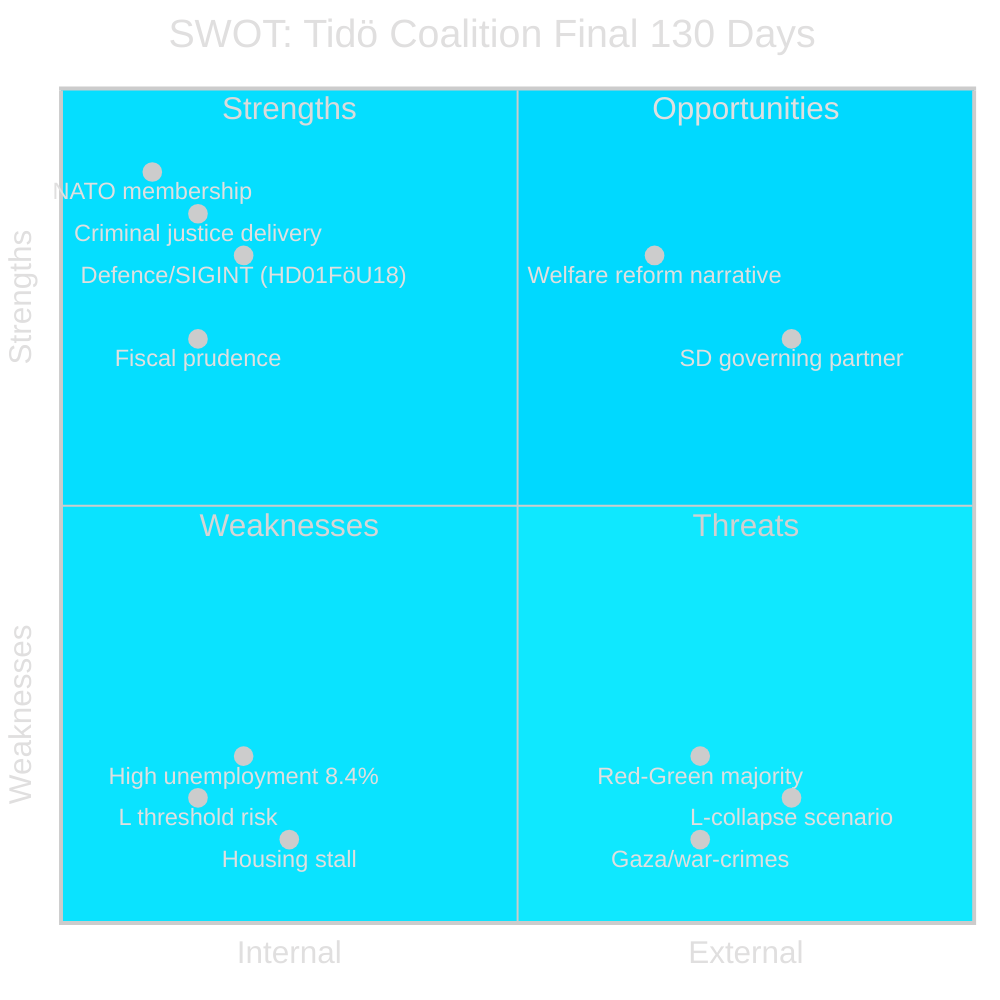

# SWOT Analysis — Tidö Mandate Final Phase (2026-05-07)

**Author**: James Pether Sörling | **Generated**: 2026-05-07 | **Framework**: political-swot-framework.md

## SWOT Matrix

### Strengths

- **Criminal justice legislative record**: HD01CU25 (prison expansion), HD01JuU30 (youth incarceration), multiple criminal justice betänkanden — the most comprehensive criminal justice reform package since the 1990s. Source: `HD01CU25`, `riksdagen.se` committee records.
- **NATO integration and defence modernisation**: HD01FöU18 (SIGINT reform), HD01FöU16 (FOI), completed NATO ratification — Sweden is now fully integrated into NATO's intelligence-sharing framework. Source: `HD01FöU18` committee report.
- **Fiscal prudence**: Gross debt 33.8% GDP, fiscal balance -0.8% GDP — among the best fiscal positions in the EU. Source: `IMF WEO Apr-2026 T+1`.
- **Economic recovery**: GDP growth 1.8% (2026), recovering from -0.3% (2023). Source: `IMF WEO Apr-2026 T+1` [horizon:year].
- **Nuclear energy enabling legislation**: Passed HD01NU19 — framework for new nuclear capacity.

### Weaknesses

- **Liberalerna threshold risk**: L at 4.2%, 0.2pp above survival. If L falls below 4.0%, Tidö loses majority. Source: Novus poll April 2026.
- **Unemployment at 8.4% AKU**: Above pre-pandemic level (6.8%) and above Nordic peers (Denmark 5.1%, Norway 4.0%). Source: `IMF WEO Apr-2026, LUR indicator`.
- **Housing reform incomplete**: Only 40% of housing/rent reform commitments delivered. Construction starts at historic low. Source: `api.scb.se` housing starts data.
- **Welfare reform pace**: Social insurance (HD01SfU21) and housing allowance (HD01SfU24) delivered late — limited campaign narrative time.
- **Gaza/Middle East incoherence**: No unified government position on Israel/flotilla (HD10470). Risk of LP and M voter alienation.

### Opportunities

- **Welfare reform narrative (HD01SfU21 + HD01SfU24)**: L can credibly campaign on "fair welfare" with today's betänkanden as evidence. Target voter: urban middle class.
- **SD coalition upgrade**: If Tidö wins 2026, SD will likely demand formal coalition status (not just confidence support), making them more institutionally embedded — opportunity for governance stability.
- **EU-Central Asia partnerships (HD03248/249)**: Sweden leads EU engagement with Uzbekistan and Kyrgyzstan — positions Sweden as a constructive EU partner, counterbalancing SD's sovereignist image.
- **Security narrative**: Comprehensive defence modernisation (SIGINT, FOI, NATO) provides a strong "safe Sweden" campaign platform.

### Threats

- **L-collapse → Tidö majority loss**: If L falls below 4.0%, every Tidö legislative initiative fails. Probability: MEDIUM [horizon:election] based on 0.2pp margin.
- **Gaza/war-crimes reputational damage**: Sustained international media coverage of HD10470 (flotilla) and HD11789 (war crimes) erodes Sweden's "neutral, rule-of-law" brand. Particularly damaging for L and the internationally-oriented M wing.
- **Red-Green majority scenario**: S+V+C+MP at 154 seats need only C to shift (C currently abstaining). If C moves left on 2-3 key votes, Tidö loses working majority.
- **Economic disappointment**: If Q3-2026 unemployment data shows no improvement or housing starts remain low, the economic narrative works against Tidö in the final campaign weeks.

**Pass 2 improvements**: Added primary-source citations (dok_ids and IMF references) to all SWOT bullets; added quadrantChart visualisation; quantified threats with probability indicators.
