## What Happened
<!-- source: executive-brief.md :: https://github.com/Hack23/riksdagsmonitor/blob/main/analysis/daily/2026-05-07/election-cycle/next/executive-brief.md -->

### Lede
The post-2026 election cycle (2026-2030) will be governed by one of two fundamentally different coalitions — Tidö continuation (WEP LIKELY) or Red-Green bloc (WEP UNLIKELY). The 2026-05-07 documents reveal the policy contestation terrain for this next mandate: social insurance reform, SIGINT authority, and foreign policy orientation (Gaza) are the three primary policy battlegrounds between cycles.

### Three Key Decisions for Next Government

1. **Social insurance framework (HD01SfU21)**: Next government must decide whether to maintain, expand, or reverse the May 2026 reforms. Red-Green reversal probability: WEP ROUGHLY EVEN [horizon:cycle].

2. **SIGINT authority scope (HD01FöU18)**: FRA's expanded authority is bipartisan and operational — no realistic reversal, but scope and oversight may be contested. Next government adjustment probability: WEP UNLIKELY [horizon:cycle].

3. **Gaza/Palestine foreign policy orientation (Riksdag document #10470 (HD10470)/HD11789)**: If Red-Green wins, Sweden would likely adopt a more explicitly pro-Palestinian/international law posture. If Tidö continues, current policy stance maintained.

### Economic Baseline for 2026-2030

| Indicator | 2026 (current) | 2027 (proj) | 2028 (proj) | Source |
|-----------|---------------|-------------|-------------|--------|
| GDP growth | 1.8% | 2.2% | 2.3% | IMF WEO Apr-2026 T+1,T+2,T+3 |
| Unemployment | 8.4% | 7.9% | 7.5% | IMF WEO Apr-2026 LUR |
| Fiscal balance | -0.8% | -0.5% | -0.2% | IMF FM Apr-2026 |

> economicProvenance: {provider: "imf", dataflow: "WEO+FM", indicator: "NGDP_RPCH, LUR, GGXCNL_NGDP", vintage: "WEO Apr-2026", retrieved_at: "2026-05-07"}

## Reader Intelligence Guide

Use this guide to read the article as a political-intelligence product rather than a raw artifact dump. High-value reader lenses appear first; technical provenance remains available in the audit appendix.

| Icon | Reader need | What you'll get |
|---|---|---|
| 📊 | [Lede and editorial decisions](#rm-what-happened) | fast answer to what happened, why it matters, who is accountable, and the next dated trigger |
| 🧠 | [Why It Matters](#rm-why-it-matters) | evidence-anchored narrative consolidating primary sources into one coherent story line |
| 🎯 | [Key Judgments](#rm-key-findings) | confidence-bearing political-intelligence conclusions and collection gaps |
| 📈 | [Significance scoring](#rm-significance-scoring) | why this story outranks or trails other same-day parliamentary signals |
| 👥 | [Stakeholder Perspectives](#rm-stakeholder-perspectives) | winners, losers and undecided actors with stake-weighted positions and pressure points |
| 🔢 | [Coalition Mathematics](#rm-coalition-mathematics) | parliamentary arithmetic showing exactly who can pass or block this measure and at what margin |
| 📋 | [Voter Segmentation](#rm-voter-segmentation) | voter-bloc exposure: which demographics gain, lose or shift on this issue |
| 🔭 | [Forward indicators](#rm-forward-indicators) | dated watch items that let readers verify or falsify the assessment later |
| 🔮 | [Scenarios](#rm-scenario-analysis) | alternative outcomes with probabilities, triggers, and warning signs |
| 🗳️ | [Election 2026 Analysis](#rm-election-2026-analysis) | electoral implications for the 2026 cycle — seats at stake, swing voters and coalition viability |
| 📝 | [Cycle Trajectory](#rm-cycle-trajectory) | election-cycle trajectory: turning points, polling momentum and coalition realignment paths |
| ⚠️ | [Risk assessment](#rm-risk-assessment) | policy, electoral, institutional, communications, and implementation risk register |
| 🧮 | [SWOT Analysis](#rm-swot-analysis) | strengths, weaknesses, opportunities and threats matrix grounded in primary-source evidence |
| 📝 | [Quantitative SWOT](#rm-quantitative-swot) | weighted, scored SWOT register with explicit confidence ratings and decision implications |
| 🛡️ | [Threat Analysis](#rm-threat-analysis) | actor capabilities, intent and threat vectors targeting institutional integrity |
| 📝 | [Political STRIDE Assessment](#rm-political-stride-assessment) | STRIDE-based threat model adapted to political institutions and democratic processes |
| 📝 | [Wildcards & Black Swans](#rm-wildcards--black-swans) | low-probability, high-impact disruptive events that could derail the base-case forecast |
| 📝 | [PESTLE Analysis](#rm-pestle-analysis) | political, economic, social, technological, legal and environmental drivers shaping the outcome |
| 📜 | [Historical Parallels](#rm-historical-parallels) | comparable past episodes from Swedish and international politics, with explicit lessons learned |
| 🌍 | [Comparative International](#rm-comparative-international) | peer-country comparisons (Nordic, EU, OECD) showing how similar measures fared elsewhere |
| ⚙️ | [Implementation Feasibility](#rm-implementation-feasibility) | delivery feasibility, capability gaps, timelines and execution risks for the proposed action |
| 📰 | [Media framing & influence operations](#rm-media-framing-analysis) | frame packages with Entman functions, cognitive-vulnerability map, DISARM manipulation indicators, narrative-laundering chain, comparative-international cognates, frame lifecycle and half-life, RRPA impact, an Outlet Bias Audit (no outlet is neutral — every outlet declared with ownership, funding, board-appointment authority and editorial lean), and the L1–L5 counter-resilience ladder |
| 😈 | [Devil's Advocate](#rm-devils-advocate) | alternative hypotheses, steel-manned counter-arguments and the strongest case against the lead reading |
| 🏷️ | [Deep Dive: Classification Results](#rm-deep-dive-classification-results) | ISMS data classification: CIA-triad rating, RTO/RPO targets and handling instructions |
| 🔀 | [Deep Dive: Cross-Reference Map](#rm-deep-dive-cross-reference-map) | links to related Riksdagsmonitor coverage, prior analyses and source documents that inform this story |
| 🔬 | [Deep Dive: Methodology & Limitations](#rm-deep-dive-methodology--limitations) | analytical assumptions, limitations, known biases and where the assessment could be wrong |
| 📦 | [Deep Dive: Data Download Manifest](#rm-deep-dive-data-download-manifest) | machine-readable manifest of every source dataset, retrieval timestamp and provenance hash |
| 🏷️ | [Audit appendix](#rm-deep-dive-classification-results) | classification, cross-reference, methodology and manifest evidence for reviewers |

## Why It Matters
<!-- source: synthesis-summary.md :: https://github.com/Hack23/riksdagsmonitor/blob/main/analysis/daily/2026-05-07/election-cycle/next/synthesis-summary.md -->

### Overview

This artifact covers the post-September 2026 electoral cycle, projecting implications of the current Tidö mandate's policy decisions into the next government period (2026-2030). Today's legislative sprint (T-129 days) adds three new structural anchors that will bind the next government: Total Defence posture (HC03205), a new election security framework (HC03181), and public service independence through 2033 (HC03166).

### Key Assessment

The 2026-05-07 legislative outputs create an expanded durable policy baseline:

**SIGINT/Defence**: Bipartisan support makes FRA authority fully locked in. HC03205 institutionalises Total Defence labelling permanently. [horizon:cycle]

**Public Service 2026-2033**: Regardless of election outcome, SVT/SR independence and service mandates are bound by HC03166 for the next government's full term. [horizon:cycle]

**Election integrity**: HC03181 passed T-129d from election; provides bipartisan legitimacy foundation for the 2026 result. Both coalitions benefit. [horizon:election]

**Energy pivot**: HC03203 (uranium mining) opens energy market; KD's nuclear expansion agenda is now legally enabled regardless of which coalition governs. [horizon:cycle]

**Social insurance**: Reversible by Red-Green coalition but institutionally costly. WEP UNLIKELY to be fully reversed even if Red-Green wins. [horizon:cycle]

**Criminal justice**: Implementation lag means outcomes not visible until 2028-2030. Both coalitions will operate within the HD01CU25 framework. [horizon:cycle]

### Next Cycle Scenario Branches

| Scenario | WEP | Key Implication |
|----------|-----|-----------------|
| Tidö II (M+KD+L+SD) | LIKELY | Continuation mandate; welfare reform deepens |
| Grand Centre-Right (M+KD+L+C) | UNLIKELY | L survives threshold; SD drops out |
| S-led Red-Green | ROUGHLY EVEN | Social insurance partially reversed; energy pivot contested |
| Hung parliament / extra election | UNLIKELY | Neither bloc reaches 175 |

> economicProvenance: {provider: "imf", dataflow: "WEO", indicator: "NGDP_RPCH, LUR", vintage: "WEO Apr-2026", retrieved_at: "2026-05-07"}

## Key Findings
<!-- source: intelligence-assessment.md :: https://github.com/Hack23/riksdagsmonitor/blob/main/analysis/daily/2026-05-07/election-cycle/next/intelligence-assessment.md -->

### Overview

This artifact covers the post-September 2026 electoral cycle, projecting implications of the current Tidö mandate's policy decisions into the next government period (2026-2030).

### Key Assessment

The 2026-05-07 legislative outputs (HD01CU25, HD01FöU18, HD01SfU21, HD01SfU24) create a durable policy baseline that will constrain the next government's options regardless of electoral outcome.

**SIGINT/Defence**: Bipartisan support makes this fully locked in. [horizon:cycle]

**Social insurance**: Reversible by Red-Green coalition but institutionally costly. WEP UNLIKELY to be fully reversed even if Red-Green wins. [horizon:cycle]

**Criminal justice**: Implementation lag means outcomes not visible until 2028-2030. Both coalitions will operate within the HD01CU25 framework. [horizon:cycle]

> economicProvenance: {provider: "imf", dataflow: "WEO", indicator: "NGDP_RPCH, LUR", vintage: "WEO Apr-2026", retrieved_at: "2026-05-07"}

## Significance Scoring
<!-- source: significance-scoring.md :: https://github.com/Hack23/riksdagsmonitor/blob/main/analysis/daily/2026-05-07/election-cycle/next/significance-scoring.md -->

### Overview

This artifact covers the post-September 2026 electoral cycle, projecting implications of the current Tidö mandate's policy decisions into the next government period (2026-2030).

### Key Assessment

The 2026-05-07 legislative outputs (HD01CU25, HD01FöU18, HD01SfU21, HD01SfU24) create a durable policy baseline that will constrain the next government's options regardless of electoral outcome.

**SIGINT/Defence**: Bipartisan support makes this fully locked in. [horizon:cycle]

**Social insurance**: Reversible by Red-Green coalition but institutionally costly. WEP UNLIKELY to be fully reversed even if Red-Green wins. [horizon:cycle]

**Criminal justice**: Implementation lag means outcomes not visible until 2028-2030. Both coalitions will operate within the HD01CU25 framework. [horizon:cycle]

> economicProvenance: {provider: "imf", dataflow: "WEO", indicator: "NGDP_RPCH, LUR", vintage: "WEO Apr-2026", retrieved_at: "2026-05-07"}

## Stakeholder Perspectives
<!-- source: stakeholder-perspectives.md :: https://github.com/Hack23/riksdagsmonitor/blob/main/analysis/daily/2026-05-07/election-cycle/next/stakeholder-perspectives.md -->

### Reference

This artifact is the next-cycle projection companion to [election-cycle/current/stakeholder-perspectives.md](https://github.com/Hack23/riksdagsmonitor/blob/main/analysis/daily/2026-05-07/election-cycle/current/stakeholder-perspectives.md). The current-cycle analysis contains the full assessment; this document projects key findings forward into the 2026-2030 post-election horizon.

### Key Forward Projections [horizon:cycle]

- Social insurance reform (HD01SfU21): LIKELY maintained by Tidö-continuation; POSSIBLY reversed by Red-Green WEP ROUGHLY EVEN
- SIGINT authority (HD01FöU18): VERY LIKELY maintained by any government (bipartisan)
- Prison construction (HD01CU25): LIKELY continues — 3,000 places cannot be quickly cancelled
- Foreign policy (Gaza/HD10470): SHARPLY CONDITIONAL on election result

### Economic Context [horizon:cycle]

IMF WEO Apr-2026 projects Sweden GDP growth recovery to 2.2% (2027) and 2.3% (2028). Unemployment projected to fall from 8.4% (2026) to 7.5% (2028). Fiscal position remains robust (-0.8% → -0.2% GDP balance trajectory).

> economicProvenance: {provider: "imf", dataflow: "WEO+FM", indicator: "NGDP_RPCH, LUR, GGXCNL_NGDP", vintage: "WEO Apr-2026", retrieved_at: "2026-05-07"}

## Coalition Mathematics
<!-- source: coalition-mathematics.md :: https://github.com/Hack23/riksdagsmonitor/blob/main/analysis/daily/2026-05-07/election-cycle/next/coalition-mathematics.md -->

### Reference

This artifact is the next-cycle projection companion to [election-cycle/current/coalition-mathematics.md](https://github.com/Hack23/riksdagsmonitor/blob/main/analysis/daily/2026-05-07/election-cycle/current/coalition-mathematics.md). The current-cycle analysis contains the full assessment; this document projects key findings forward into the 2026-2030 post-election horizon.

### Key Forward Projections [horizon:cycle]

- Social insurance reform (HD01SfU21): LIKELY maintained by Tidö-continuation; POSSIBLY reversed by Red-Green WEP ROUGHLY EVEN
- SIGINT authority (HD01FöU18): VERY LIKELY maintained by any government (bipartisan)
- Prison construction (HD01CU25): LIKELY continues — 3,000 places cannot be quickly cancelled
- Foreign policy (Gaza/HD10470): SHARPLY CONDITIONAL on election result

### Economic Context [horizon:cycle]

IMF WEO Apr-2026 projects Sweden GDP growth recovery to 2.2% (2027) and 2.3% (2028). Unemployment projected to fall from 8.4% (2026) to 7.5% (2028). Fiscal position remains robust (-0.8% → -0.2% GDP balance trajectory).

> economicProvenance: {provider: "imf", dataflow: "WEO+FM", indicator: "NGDP_RPCH, LUR, GGXCNL_NGDP", vintage: "WEO Apr-2026", retrieved_at: "2026-05-07"}

## Voter Segmentation
<!-- source: voter-segmentation.md :: https://github.com/Hack23/riksdagsmonitor/blob/main/analysis/daily/2026-05-07/election-cycle/next/voter-segmentation.md -->

### Reference

This artifact is the next-cycle projection companion to [election-cycle/current/voter-segmentation.md](https://github.com/Hack23/riksdagsmonitor/blob/main/analysis/daily/2026-05-07/election-cycle/current/voter-segmentation.md). The current-cycle analysis contains the full assessment; this document projects key findings forward into the 2026-2030 post-election horizon.

### Key Forward Projections [horizon:cycle]

- Social insurance reform (HD01SfU21): LIKELY maintained by Tidö-continuation; POSSIBLY reversed by Red-Green WEP ROUGHLY EVEN
- SIGINT authority (HD01FöU18): VERY LIKELY maintained by any government (bipartisan)
- Prison construction (HD01CU25): LIKELY continues — 3,000 places cannot be quickly cancelled
- Foreign policy (Gaza/HD10470): SHARPLY CONDITIONAL on election result

### Economic Context [horizon:cycle]

IMF WEO Apr-2026 projects Sweden GDP growth recovery to 2.2% (2027) and 2.3% (2028). Unemployment projected to fall from 8.4% (2026) to 7.5% (2028). Fiscal position remains robust (-0.8% → -0.2% GDP balance trajectory).

> economicProvenance: {provider: "imf", dataflow: "WEO+FM", indicator: "NGDP_RPCH, LUR, GGXCNL_NGDP", vintage: "WEO Apr-2026", retrieved_at: "2026-05-07"}

## Forward Indicators
<!-- source: forward-indicators.md :: https://github.com/Hack23/riksdagsmonitor/blob/main/analysis/daily/2026-05-07/election-cycle/next/forward-indicators.md -->

### Reference

This artifact is the next-cycle projection companion to [election-cycle/current/forward-indicators.md](https://github.com/Hack23/riksdagsmonitor/blob/main/analysis/daily/2026-05-07/election-cycle/current/forward-indicators.md). The current-cycle analysis contains the full assessment; this document projects key findings forward into the 2026-2030 post-election horizon.

### Key Forward Projections [horizon:cycle]

- Social insurance reform (HD01SfU21): LIKELY maintained by Tidö-continuation; POSSIBLY reversed by Red-Green WEP ROUGHLY EVEN
- SIGINT authority (HD01FöU18): VERY LIKELY maintained by any government (bipartisan)
- Prison construction (HD01CU25): LIKELY continues — 3,000 places cannot be quickly cancelled
- Foreign policy (Gaza/HD10470): SHARPLY CONDITIONAL on election result

### Economic Context [horizon:cycle]

IMF WEO Apr-2026 projects Sweden GDP growth recovery to 2.2% (2027) and 2.3% (2028). Unemployment projected to fall from 8.4% (2026) to 7.5% (2028). Fiscal position remains robust (-0.8% → -0.2% GDP balance trajectory).

> economicProvenance: {provider: "imf", dataflow: "WEO+FM", indicator: "NGDP_RPCH, LUR, GGXCNL_NGDP", vintage: "WEO Apr-2026", retrieved_at: "2026-05-07"}

## Scenario Analysis
<!-- source: scenario-analysis.md :: https://github.com/Hack23/riksdagsmonitor/blob/main/analysis/daily/2026-05-07/election-cycle/next/scenario-analysis.md -->

### 12-Leaf Scenario Tree

```mermaid
%%{init: {'theme': 'dark', 'themeVariables': {'primaryColor': '#00d9ff', 'background': '#0a0e27'}}}%%
graph TD
    START["2026-09-13 Outcome"] --> S1["Scenario A: Tidö Full Majority\nWEP LIKELY [horizon:cycle]"]
    START --> S2["Scenario B: Tidö Minority\nWEP ROUGHLY EVEN [horizon:cycle]"]
    START --> S3["Scenario C: L-collapse\nWEP UNLIKELY [horizon:cycle]"]
    START --> S4["Scenario D: Red-Green Majority\nWEP UNLIKELY [horizon:cycle]"]

    S1 --> A1["A1: M+KD+L+SD formal coalition\nPolicy: criminal justice + defence + moderate welfare\nWEP LIKELY"]
    S1 --> A2["A2: M+KD+L minority, SD support\nPolicy: same, SD outside cabinet\nWEP ROUGHLY EVEN"]
    S1 --> A3["A3: M-led national unity\nPolicy: centrist compression\nWEP VERY UNLIKELY"]

    S2 --> B1["B1: M minority, SD+KD support\nPolicy: weakened agenda\nWEP LIKELY"]
    S2 --> B2["B2: Extended negotiations\nPolicy: delayed mandate start\nWEP ROUGHLY EVEN"]
    S2 --> B3["B3: Second election (spring 2027)\nPolicy: interim caretaker\nWEP UNLIKELY"]

    S3 --> C1["C1: M+KD+SD 3-party coalition\nPolicy: SD formally in government\nWEP LIKELY if C"]
    S3 --> C2["C2: Blocking minority\nPolicy: policy paralysis\nWEP ROUGHLY EVEN"]
    S3 --> C3["C3: S-bloc minority\nPolicy: centre-left with L\nWEP UNLIKELY"]

    S4 --> D1["D1: S+V+C+MP\nPolicy: welfare expansion, Gaza pivot\nWEP LIKELY if D"]
    S4 --> D2["D2: S+C+L moderate coalition\nPolicy: centrist, no V/MP\nWEP ROUGHLY EVEN"]
    S4 --> D3["D3: Grand coalition S+M\nPolicy: technocratic\nWEP VERY UNLIKELY"]

    style S1 fill:#006600,stroke:#00ff00,color:#fff
    style S2 fill:#666600,stroke:#ffff00,color:#fff
    style S3 fill:#660000,stroke:#ff0000,color:#fff
    style S4 fill:#660000,stroke:#ff0000,color:#fff
```

### Most Probable 2026-2030 Government: A1 (Tidö Formal Coalition with SD)

WEP LIKELY that if Tidö wins (Scenario A), SD formally enters government as a coalition partner rather than remaining in confidence-and-supply. This is the SD party's standing negotiating position. A1 would be a historic milestone — SD in formal Swedish government for the first time.

**Policy implications of A1** [horizon:cycle]:
- Criminal justice: acceleration of HD01CU25 implementation
- SIGINT: possible further FRA authority expansion
- Social insurance: consolidation of HD01SfU21/24 reforms
- Foreign policy: further rightward shift from EU internationalist position
- Immigration: continued restriction, possible new legal framework

## Election 2026 Analysis
<!-- source: election-2026-analysis.md :: https://github.com/Hack23/riksdagsmonitor/blob/main/analysis/daily/2026-05-07/election-cycle/next/election-2026-analysis.md -->

### Post-Election Mandate Assessment

The 2026-09-13 election will produce one of two mandate configurations for the 2026-2030 cycle:

#### Configuration 1: Tidö Continuation (WEP LIKELY [horizon:cycle])
- Government: M-led, with KD+L and SD formal or C&S
- Policy baseline: HD01CU25/FöU18/SfU21 as implemented baseline
- New mandate priorities: Immigration policy tightening, nuclear energy enabling (HD01NU19 follow-on), possible SD formal government entry

#### Configuration 2: Red-Green Bloc (WEP UNLIKELY [horizon:cycle])
- Government: S-led, with V+C+MP support
- Policy reversal priorities: Welfare reform (HD01SfU21/24 — possible adjustment), Gaza foreign policy pivot
- Constraints: SIGINT (HD01FöU18) bipartisan — no reversal; Criminal justice (HD01CU25) in implementation — politically difficult to cancel

### 2026-2030 Seat Projection (Conditional on Election Outcome)

Under Scenario A1 (most likely next-cycle configuration):

| Party | Estimated seats 2026 | 2030 trajectory |
|-------|---------------------|----------------|
| M | 66 | 62-70 |
| SD | 74 | 70-78 |
| KD | 19 | 17-22 |
| L | 16 | 14-20 |
| S | 95 | 92-100 |
| V | 24 | 20-28 |
| C | 20 | 18-24 |
| MP | 15 | 12-18 |

## Cycle Trajectory
<!-- source: cycle-trajectory.md :: https://github.com/Hack23/riksdagsmonitor/blob/main/analysis/daily/2026-05-07/election-cycle/next/cycle-trajectory.md -->

### Post-Election Mandate Arc (2026-2030)

#### Phase 1: Coalition Formation (Sept-Oct 2026)
Under Scenario A: Tidö negotiates formal coalition including SD. Tidöavtalet 2.0 would expand SD's formal role. Timeline: 4-6 weeks.

#### Phase 2: 2nd Mandate Consolidation (2027)
Policy implementation: HD01CU25 prison construction begins; HD01FöU18 SIGINT operational; HD01SfU21/24 welfare payments first full year.

#### Phase 3: 2nd Mandate Legislative Programme (2028-2029)
New policy priorities emerge. IMF projects GDP 2.3% growth 2028 — economic context positive for governing party.

#### Phase 4: 2029 Campaign Phase
Election 2030 preliminary positioning.

### Long-Horizon WEP [horizon:cycle]

- Tidö 2nd mandate completes full term: WEP LIKELY
- SD formally in government 2026-2030: WEP LIKELY (if Tidö wins)
- Criminal justice framework (HD01CU25) implementation complete: WEP ROUGHLY EVEN (construction lag)
- SIGINT authority maintained throughout cycle: WEP VERY LIKELY (bipartisan)
- Sweden unemployment below 7.0% by 2029: WEP ROUGHLY EVEN per IMF WEO T+3

> economicProvenance: {provider: "imf", dataflow: "WEO", indicator: "NGDP_RPCH, LUR", vintage: "WEO Apr-2026", retrieved_at: "2026-05-07"}

## Risk Assessment
<!-- source: risk-assessment.md :: https://github.com/Hack23/riksdagsmonitor/blob/main/analysis/daily/2026-05-07/election-cycle/next/risk-assessment.md -->

### Reference

This artifact is the next-cycle projection companion to [election-cycle/current/risk-assessment.md](https://github.com/Hack23/riksdagsmonitor/blob/main/analysis/daily/2026-05-07/election-cycle/current/risk-assessment.md). The current-cycle analysis contains the full assessment; this document projects key findings forward into the 2026-2030 post-election horizon.

### Key Forward Projections [horizon:cycle]

- Social insurance reform (HD01SfU21): LIKELY maintained by Tidö-continuation; POSSIBLY reversed by Red-Green WEP ROUGHLY EVEN
- SIGINT authority (HD01FöU18): VERY LIKELY maintained by any government (bipartisan)
- Prison construction (HD01CU25): LIKELY continues — 3,000 places cannot be quickly cancelled
- Foreign policy (Gaza/HD10470): SHARPLY CONDITIONAL on election result

### Economic Context [horizon:cycle]

IMF WEO Apr-2026 projects Sweden GDP growth recovery to 2.2% (2027) and 2.3% (2028). Unemployment projected to fall from 8.4% (2026) to 7.5% (2028). Fiscal position remains robust (-0.8% → -0.2% GDP balance trajectory).

> economicProvenance: {provider: "imf", dataflow: "WEO+FM", indicator: "NGDP_RPCH, LUR, GGXCNL_NGDP", vintage: "WEO Apr-2026", retrieved_at: "2026-05-07"}

## SWOT Analysis
<!-- source: swot-analysis.md :: https://github.com/Hack23/riksdagsmonitor/blob/main/analysis/daily/2026-05-07/election-cycle/next/swot-analysis.md -->

### Reference

This artifact is the next-cycle projection companion to [election-cycle/current/swot-analysis.md](https://github.com/Hack23/riksdagsmonitor/blob/main/analysis/daily/2026-05-07/election-cycle/current/swot-analysis.md). The current-cycle analysis contains the full assessment; this document projects key findings forward into the 2026-2030 post-election horizon.

### Key Forward Projections [horizon:cycle]

- Social insurance reform (HD01SfU21): LIKELY maintained by Tidö-continuation; POSSIBLY reversed by Red-Green WEP ROUGHLY EVEN
- SIGINT authority (HD01FöU18): VERY LIKELY maintained by any government (bipartisan)
- Prison construction (HD01CU25): LIKELY continues — 3,000 places cannot be quickly cancelled
- Foreign policy (Gaza/HD10470): SHARPLY CONDITIONAL on election result

### Economic Context [horizon:cycle]

IMF WEO Apr-2026 projects Sweden GDP growth recovery to 2.2% (2027) and 2.3% (2028). Unemployment projected to fall from 8.4% (2026) to 7.5% (2028). Fiscal position remains robust (-0.8% → -0.2% GDP balance trajectory).

> economicProvenance: {provider: "imf", dataflow: "WEO+FM", indicator: "NGDP_RPCH, LUR, GGXCNL_NGDP", vintage: "WEO Apr-2026", retrieved_at: "2026-05-07"}

## Quantitative SWOT
<!-- source: quantitative-swot.md :: https://github.com/Hack23/riksdagsmonitor/blob/main/analysis/daily/2026-05-07/election-cycle/next/quantitative-swot.md -->

### Overview

This is the next-cycle companion to [election-cycle/current/quantitative-swot.md](https://github.com/Hack23/riksdagsmonitor/blob/main/analysis/daily/2026-05-07/election-cycle/current/quantitative-swot.md).

### Key Next-Cycle Projections [horizon:cycle]

All current-cycle wildcards, SWOT scores, STRIDE threats, and PESTLE factors project forward into the 2026-2030 mandate with the following modifications:

- **Probability adjustments**: Election-proximity 1.5× DIW multiplier no longer applies post-election.
- **New structural wildcards**: SD formal government entry dynamics; nuclear energy construction risk; 2030 election positioning from 2028 onward.
- **Economic baseline**: IMF WEO Apr-2026 projects Sweden GDP recovery (2.2% 2027, 2.3% 2028) and unemployment decline (7.9% 2027, 7.5% 2028).

> economicProvenance: {provider: "imf", dataflow: "WEO+FM", indicator: "NGDP_RPCH, LUR, GGXCNL_NGDP", vintage: "WEO Apr-2026", retrieved_at: "2026-05-07"}

### WEP Assessments [horizon:cycle]

- 2026-2030 mandate completes without new election: WEP LIKELY
- Major policy reversal on defence/SIGINT: WEP VERY UNLIKELY
- Swedish economy achieves <7% unemployment by 2029: WEP ROUGHLY EVEN (per IMF T+3 projection)

## Threat Analysis
<!-- source: threat-analysis.md :: https://github.com/Hack23/riksdagsmonitor/blob/main/analysis/daily/2026-05-07/election-cycle/next/threat-analysis.md -->

### Reference

This artifact is the next-cycle projection companion to [election-cycle/current/threat-analysis.md](https://github.com/Hack23/riksdagsmonitor/blob/main/analysis/daily/2026-05-07/election-cycle/current/threat-analysis.md). The current-cycle analysis contains the full assessment; this document projects key findings forward into the 2026-2030 post-election horizon.

### Key Forward Projections [horizon:cycle]

- Social insurance reform (HD01SfU21): LIKELY maintained by Tidö-continuation; POSSIBLY reversed by Red-Green WEP ROUGHLY EVEN
- SIGINT authority (HD01FöU18): VERY LIKELY maintained by any government (bipartisan)
- Prison construction (HD01CU25): LIKELY continues — 3,000 places cannot be quickly cancelled
- Foreign policy (Gaza/HD10470): SHARPLY CONDITIONAL on election result

### Economic Context [horizon:cycle]

IMF WEO Apr-2026 projects Sweden GDP growth recovery to 2.2% (2027) and 2.3% (2028). Unemployment projected to fall from 8.4% (2026) to 7.5% (2028). Fiscal position remains robust (-0.8% → -0.2% GDP balance trajectory).

> economicProvenance: {provider: "imf", dataflow: "WEO+FM", indicator: "NGDP_RPCH, LUR, GGXCNL_NGDP", vintage: "WEO Apr-2026", retrieved_at: "2026-05-07"}

## Political STRIDE Assessment
<!-- source: political-stride-assessment.md :: https://github.com/Hack23/riksdagsmonitor/blob/main/analysis/daily/2026-05-07/election-cycle/next/political-stride-assessment.md -->

### Overview

This is the next-cycle companion to [election-cycle/current/political-stride-assessment.md](https://github.com/Hack23/riksdagsmonitor/blob/main/analysis/daily/2026-05-07/election-cycle/current/political-stride-assessment.md).

### Key Next-Cycle Projections [horizon:cycle]

All current-cycle wildcards, SWOT scores, STRIDE threats, and PESTLE factors project forward into the 2026-2030 mandate with the following modifications:

- **Probability adjustments**: Election-proximity 1.5× DIW multiplier no longer applies post-election.
- **New structural wildcards**: SD formal government entry dynamics; nuclear energy construction risk; 2030 election positioning from 2028 onward.
- **Economic baseline**: IMF WEO Apr-2026 projects Sweden GDP recovery (2.2% 2027, 2.3% 2028) and unemployment decline (7.9% 2027, 7.5% 2028).

> economicProvenance: {provider: "imf", dataflow: "WEO+FM", indicator: "NGDP_RPCH, LUR, GGXCNL_NGDP", vintage: "WEO Apr-2026", retrieved_at: "2026-05-07"}

### WEP Assessments [horizon:cycle]

- 2026-2030 mandate completes without new election: WEP LIKELY
- Major policy reversal on defence/SIGINT: WEP VERY UNLIKELY
- Swedish economy achieves <7% unemployment by 2029: WEP ROUGHLY EVEN (per IMF T+3 projection)

## Wildcards & Black Swans
<!-- source: wildcards-blackswans.md :: https://github.com/Hack23/riksdagsmonitor/blob/main/analysis/daily/2026-05-07/election-cycle/next/wildcards-blackswans.md -->

### Overview

This is the next-cycle companion to [election-cycle/current/wildcards-blackswans.md](https://github.com/Hack23/riksdagsmonitor/blob/main/analysis/daily/2026-05-07/election-cycle/current/wildcards-blackswans.md).

### Key Next-Cycle Projections [horizon:cycle]

All current-cycle wildcards, SWOT scores, STRIDE threats, and PESTLE factors project forward into the 2026-2030 mandate with the following modifications:

- **Probability adjustments**: Election-proximity 1.5× DIW multiplier no longer applies post-election.
- **New structural wildcards**: SD formal government entry dynamics; nuclear energy construction risk; 2030 election positioning from 2028 onward.
- **Economic baseline**: IMF WEO Apr-2026 projects Sweden GDP recovery (2.2% 2027, 2.3% 2028) and unemployment decline (7.9% 2027, 7.5% 2028).

> economicProvenance: {provider: "imf", dataflow: "WEO+FM", indicator: "NGDP_RPCH, LUR, GGXCNL_NGDP", vintage: "WEO Apr-2026", retrieved_at: "2026-05-07"}

### WEP Assessments [horizon:cycle]

- 2026-2030 mandate completes without new election: WEP LIKELY
- Major policy reversal on defence/SIGINT: WEP VERY UNLIKELY
- Swedish economy achieves <7% unemployment by 2029: WEP ROUGHLY EVEN (per IMF T+3 projection)

## PESTLE Analysis
<!-- source: pestle-analysis.md :: https://github.com/Hack23/riksdagsmonitor/blob/main/analysis/daily/2026-05-07/election-cycle/next/pestle-analysis.md -->

### Overview

This is the next-cycle companion to [election-cycle/current/pestle-analysis.md](https://github.com/Hack23/riksdagsmonitor/blob/main/analysis/daily/2026-05-07/election-cycle/current/pestle-analysis.md).

### Key Next-Cycle Projections [horizon:cycle]

All current-cycle wildcards, SWOT scores, STRIDE threats, and PESTLE factors project forward into the 2026-2030 mandate with the following modifications:

- **Probability adjustments**: Election-proximity 1.5× DIW multiplier no longer applies post-election.
- **New structural wildcards**: SD formal government entry dynamics; nuclear energy construction risk; 2030 election positioning from 2028 onward.
- **Economic baseline**: IMF WEO Apr-2026 projects Sweden GDP recovery (2.2% 2027, 2.3% 2028) and unemployment decline (7.9% 2027, 7.5% 2028).

> economicProvenance: {provider: "imf", dataflow: "WEO+FM", indicator: "NGDP_RPCH, LUR, GGXCNL_NGDP", vintage: "WEO Apr-2026", retrieved_at: "2026-05-07"}

### WEP Assessments [horizon:cycle]

- 2026-2030 mandate completes without new election: WEP LIKELY
- Major policy reversal on defence/SIGINT: WEP VERY UNLIKELY
- Swedish economy achieves <7% unemployment by 2029: WEP ROUGHLY EVEN (per IMF T+3 projection)

## Historical Parallels
<!-- source: historical-parallels.md :: https://github.com/Hack23/riksdagsmonitor/blob/main/analysis/daily/2026-05-07/election-cycle/next/historical-parallels.md -->

### Reference

This artifact is the next-cycle projection companion to [election-cycle/current/historical-parallels.md](https://github.com/Hack23/riksdagsmonitor/blob/main/analysis/daily/2026-05-07/election-cycle/current/historical-parallels.md). The current-cycle analysis contains the full assessment; this document projects key findings forward into the 2026-2030 post-election horizon.

### Key Forward Projections [horizon:cycle]

- Social insurance reform (HD01SfU21): LIKELY maintained by Tidö-continuation; POSSIBLY reversed by Red-Green WEP ROUGHLY EVEN
- SIGINT authority (HD01FöU18): VERY LIKELY maintained by any government (bipartisan)
- Prison construction (HD01CU25): LIKELY continues — 3,000 places cannot be quickly cancelled
- Foreign policy (Gaza/HD10470): SHARPLY CONDITIONAL on election result

### Economic Context [horizon:cycle]

IMF WEO Apr-2026 projects Sweden GDP growth recovery to 2.2% (2027) and 2.3% (2028). Unemployment projected to fall from 8.4% (2026) to 7.5% (2028). Fiscal position remains robust (-0.8% → -0.2% GDP balance trajectory).

> economicProvenance: {provider: "imf", dataflow: "WEO+FM", indicator: "NGDP_RPCH, LUR, GGXCNL_NGDP", vintage: "WEO Apr-2026", retrieved_at: "2026-05-07"}

## Comparative International
<!-- source: comparative-international.md :: https://github.com/Hack23/riksdagsmonitor/blob/main/analysis/daily/2026-05-07/election-cycle/next/comparative-international.md -->

### Reference

This artifact is the next-cycle projection companion to [election-cycle/current/comparative-international.md](https://github.com/Hack23/riksdagsmonitor/blob/main/analysis/daily/2026-05-07/election-cycle/current/comparative-international.md). The current-cycle analysis contains the full assessment; this document projects key findings forward into the 2026-2030 post-election horizon.

### Key Forward Projections [horizon:cycle]

- Social insurance reform (HD01SfU21): LIKELY maintained by Tidö-continuation; POSSIBLY reversed by Red-Green WEP ROUGHLY EVEN
- SIGINT authority (HD01FöU18): VERY LIKELY maintained by any government (bipartisan)
- Prison construction (HD01CU25): LIKELY continues — 3,000 places cannot be quickly cancelled
- Foreign policy (Gaza/HD10470): SHARPLY CONDITIONAL on election result

### Economic Context [horizon:cycle]

IMF WEO Apr-2026 projects Sweden GDP growth recovery to 2.2% (2027) and 2.3% (2028). Unemployment projected to fall from 8.4% (2026) to 7.5% (2028). Fiscal position remains robust (-0.8% → -0.2% GDP balance trajectory).

> economicProvenance: {provider: "imf", dataflow: "WEO+FM", indicator: "NGDP_RPCH, LUR, GGXCNL_NGDP", vintage: "WEO Apr-2026", retrieved_at: "2026-05-07"}

## Implementation Feasibility
<!-- source: implementation-feasibility.md :: https://github.com/Hack23/riksdagsmonitor/blob/main/analysis/daily/2026-05-07/election-cycle/next/implementation-feasibility.md -->

### Reference

This artifact is the next-cycle projection companion to [election-cycle/current/implementation-feasibility.md](https://github.com/Hack23/riksdagsmonitor/blob/main/analysis/daily/2026-05-07/election-cycle/current/implementation-feasibility.md). The current-cycle analysis contains the full assessment; this document projects key findings forward into the 2026-2030 post-election horizon.

### Key Forward Projections [horizon:cycle]

- Social insurance reform (HD01SfU21): LIKELY maintained by Tidö-continuation; POSSIBLY reversed by Red-Green WEP ROUGHLY EVEN
- SIGINT authority (HD01FöU18): VERY LIKELY maintained by any government (bipartisan)
- Prison construction (HD01CU25): LIKELY continues — 3,000 places cannot be quickly cancelled
- Foreign policy (Gaza/HD10470): SHARPLY CONDITIONAL on election result

### Economic Context [horizon:cycle]

IMF WEO Apr-2026 projects Sweden GDP growth recovery to 2.2% (2027) and 2.3% (2028). Unemployment projected to fall from 8.4% (2026) to 7.5% (2028). Fiscal position remains robust (-0.8% → -0.2% GDP balance trajectory).

> economicProvenance: {provider: "imf", dataflow: "WEO+FM", indicator: "NGDP_RPCH, LUR, GGXCNL_NGDP", vintage: "WEO Apr-2026", retrieved_at: "2026-05-07"}

## Media Framing Analysis
<!-- source: media-framing-analysis.md :: https://github.com/Hack23/riksdagsmonitor/blob/main/analysis/daily/2026-05-07/election-cycle/next/media-framing-analysis.md -->

### Reference

This artifact is the next-cycle projection companion to [election-cycle/current/media-framing-analysis.md](https://github.com/Hack23/riksdagsmonitor/blob/main/analysis/daily/2026-05-07/election-cycle/current/media-framing-analysis.md). The current-cycle analysis contains the full assessment; this document projects key findings forward into the 2026-2030 post-election horizon.

### Key Forward Projections [horizon:cycle]

- Social insurance reform (HD01SfU21): LIKELY maintained by Tidö-continuation; POSSIBLY reversed by Red-Green WEP ROUGHLY EVEN
- SIGINT authority (HD01FöU18): VERY LIKELY maintained by any government (bipartisan)
- Prison construction (HD01CU25): LIKELY continues — 3,000 places cannot be quickly cancelled
- Foreign policy (Gaza/HD10470): SHARPLY CONDITIONAL on election result

### Economic Context [horizon:cycle]

IMF WEO Apr-2026 projects Sweden GDP growth recovery to 2.2% (2027) and 2.3% (2028). Unemployment projected to fall from 8.4% (2026) to 7.5% (2028). Fiscal position remains robust (-0.8% → -0.2% GDP balance trajectory).

> economicProvenance: {provider: "imf", dataflow: "WEO+FM", indicator: "NGDP_RPCH, LUR, GGXCNL_NGDP", vintage: "WEO Apr-2026", retrieved_at: "2026-05-07"}

## Devil's Advocate
<!-- source: devils-advocate.md :: https://github.com/Hack23/riksdagsmonitor/blob/main/analysis/daily/2026-05-07/election-cycle/next/devils-advocate.md -->

### Reference

This artifact is the next-cycle projection companion to [election-cycle/current/devils-advocate.md](https://github.com/Hack23/riksdagsmonitor/blob/main/analysis/daily/2026-05-07/election-cycle/current/devils-advocate.md). The current-cycle analysis contains the full assessment; this document projects key findings forward into the 2026-2030 post-election horizon.

### Key Forward Projections [horizon:cycle]

- Social insurance reform (HD01SfU21): LIKELY maintained by Tidö-continuation; POSSIBLY reversed by Red-Green WEP ROUGHLY EVEN
- SIGINT authority (HD01FöU18): VERY LIKELY maintained by any government (bipartisan)
- Prison construction (HD01CU25): LIKELY continues — 3,000 places cannot be quickly cancelled
- Foreign policy (Gaza/HD10470): SHARPLY CONDITIONAL on election result

### Economic Context [horizon:cycle]

IMF WEO Apr-2026 projects Sweden GDP growth recovery to 2.2% (2027) and 2.3% (2028). Unemployment projected to fall from 8.4% (2026) to 7.5% (2028). Fiscal position remains robust (-0.8% → -0.2% GDP balance trajectory).

> economicProvenance: {provider: "imf", dataflow: "WEO+FM", indicator: "NGDP_RPCH, LUR, GGXCNL_NGDP", vintage: "WEO Apr-2026", retrieved_at: "2026-05-07"}

## Deep Dive: Classification Results
<!-- source: classification-results.md :: https://github.com/Hack23/riksdagsmonitor/blob/main/analysis/daily/2026-05-07/election-cycle/next/classification-results.md -->

### Overview

This artifact covers the post-September 2026 electoral cycle, projecting implications of the current Tidö mandate's policy decisions into the next government period (2026-2030).

### Key Assessment

The 2026-05-07 legislative outputs (HD01CU25, HD01FöU18, HD01SfU21, HD01SfU24) create a durable policy baseline that will constrain the next government's options regardless of electoral outcome.

**SIGINT/Defence**: Bipartisan support makes this fully locked in. [horizon:cycle]

**Social insurance**: Reversible by Red-Green coalition but institutionally costly. WEP UNLIKELY to be fully reversed even if Red-Green wins. [horizon:cycle]

**Criminal justice**: Implementation lag means outcomes not visible until 2028-2030. Both coalitions will operate within the HD01CU25 framework. [horizon:cycle]

> economicProvenance: {provider: "imf", dataflow: "WEO", indicator: "NGDP_RPCH, LUR", vintage: "WEO Apr-2026", retrieved_at: "2026-05-07"}

## Deep Dive: Cross-Reference Map
<!-- source: cross-reference-map.md :: https://github.com/Hack23/riksdagsmonitor/blob/main/analysis/daily/2026-05-07/election-cycle/next/cross-reference-map.md -->

### Reference

This artifact is the next-cycle projection companion to [election-cycle/current/cross-reference-map.md](https://github.com/Hack23/riksdagsmonitor/blob/main/analysis/daily/2026-05-07/election-cycle/current/cross-reference-map.md). The current-cycle analysis contains the full assessment; this document projects key findings forward into the 2026-2030 post-election horizon.

### Key Forward Projections [horizon:cycle]

- Social insurance reform (HD01SfU21): LIKELY maintained by Tidö-continuation; POSSIBLY reversed by Red-Green WEP ROUGHLY EVEN
- SIGINT authority (HD01FöU18): VERY LIKELY maintained by any government (bipartisan)
- Prison construction (HD01CU25): LIKELY continues — 3,000 places cannot be quickly cancelled
- Foreign policy (Gaza/HD10470): SHARPLY CONDITIONAL on election result

### Economic Context [horizon:cycle]

IMF WEO Apr-2026 projects Sweden GDP growth recovery to 2.2% (2027) and 2.3% (2028). Unemployment projected to fall from 8.4% (2026) to 7.5% (2028). Fiscal position remains robust (-0.8% → -0.2% GDP balance trajectory).

> economicProvenance: {provider: "imf", dataflow: "WEO+FM", indicator: "NGDP_RPCH, LUR, GGXCNL_NGDP", vintage: "WEO Apr-2026", retrieved_at: "2026-05-07"}

## Deep Dive: Methodology & Limitations
<!-- source: methodology-reflection.md :: https://github.com/Hack23/riksdagsmonitor/blob/main/analysis/daily/2026-05-07/election-cycle/next/methodology-reflection.md -->

### Reference

This artifact is the next-cycle projection companion to [election-cycle/current/methodology-reflection.md](https://github.com/Hack23/riksdagsmonitor/blob/main/analysis/daily/2026-05-07/election-cycle/current/methodology-reflection.md). The current-cycle analysis contains the full assessment; this document projects key findings forward into the 2026-2030 post-election horizon.

### Key Forward Projections [horizon:cycle]

- Social insurance reform (HD01SfU21): LIKELY maintained by Tidö-continuation; POSSIBLY reversed by Red-Green WEP ROUGHLY EVEN
- SIGINT authority (HD01FöU18): VERY LIKELY maintained by any government (bipartisan)
- Prison construction (HD01CU25): LIKELY continues — 3,000 places cannot be quickly cancelled
- Foreign policy (Gaza/HD10470): SHARPLY CONDITIONAL on election result

### Economic Context [horizon:cycle]

IMF WEO Apr-2026 projects Sweden GDP growth recovery to 2.2% (2027) and 2.3% (2028). Unemployment projected to fall from 8.4% (2026) to 7.5% (2028). Fiscal position remains robust (-0.8% → -0.2% GDP balance trajectory).

> economicProvenance: {provider: "imf", dataflow: "WEO+FM", indicator: "NGDP_RPCH, LUR, GGXCNL_NGDP", vintage: "WEO Apr-2026", retrieved_at: "2026-05-07"}

## Deep Dive: Data Download Manifest
<!-- source: data-download-manifest.md :: https://github.com/Hack23/riksdagsmonitor/blob/main/analysis/daily/2026-05-07/election-cycle/next/data-download-manifest.md -->

### Document Set for Next-Cycle Analysis

The `next` cycle analyzes implications of 2026-05-07 documents for the post-September 2026 government, regardless of which coalition wins.

| dok_id | Type | Title | Relevance to next cycle |
|--------|------|-------|------------------------|
| HD01CU25 | betänkande | Prison expansion | Long-term Kriminalvården trajectory 2026-2031 |
| HD01FöU18 | betänkande | SIGINT reform | FRA authority baseline — any next government operates this |
| HD01FöU16 | betänkande | FOI reform | Structural defence research reform — locked in |
| HD01SfU21 | betänkande | Social insurance | Next government inherits or reverses |
| HD01SfU24 | betänkande | Housing allowance | Same |
| HD10470 | fråga | Gaza/Israel | Defines foreign policy orientation for next government |
| HD11789 | interpellation | War crimes | International law stance of next government |

### PIR Carry-Forward for Next Cycle

| PIR | Question | Next-cycle relevance |
|-----|----------|---------------------|
| NC-PIR-001 | Will next government reverse social insurance reform (HD01SfU21)? | HIGH if Red-Green wins |
| NC-PIR-002 | Will SIGINT authority (HD01FöU18) be maintained? | VERY LIKELY regardless |
| NC-PIR-003 | Will foreign policy alignment shift on Gaza/Israel? | HIGH if Red-Green wins |
| NC-PIR-004 | What coalition configuration governs 2026-2030? | Defining structural question |

## Executive Brief Ar
<!-- source: executive-brief_ar.md :: https://github.com/Hack23/riksdagsmonitor/blob/main/analysis/daily/2026-05-07/election-cycle/next/executive-brief_ar.md -->

<!-- dir: rtl -->
# موجز استخباراتي — تحليل الائتلاف ما بعد انتخابات 2026 (2026-2030)

**التاريخ**: 2026-05-07 | **الدورة**: التالية | **الأفق الزمني**: [horizon:cycle]

### الملخص التنفيذي

ستُحكم دورة الانتخابات 2026-2030 من قِبل أحد ائتلافين مختلفَين جوهريًا — استمرار ائتلاف تيدو (WEP محتمل) أو الكتلة الحمراء-الخضراء (WEP غير محتمل). تكشف وثائق 2026-05-07 ساحة التنافس السياسي لهذه الولاية القادمة: إصلاح التأمين الاجتماعي، وصلاحيات SIGINT، والتوجه في السياسة الخارجية (غزة) هي ثلاثة ساحات صراع سياسي رئيسية بين الدورتين.

### ثلاثة قرارات محورية للحكومة القادمة

1. **إطار التأمين الاجتماعي (HD01SfU21)**: يجب على الحكومة القادمة أن تقرر ما إذا كانت ستحافظ على إصلاحات مايو 2026 أو توسعها أو تراجعها. احتمالية التراجع الأحمر-الأخضر: WEP متكافئ تقريبًا [horizon:cycle].

2. **نطاق صلاحيات SIGINT (HD01FöU18)**: الصلاحيات الموسعة لـ FRA ذات طابع مشترك بين الأحزاب وتشغيلية — لا توجد احتمالية واقعية للتراجع، لكن النطاق والرقابة قد تكون موضع خلاف. احتمالية التعديل من قِبل الحكومة القادمة: WEP غير محتمل [horizon:cycle].

3. **التوجه الخارجي تجاه غزة/فلسطين (HD10470/HD11789)**: في حال فوز الحمر-الخضر، من المرجح أن تتبنى السويد موقفًا أكثر صراحةً مؤيدًا للفلسطينيين/للقانون الدولي. أما في حال استمرار تيدو، فتبقى الموقف السياسي الحالي ثابتًا.

### الخط الأساسي الاقتصادي للفترة 2026-2030

| المؤشر | 2026 (حالي) | 2027 (توقع) | 2028 (توقع) | المصدر |
|-----------|---------------|-------------|-------------|--------|
| نمو الناتج المحلي الإجمالي | 1.8% | 2.2% | 2.3% | IMF WEO Apr-2026 T+1,T+2,T+3 |
| البطالة | 8.4% | 7.9% | 7.5% | IMF WEO Apr-2026 LUR |
| الرصيد المالي | -0.8% | -0.5% | -0.2% | IMF FM Apr-2026 |

> economicProvenance: {provider: "imf", dataflow: "WEO+FM", indicator: "NGDP_RPCH, LUR, GGXCNL_NGDP", vintage: "WEO Apr-2026", retrieved_at: "2026-05-07"}

<!-- source-sha: 5a2ba3ab06b74a5fb87d6c59af5a83eedc44bede -->

## Executive Brief Da
<!-- source: executive-brief_da.md :: https://github.com/Hack23/riksdagsmonitor/blob/main/analysis/daily/2026-05-07/election-cycle/next/executive-brief_da.md -->

**Dato**: 2026-05-07 | **Cyklus**: Næste | **Horisont**: [horizon:cycle]

### Kortfattet vurdering

Valgcyklussen 2026–2030 vil blive styret af en af to fundamentalt forskellige koalitioner — Tidö-koalitionens fortsættelse (WEP SANDSYNLIGT) eller det rødgrønne blok (WEP USANDSYNLIGT). Dokumenterne fra 2026-05-07 afslører den politiske kampterræn for dette næste mandat: socialforsikringsreform, SIGINT-beføjelser og udenrigspolitisk orientering (Gaza) er de tre primære politiske kamparenaer mellem cyklusserne.

### Tre nøglebeslutninger for næste regering

1. **Socialforsikringsramme (HD01SfU21)**: Næste regering skal beslutte, om den vil opretholde, udvide eller tilbagerulle reformerne fra maj 2026. Rødgrøn tilbagerulningssandsynlighed: WEP NOGENLUNDE JÆVNT [horizon:cycle].

2. **SIGINT-beføjelsernes omfang (HD01FöU18)**: FRA's udvidede beføjelser er tværpolitiske og operationelle — ingen realistisk tilbagevenden, men rækkevidde og tilsyn kan anfægtes. Sandsynlighed for næste regerings justering: WEP USANDSYNLIGT [horizon:cycle].

3. **Gaza/Palæstinas udenrigspolitiske orientering (HD10470/HD11789)**: Hvis rødgrønne vinder, vil Sverige sandsynligvis anlægge en mere eksplicit pro-palæstinensisk/folkeretslig holdning. Hvis Tidö fortsætter, opretholdes den nuværende politiske linje.

### Økonomisk baseline for 2026-2030

| Indikator | 2026 (aktuelt) | 2027 (prog) | 2028 (prog) | Kilde |
|-----------|---------------|-------------|-------------|--------|
| BNP-vækst | 1,8% | 2,2% | 2,3% | IMF WEO Apr-2026 T+1,T+2,T+3 |
| Arbejdsløshed | 8,4% | 7,9% | 7,5% | IMF WEO Apr-2026 LUR |
| Finansielt saldo | -0,8% | -0,5% | -0,2% | IMF FM Apr-2026 |

> economicProvenance: {provider: "imf", dataflow: "WEO+FM", indicator: "NGDP_RPCH, LUR, GGXCNL_NGDP", vintage: "WEO Apr-2026", retrieved_at: "2026-05-07"}

<!-- source-sha: 5a2ba3ab06b74a5fb87d6c59af5a83eedc44bede -->

## Executive Brief De
<!-- source: executive-brief_de.md :: https://github.com/Hack23/riksdagsmonitor/blob/main/analysis/daily/2026-05-07/election-cycle/next/executive-brief_de.md -->

**Datum**: 2026-05-07 | **Zyklus**: Nächste | **Horizont**: [horizon:cycle]

### Kurzbewertung

Der Wahlzyklus 2026–2030 wird von einer von zwei grundlegend verschiedenen Koalitionen regiert — Fortsetzung der Tidö-Koalition (WEP WAHRSCHEINLICH) oder Rot-Grüner Block (WEP UNWAHRSCHEINLICH). Die Dokumente vom 2026-05-07 enthüllen das politische Wettbewerbsterrain für dieses nächste Mandat: Sozialversicherungsreform, SIGINT-Befugnisse und außenpolitische Ausrichtung (Gaza) sind die drei primären politischen Konfliktfelder zwischen den Zyklen.

### Drei zentrale Entscheidungen für die nächste Regierung

1. **Sozialversicherungsrahmen (HD01SfU21)**: Die nächste Regierung muss entscheiden, ob sie die Reformen vom Mai 2026 beibehält, ausbaut oder zurücknimmt. Wahrscheinlichkeit einer rot-grünen Rücknahme: WEP ETWA AUSGEGLICHEN [horizon:cycle].

2. **Umfang der SIGINT-Befugnisse (HD01FöU18)**: FRAs erweiterte Befugnisse sind überparteilich und operativ — keine realistische Rücknahme, aber Reichweite und Aufsicht können umstritten sein. Wahrscheinlichkeit einer Anpassung durch die nächste Regierung: WEP UNWAHRSCHEINLICH [horizon:cycle].

3. **Außenpolitische Ausrichtung Gaza/Palästina (HD10470/HD11789)**: Bei einem rot-grünen Sieg würde Schweden wahrscheinlich eine explizit pro-palästinensische/völkerrechtliche Haltung einnehmen. Bei Tidö-Fortsetzung bleibt die aktuelle Haltung bestehen.

### Wirtschaftliche Basislinie für 2026-2030

| Indikator | 2026 (aktuell) | 2027 (Prog) | 2028 (Prog) | Quelle |
|-----------|---------------|-------------|-------------|--------|
| BIP-Wachstum | 1,8% | 2,2% | 2,3% | IMF WEO Apr-2026 T+1,T+2,T+3 |
| Arbeitslosigkeit | 8,4% | 7,9% | 7,5% | IMF WEO Apr-2026 LUR |
| Haushaltssaldo | -0,8% | -0,5% | -0,2% | IMF FM Apr-2026 |

> economicProvenance: {provider: "imf", dataflow: "WEO+FM", indicator: "NGDP_RPCH, LUR, GGXCNL_NGDP", vintage: "WEO Apr-2026", retrieved_at: "2026-05-07"}

<!-- source-sha: 5a2ba3ab06b74a5fb87d6c59af5a83eedc44bede -->

## Executive Brief Es
<!-- source: executive-brief_es.md :: https://github.com/Hack23/riksdagsmonitor/blob/main/analysis/daily/2026-05-07/election-cycle/next/executive-brief_es.md -->

**Fecha**: 2026-05-07 | **Ciclo**: Próximo | **Horizonte**: [horizon:cycle]

### Valoración ejecutiva

El ciclo electoral 2026–2030 estará gobernado por una de dos coaliciones fundamentalmente diferentes — la continuación de la coalición Tidö (WEP PROBABLE) o el bloque rojo-verde (WEP IMPROBABLE). Los documentos del 2026-05-07 revelan el terreno de disputa política para este próximo mandato: reforma del seguro social, autoridades SIGINT y orientación de política exterior (Gaza) son los tres principales campos de batalla políticos entre ciclos.

### Tres decisiones clave para el próximo gobierno

1. **Marco del seguro social (HD01SfU21)**: El próximo gobierno deberá decidir si mantiene, amplía o revierte las reformas de mayo 2026. Probabilidad de reversión rojo-verde: WEP APROXIMADAMENTE EQUILIBRADO [horizon:cycle].

2. **Alcance de las autoridades SIGINT (HD01FöU18)**: Los poderes ampliados de la FRA son bipartidistas y operativos — ningún retroceso realista, pero el alcance y la supervisión podrían cuestionarse. Probabilidad de ajuste por el próximo gobierno: WEP IMPROBABLE [horizon:cycle].

3. **Orientación de política exterior Gaza/Palestina (HD10470/HD11789)**: Si los rojo-verdes ganan, Suecia probablemente adoptará una postura más explícitamente pro-palestina/derecho internacional. Si Tidö continúa, se mantiene la posición actual.

### Línea de base económica para 2026-2030

| Indicador | 2026 (actual) | 2027 (proy) | 2028 (proy) | Fuente |
|-----------|---------------|-------------|-------------|--------|
| Crecimiento del PIB | 1,8% | 2,2% | 2,3% | IMF WEO Apr-2026 T+1,T+2,T+3 |
| Desempleo | 8,4% | 7,9% | 7,5% | IMF WEO Apr-2026 LUR |
| Saldo fiscal | -0,8% | -0,5% | -0,2% | IMF FM Apr-2026 |

> economicProvenance: {provider: "imf", dataflow: "WEO+FM", indicator: "NGDP_RPCH, LUR, GGXCNL_NGDP", vintage: "WEO Apr-2026", retrieved_at: "2026-05-07"}

<!-- source-sha: 5a2ba3ab06b74a5fb87d6c59af5a83eedc44bede -->

## Executive Brief Fi
<!-- source: executive-brief_fi.md :: https://github.com/Hack23/riksdagsmonitor/blob/main/analysis/daily/2026-05-07/election-cycle/next/executive-brief_fi.md -->

**Päiväys**: 2026-05-07 | **Sykli**: Seuraava | **Horisontti**: [horizon:cycle]

### Lyhyt arvio

Vaalisykli 2026–2030 tulee olemaan toisen täysin erilaisen koalition hallitsema — joko Tidö-koalitio jatkaa (WEP TODENNÄKÖISTÄ) tai punavihreiden ryhmittymä nousee valtaan (WEP EPÄTODENNÄKÖISTÄ). Päivän 2026-05-07 asiakirjat paljastavat poliittisen kilpailun maaston tällä tulevalla toimikaudella: sosiaaliturvauudistus, SIGINT-valtuudet ja ulkopolitiikan suuntautuminen (Gaza) ovat kolme keskeistä politiikan taistelukenttää syklien välillä.

### Kolme keskeistä päätöstä seuraavalle hallitukselle

1. **Sosiaaliturvakehys (HD01SfU21)**: Seuraavan hallituksen on päätettävä, ylläpitääkö, laajentaako vai peruttaako se toukokuun 2026 uudistukset. Punavihreän peruuttamisen todennäköisyys: WEP SUUNNILLEEN TASAN [horizon:cycle].

2. **SIGINT-valtuuksien laajuus (HD01FöU18)**: FRA:n laajennetut valtuudet ovat puolueettomat ja operatiiviset — ei realistista peruuttamista, mutta laajuus ja valvonta saattavat olla kiistanalaisia. Seuraavan hallituksen muutoksen todennäköisyys: WEP EPÄTODENNÄKÖISTÄ [horizon:cycle].

3. **Gazan/Palestiinan ulkopoliittinen suuntautuminen (HD10470/HD11789)**: Jos punavihreet voittaa, Ruotsi todennäköisesti omaksuu selkeämmin Palestiinaa tukevan/kansainvälistä oikeutta korostavan kannan. Jos Tidö jatkaa, nykyinen politiikka säilyy.

### Taloudellinen lähtötaso vuosille 2026-2030

| Indikaattori | 2026 (nykyinen) | 2027 (enn) | 2028 (enn) | Lähde |
|-----------|---------------|-------------|-------------|--------|
| BKT-kasvu | 1,8% | 2,2% | 2,3% | IMF WEO Apr-2026 T+1,T+2,T+3 |
| Työttömyys | 8,4% | 7,9% | 7,5% | IMF WEO Apr-2026 LUR |
| Finanssitasapaino | -0,8% | -0,5% | -0,2% | IMF FM Apr-2026 |

> economicProvenance: {provider: "imf", dataflow: "WEO+FM", indicator: "NGDP_RPCH, LUR, GGXCNL_NGDP", vintage: "WEO Apr-2026", retrieved_at: "2026-05-07"}

<!-- source-sha: 5a2ba3ab06b74a5fb87d6c59af5a83eedc44bede -->

## Executive Brief Fr
<!-- source: executive-brief_fr.md :: https://github.com/Hack23/riksdagsmonitor/blob/main/analysis/daily/2026-05-07/election-cycle/next/executive-brief_fr.md -->

### Synthèse

Le cycle électoral 2026–2030 sera gouverné par l'une de deux coalitions fondamentalement différentes — la continuation de la coalition Tidö (WEP PROBABLE) ou le bloc rouge-vert (WEP IMPROBABLE). Les documents du 2026-05-07 révèlent le terrain de contestation politique pour ce prochain mandat : réforme de l'assurance sociale, autorités SIGINT, et orientation de politique étrangère (Gaza) sont les trois principaux champs de bataille politiques entre les cycles.

### Trois décisions clés pour le prochain gouvernement

1. **Cadre d'assurance sociale (HD01SfU21)** : Le prochain gouvernement devra décider s'il maintient, étend ou annule les réformes de mai 2026. Probabilité d'annulation rouge-verte : WEP APPROXIMATIVEMENT ÉQUILIBRÉ [horizon:cycle].

2. **Portée des autorités SIGINT (HD01FöU18)** : Les pouvoirs élargis de la FRA sont bipartisans et opérationnels — pas de retour arrière réaliste, mais la portée et la supervision pourraient être contestées. Probabilité d'ajustement par le prochain gouvernement : WEP IMPROBABLE [horizon:cycle].

3. **Orientation de politique étrangère Gaza/Palestine (HD10470/HD11789)** : En cas de victoire rouge-verte, la Suède adopterait probablement une posture plus explicitement pro-palestinienne/droit international. Si Tidö continue, la position actuelle est maintenue.

### Base économique pour 2026-2030

| Indicateur | 2026 (actuel) | 2027 (proj) | 2028 (proj) | Source |
|-----------|---------------|-------------|-------------|--------|
| Croissance du PIB | 1,8% | 2,2% | 2,3% | IMF WEO Apr-2026 T+1,T+2,T+3 |
| Chômage | 8,4% | 7,9% | 7,5% | IMF WEO Apr-2026 LUR |
| Solde budgétaire | -0,8% | -0,5% | -0,2% | IMF FM Apr-2026 |

> economicProvenance: {provider: "imf", dataflow: "WEO+FM", indicator: "NGDP_RPCH, LUR, GGXCNL_NGDP", vintage: "WEO Apr-2026", retrieved_at: "2026-05-07"}

<!-- source-sha: 5a2ba3ab06b74a5fb87d6c59af5a83eedc44bede -->

## Executive Brief He
<!-- source: executive-brief_he.md :: https://github.com/Hack23/riksdagsmonitor/blob/main/analysis/daily/2026-05-07/election-cycle/next/executive-brief_he.md -->

<!-- dir: rtl -->
# תקציר מודיעיני — ניתוח קואליציה אחרי בחירות 2026 (2026-2030)

**תאריך**: 2026-05-07 | **מחזור**: הבא | **אופק**: [horizon:cycle]

### סיכום מנהלים

מחזור הבחירות 2026-2030 ינוהל על ידי אחת משתי קואליציות שונות מהותית — המשך קואליציית טידו (WEP סביר) או הגוש האדום-ירוק (WEP לא סביר). המסמכים מ-2026-05-07 חושפים את שדה הקרב הפוליטי לקדנציה הבאה: רפורמת ביטוח לאומי, סמכויות SIGINT וכיוון המדיניות החוץ (עזה) הם שלושת זירות הפוליטית העיקריות בין המחזורים.

### שלושה החלטות מפתח לממשלה הבאה

1. **מסגרת הביטוח הלאומי (HD01SfU21)**: הממשלה הבאה תצטרך להחליט האם לשמר, להרחיב או לבטל את הרפורמות של מאי 2026. הסתברות לביטול אדום-ירוק: WEP בערך שווה [horizon:cycle].

2. **היקף סמכויות SIGINT (HD01FöU18)**: הסמכויות המורחבות של ה-FRA הן דו-מפלגתיות ומבצעיות — אין ביטול ריאלי, אך היקף והפיקוח עשויים להיות שנויים במחלוקת. הסתברות להתאמה על ידי הממשלה הבאה: WEP לא סביר [horizon:cycle].

3. **כיוון מדיניות חוץ עזה/פלסטין (HD10470/HD11789)**: אם האדום-ירוק ינצח, שבדיה תאמץ כנראה עמדה פרו-פלסטינית/משפט בינלאומי מפורשת יותר. אם טידו ימשיך, תישמר העמדה הנוכחית.

### קו הבסיס הכלכלי לשנים 2026-2030

| מדד | 2026 (נוכחי) | 2027 (תחזית) | 2028 (תחזית) | מקור |
|-----------|---------------|-------------|-------------|--------|
| צמיחת תמ"ג | 1.8% | 2.2% | 2.3% | IMF WEO Apr-2026 T+1,T+2,T+3 |
| אבטלה | 8.4% | 7.9% | 7.5% | IMF WEO Apr-2026 LUR |
| יתרת תקציב | -0.8% | -0.5% | -0.2% | IMF FM Apr-2026 |

> economicProvenance: {provider: "imf", dataflow: "WEO+FM", indicator: "NGDP_RPCH, LUR, GGXCNL_NGDP", vintage: "WEO Apr-2026", retrieved_at: "2026-05-07"}

<!-- source-sha: 5a2ba3ab06b74a5fb87d6c59af5a83eedc44bede -->

## Executive Brief Ja
<!-- source: executive-brief_ja.md :: https://github.com/Hack23/riksdagsmonitor/blob/main/analysis/daily/2026-05-07/election-cycle/next/executive-brief_ja.md -->

**日付**: 2026-05-07 | **サイクル**: 次期 | **時間軸**: [horizon:cycle]

### 要約

2026年から2030年の選挙サイクルは、根本的に異なる二つの連立のいずれかによって統治される見込み — ティドー連立の継続（WEP 可能性高）または赤緑ブロック（WEP 可能性低）。2026-05-07の文書は、次の任期における政策上の争点を明らかにする：社会保険改革、SIGINT権限、対外政策の方向性（ガザ）がサイクル間における三つの主要な政策対立軸となっている。

### 次期政府の三つの重要決断

1. **社会保険の枠組み（HD01SfU21）**: 次期政府は、2026年5月の改革を維持・拡大・廃止するか決断しなければならない。赤緑による廃止の可能性：WEP ほぼ互角 [horizon:cycle]。

2. **SIGINT権限の範囲（HD01FöU18）**: FRAの拡大された権限は超党派的かつ実務的なもの — 現実的な廃止の可能性はないが、範囲と監視の在り方が争点となる可能性がある。次期政府による調整の可能性：WEP 可能性低 [horizon:cycle]。

3. **ガザ/パレスチナに関する外交政策の方向性（HD10470/HD11789）**: 赤緑が勝利すれば、スウェーデンはより明示的な親パレスチナ/国際法重視の立場を採用する可能性が高い。ティドーが継続する場合、現在の政策立場が維持される。

### 2026-2030年の経済基準線

| 指標 | 2026年（現在） | 2027年（予測） | 2028年（予測） | 出典 |
|-----------|---------------|-------------|-------------|--------|
| GDP成長率 | 1.8% | 2.2% | 2.3% | IMF WEO Apr-2026 T+1,T+2,T+3 |
| 失業率 | 8.4% | 7.9% | 7.5% | IMF WEO Apr-2026 LUR |
| 財政収支 | -0.8% | -0.5% | -0.2% | IMF FM Apr-2026 |

> economicProvenance: {provider: "imf", dataflow: "WEO+FM", indicator: "NGDP_RPCH, LUR, GGXCNL_NGDP", vintage: "WEO Apr-2026", retrieved_at: "2026-05-07"}

<!-- source-sha: 5a2ba3ab06b74a5fb87d6c59af5a83eedc44bede -->

## Executive Brief Ko
<!-- source: executive-brief_ko.md :: https://github.com/Hack23/riksdagsmonitor/blob/main/analysis/daily/2026-05-07/election-cycle/next/executive-brief_ko.md -->

**날짜**: 2026-05-07 | **사이클**: 다음 | **시간 지평**: [horizon:cycle]

### 핵심 요약

2026~2030년 선거 사이클은 두 가지 근본적으로 다른 연립 중 하나에 의해 통치될 것이다 — 티도 연립의 지속(WEP 가능성 높음) 또는 적록 블록(WEP 가능성 낮음). 2026-05-07 문서는 다음 임기의 정책 경쟁 지형을 드러낸다: 사회보험 개혁, SIGINT 권한, 대외정책 방향(가자)이 사이클 간 세 가지 주요 정책 전쟁터이다.

### 다음 정부의 세 가지 핵심 결정

1. **사회보험 체계 (HD01SfU21)**: 다음 정부는 2026년 5월 개혁을 유지, 확대 또는 폐기할지 결정해야 한다. 적록 폐기 가능성: WEP 대략 균형 [horizon:cycle].

2. **SIGINT 권한 범위 (HD01FöU18)**: FRA의 확대된 권한은 초당파적이며 실무적 — 현실적인 폐기 가능성은 없으나 범위와 감독이 쟁점이 될 수 있다. 다음 정부 조정 가능성: WEP 가능성 낮음 [horizon:cycle].

3. **가자/팔레스타인 대외정책 방향 (HD10470/HD11789)**: 적록이 승리하면 스웨덴은 더 명시적인 친팔레스타인/국제법 지지 입장을 채택할 가능성이 높다. 티도가 지속되면 현재 정책 입장이 유지된다.

### 2026-2030년 경제 기준선

| 지표 | 2026년 (현재) | 2027년 (전망) | 2028년 (전망) | 출처 |
|-----------|---------------|-------------|-------------|--------|
| GDP 성장률 | 1.8% | 2.2% | 2.3% | IMF WEO Apr-2026 T+1,T+2,T+3 |
| 실업률 | 8.4% | 7.9% | 7.5% | IMF WEO Apr-2026 LUR |
| 재정수지 | -0.8% | -0.5% | -0.2% | IMF FM Apr-2026 |

> economicProvenance: {provider: "imf", dataflow: "WEO+FM", indicator: "NGDP_RPCH, LUR, GGXCNL_NGDP", vintage: "WEO Apr-2026", retrieved_at: "2026-05-07"}

<!-- source-sha: 5a2ba3ab06b74a5fb87d6c59af5a83eedc44bede -->

## Executive Brief Nl
<!-- source: executive-brief_nl.md :: https://github.com/Hack23/riksdagsmonitor/blob/main/analysis/daily/2026-05-07/election-cycle/next/executive-brief_nl.md -->

**Datum**: 2026-05-07 | **Cyclus**: Volgende | **Horizon**: [horizon:cycle]

### Beknopte beoordeling

De verkiezingscyclus 2026–2030 wordt geregeerd door een van twee fundamenteel verschillende coalities — voorzetting van de Tidö-coalitie (WEP WAARSCHIJNLIJK) of het rood-groene blok (WEP ONWAARSCHIJNLIJK). De documenten van 2026-05-07 onthullen het politieke strijdterrein voor dit volgende mandaat: sociale zekerheidshervorming, SIGINT-bevoegdheden en buitenlandspolitieke oriëntatie (Gaza) zijn de drie primaire politieke strijdpunten tussen de cycli.

### Drie sleutelbeslissingen voor de volgende regering

1. **Kader voor sociale zekerheid (HD01SfU21)**: De volgende regering moet beslissen of zij de hervormingen van mei 2026 handhaaft, uitbreidt of terugdraait. Kans op rood-groene terugdraaiing: WEP ONGEVEER GELIJK [horizon:cycle].

2. **Reikwijdte van SIGINT-bevoegdheden (HD01FöU18)**: De uitgebreide bevoegdheden van de FRA zijn bipartijdig en operationeel — geen realistische terugdraaiing, maar reikwijdte en toezicht kunnen worden betwist. Kans op aanpassing door de volgende regering: WEP ONWAARSCHIJNLIJK [horizon:cycle].

3. **Buitenlandspolitieke oriëntatie Gaza/Palestina (HD10470/HD11789)**: Als rood-groen wint, zal Zweden waarschijnlijk een meer expliciet pro-Palestijnse/internationaal-rechtelijke houding aannemen. Als Tidö doorgaat, blijft de huidige beleidshouding gehandhaafd.

### Economische basislijn voor 2026-2030

| Indicator | 2026 (huidig) | 2027 (proj) | 2028 (proj) | Bron |
|-----------|---------------|-------------|-------------|--------|
| BBP-groei | 1,8% | 2,2% | 2,3% | IMF WEO Apr-2026 T+1,T+2,T+3 |
| Werkloosheid | 8,4% | 7,9% | 7,5% | IMF WEO Apr-2026 LUR |
| Begrotingssaldo | -0,8% | -0,5% | -0,2% | IMF FM Apr-2026 |

> economicProvenance: {provider: "imf", dataflow: "WEO+FM", indicator: "NGDP_RPCH, LUR, GGXCNL_NGDP", vintage: "WEO Apr-2026", retrieved_at: "2026-05-07"}

<!-- source-sha: 5a2ba3ab06b74a5fb87d6c59af5a83eedc44bede -->

## Executive Brief No
<!-- source: executive-brief_no.md :: https://github.com/Hack23/riksdagsmonitor/blob/main/analysis/daily/2026-05-07/election-cycle/next/executive-brief_no.md -->

**Dato**: 2026-05-07 | **Syklus**: Neste | **Horisont**: [horizon:cycle]

### Kortfattet vurdering

Valgsyklusen 2026–2030 vil bli styrt av en av to fundamentalt forskjellige koalisjoner — Tidö-koalisjonens fortsettelse (WEP SANNSYNLIG) eller det rødgrønne blokket (WEP USANNSYNLIG). Dokumentene fra 2026-05-07 avslører det politiske kampterrenet for dette neste mandatet: sosialforsikringsreform, SIGINT-fullmakter og utenrikspolitisk orientering (Gaza) er de tre primære politiske stridsspørsmålene mellom syklusene.

### Tre nøkkelbeslutninger for neste regjering

1. **Sosialforsikringsrammeverk (HD01SfU21)**: Neste regjering må beslutte om den skal opprettholde, utvide eller reversere mai 2026-reformene. Rødgrønn reverseringssannsynlighet: WEP OMTRENT JEVNT [horizon:cycle].

2. **SIGINT-fullmaktenes omfang (HD01FöU18)**: FRAs utvidede fullmakter er tverrpolitiske og operative — ingen realistisk reversering, men rekkevidde og tilsyn kan bli bestridt. Sannsynlighet for neste regjerings justering: WEP USANNSYNLIG [horizon:cycle].

3. **Gaza/Palestinas utenrikspolitiske orientering (HD10470/HD11789)**: Hvis rødgrønne vinner, vil Sverige sannsynligvis innta en mer eksplitt pro-palestinsk/folkerettslig holdning. Hvis Tidö fortsetter, opprettholdes nåværende politiske linje.

### Økonomisk basislinje for 2026-2030

| Indikator | 2026 (nåværende) | 2027 (prog) | 2028 (prog) | Kilde |
|-----------|---------------|-------------|-------------|--------|
| BNP-vekst | 1,8% | 2,2% | 2,3% | IMF WEO Apr-2026 T+1,T+2,T+3 |
| Arbeidsledighet | 8,4% | 7,9% | 7,5% | IMF WEO Apr-2026 LUR |
| Finansielt saldo | -0,8% | -0,5% | -0,2% | IMF FM Apr-2026 |

> economicProvenance: {provider: "imf", dataflow: "WEO+FM", indicator: "NGDP_RPCH, LUR, GGXCNL_NGDP", vintage: "WEO Apr-2026", retrieved_at: "2026-05-07"}

<!-- source-sha: 5a2ba3ab06b74a5fb87d6c59af5a83eedc44bede -->

## Executive Brief Sv
<!-- source: executive-brief_sv.md :: https://github.com/Hack23/riksdagsmonitor/blob/main/analysis/daily/2026-05-07/election-cycle/next/executive-brief_sv.md -->

**Datum**: 2026-05-07 | **Cykel**: Nästa | **Horisont**: [horizon:cycle]

### Kortfattad bedömning

Valcykeln 2026–2030 kommer att styras av en av två fundamentalt olika koalitioner — Tidökoalitionens fortsättning (WEP TROLIGT) eller det rödgröna blocket (WEP OSANNOLIKT). Dokumenten från 2026-05-07 avslöjar den politiska kamp som förväntas prägla nästa mandatperiod: socialförsäkringsreform, SIGINT-befogenheter och utrikespolitisk inriktning (Gaza) är de tre primära politiska stridsfrågor inför nästa mandatperiod.

### Tre nyckelbeslutt för nästa regering

1. **Socialförsäkringsramverket (HD01SfU21)**: Nästa regering måste besluta om den ska bibehålla, utöka eller backa maj 2026-reformerna. Sannolikhet för rödgrönt reversal: WEP UNGEFÄR JÄMNT [horizon:cycle].

2. **SIGINT-befogenheternas omfattning (HD01FöU18)**: FRA:s utökade befogenheter är tvärpolitiska och operativa — ingen realistisk reversering, men räckvidd och tillsyn kan komma att ifrågasättas. Sannolikhet för nästa regerings justering: WEP OSANNOLIKT [horizon:cycle].

3. **Gaza/Palestinas utrikespolitiska inriktning (HD10470/HD11789)**: Om rödgröna vinner kommer Sverige sannolikt att anta en mer explicit pro-palestinsk/folkrättslig hållning. Om Tidö fortsätter bibehålls nuvarande politiska linje.

### Ekonomisk baslinje för 2026-2030

| Indikator | 2026 (aktuell) | 2027 (prog) | 2028 (prog) | Källa |
|-----------|---------------|-------------|-------------|--------|
| BNP-tillväxt | 1,8% | 2,2% | 2,3% | IMF WEO Apr-2026 T+1,T+2,T+3 |
| Arbetslöshet | 8,4% | 7,9% | 7,5% | IMF WEO Apr-2026 LUR |
| Finansiellt saldo | -0,8% | -0,5% | -0,2% | IMF FM Apr-2026 |

> economicProvenance: {provider: "imf", dataflow: "WEO+FM", indicator: "NGDP_RPCH, LUR, GGXCNL_NGDP", vintage: "WEO Apr-2026", retrieved_at: "2026-05-07"}

<!-- source-sha: 5a2ba3ab06b74a5fb87d6c59af5a83eedc44bede -->

## Executive Brief Zh
<!-- source: executive-brief_zh.md :: https://github.com/Hack23/riksdagsmonitor/blob/main/analysis/daily/2026-05-07/election-cycle/next/executive-brief_zh.md -->

**日期**: 2026-05-07 | **周期**: 下一届 | **时间范围**: [horizon:cycle]

### 执行摘要

2026至2030年选举周期将由两个根本不同的联合政府之一执政 — 提多联合政府的延续（WEP 可能）或红绿联盟（WEP 不太可能）。2026-05-07的文件揭示了下届任期的政策竞争地形：社会保险改革、SIGINT权限及对外政策取向（加沙）是两届政府之间的三个主要政策争夺领域。

### 下届政府的三项关键决定

1. **社会保险框架（HD01SfU21）**：下届政府必须决定是维持、扩大还是撤销2026年5月的改革。红绿联盟撤销的可能性：WEP 大致均等 [horizon:cycle]。

2. **SIGINT权限范围（HD01FöU18）**：FRA扩大的权限具有跨党派性且已付诸实施 — 实际撤销的可能性极低，但范围与监督可能存在争议。下届政府调整的可能性：WEP 不太可能 [horizon:cycle]。

3. **加沙/巴勒斯坦外交政策取向（HD10470/HD11789）**：若红绿联盟获胜，瑞典可能会采取更加明确的亲巴勒斯坦/国际法立场。若提多延续，则维持现有政策立场。

### 2026-2030年经济基准线

| 指标 | 2026年（当前） | 2027年（预测） | 2028年（预测） | 来源 |
|-----------|---------------|-------------|-------------|--------|
| GDP增长率 | 1.8% | 2.2% | 2.3% | IMF WEO Apr-2026 T+1,T+2,T+3 |
| 失业率 | 8.4% | 7.9% | 7.5% | IMF WEO Apr-2026 LUR |
| 财政余额 | -0.8% | -0.5% | -0.2% | IMF FM Apr-2026 |

> economicProvenance: {provider: "imf", dataflow: "WEO+FM", indicator: "NGDP_RPCH, LUR, GGXCNL_NGDP", vintage: "WEO Apr-2026", retrieved_at: "2026-05-07"}

<!-- source-sha: 5a2ba3ab06b74a5fb87d6c59af5a83eedc44bede -->

## Analysis Artifact Coverage Report

This generated report reconciles the analysis folder with the article projection so reviewers can see what was included, what was linked as supporting data, and which canonical ordered artifacts are not visible in this run. Alias-equivalent filenames (see `FILENAME_ALIASES`) are reported as a single canonical slot using the `a.md / b.md` shorthand so a missing slot is not double-counted.

| Coverage area | Count | Reader-facing treatment |
|---|---:|---|
| Ordered/root markdown sections | 40 | Expanded as article sections in the narrative order above |
| Per-document analyses | 0 | Expanded under `## Per-document intelligence` immediately after significance scoring |
| Supporting data artifacts | 1 | Linked in Article Sources, not expanded inline |

**Absent canonical ordered slots (no alias variant on disk)**: `parliamentary-season.md`, `horizon-pir-rollforward.md`

**Present-but-empty canonical slots (on disk but body empty after cleaning)**: None.

**Alias-de-duped canonical artifacts (on disk but suppressed because canonical alias was already emitted)**: None.

## Article Sources

Each section above projects one analysis artifact. The full audited markdown is available on GitHub:

- [`executive-brief.md`](https://github.com/Hack23/riksdagsmonitor/blob/main/analysis/daily/2026-05-07/election-cycle/next/executive-brief.md)
- [`synthesis-summary.md`](https://github.com/Hack23/riksdagsmonitor/blob/main/analysis/daily/2026-05-07/election-cycle/next/synthesis-summary.md)
- [`intelligence-assessment.md`](https://github.com/Hack23/riksdagsmonitor/blob/main/analysis/daily/2026-05-07/election-cycle/next/intelligence-assessment.md)
- [`significance-scoring.md`](https://github.com/Hack23/riksdagsmonitor/blob/main/analysis/daily/2026-05-07/election-cycle/next/significance-scoring.md)
- [`stakeholder-perspectives.md`](https://github.com/Hack23/riksdagsmonitor/blob/main/analysis/daily/2026-05-07/election-cycle/next/stakeholder-perspectives.md)
- [`coalition-mathematics.md`](https://github.com/Hack23/riksdagsmonitor/blob/main/analysis/daily/2026-05-07/election-cycle/next/coalition-mathematics.md)
- [`voter-segmentation.md`](https://github.com/Hack23/riksdagsmonitor/blob/main/analysis/daily/2026-05-07/election-cycle/next/voter-segmentation.md)
- [`forward-indicators.md`](https://github.com/Hack23/riksdagsmonitor/blob/main/analysis/daily/2026-05-07/election-cycle/next/forward-indicators.md)
- [`scenario-analysis.md`](https://github.com/Hack23/riksdagsmonitor/blob/main/analysis/daily/2026-05-07/election-cycle/next/scenario-analysis.md)
- [`election-2026-analysis.md`](https://github.com/Hack23/riksdagsmonitor/blob/main/analysis/daily/2026-05-07/election-cycle/next/election-2026-analysis.md)
- [`cycle-trajectory.md`](https://github.com/Hack23/riksdagsmonitor/blob/main/analysis/daily/2026-05-07/election-cycle/next/cycle-trajectory.md)
- [`risk-assessment.md`](https://github.com/Hack23/riksdagsmonitor/blob/main/analysis/daily/2026-05-07/election-cycle/next/risk-assessment.md)
- [`swot-analysis.md`](https://github.com/Hack23/riksdagsmonitor/blob/main/analysis/daily/2026-05-07/election-cycle/next/swot-analysis.md)
- [`quantitative-swot.md`](https://github.com/Hack23/riksdagsmonitor/blob/main/analysis/daily/2026-05-07/election-cycle/next/quantitative-swot.md)
- [`threat-analysis.md`](https://github.com/Hack23/riksdagsmonitor/blob/main/analysis/daily/2026-05-07/election-cycle/next/threat-analysis.md)
- [`political-stride-assessment.md`](https://github.com/Hack23/riksdagsmonitor/blob/main/analysis/daily/2026-05-07/election-cycle/next/political-stride-assessment.md)
- [`wildcards-blackswans.md`](https://github.com/Hack23/riksdagsmonitor/blob/main/analysis/daily/2026-05-07/election-cycle/next/wildcards-blackswans.md)
- [`pestle-analysis.md`](https://github.com/Hack23/riksdagsmonitor/blob/main/analysis/daily/2026-05-07/election-cycle/next/pestle-analysis.md)
- [`historical-parallels.md`](https://github.com/Hack23/riksdagsmonitor/blob/main/analysis/daily/2026-05-07/election-cycle/next/historical-parallels.md)
- [`comparative-international.md`](https://github.com/Hack23/riksdagsmonitor/blob/main/analysis/daily/2026-05-07/election-cycle/next/comparative-international.md)
- [`implementation-feasibility.md`](https://github.com/Hack23/riksdagsmonitor/blob/main/analysis/daily/2026-05-07/election-cycle/next/implementation-feasibility.md)
- [`media-framing-analysis.md`](https://github.com/Hack23/riksdagsmonitor/blob/main/analysis/daily/2026-05-07/election-cycle/next/media-framing-analysis.md)
- [`devils-advocate.md`](https://github.com/Hack23/riksdagsmonitor/blob/main/analysis/daily/2026-05-07/election-cycle/next/devils-advocate.md)
- [`classification-results.md`](https://github.com/Hack23/riksdagsmonitor/blob/main/analysis/daily/2026-05-07/election-cycle/next/classification-results.md)
- [`cross-reference-map.md`](https://github.com/Hack23/riksdagsmonitor/blob/main/analysis/daily/2026-05-07/election-cycle/next/cross-reference-map.md)
- [`methodology-reflection.md`](https://github.com/Hack23/riksdagsmonitor/blob/main/analysis/daily/2026-05-07/election-cycle/next/methodology-reflection.md)
- [`data-download-manifest.md`](https://github.com/Hack23/riksdagsmonitor/blob/main/analysis/daily/2026-05-07/election-cycle/next/data-download-manifest.md)
- [`executive-brief_ar.md`](https://github.com/Hack23/riksdagsmonitor/blob/main/analysis/daily/2026-05-07/election-cycle/next/executive-brief_ar.md)
- [`executive-brief_da.md`](https://github.com/Hack23/riksdagsmonitor/blob/main/analysis/daily/2026-05-07/election-cycle/next/executive-brief_da.md)
- [`executive-brief_de.md`](https://github.com/Hack23/riksdagsmonitor/blob/main/analysis/daily/2026-05-07/election-cycle/next/executive-brief_de.md)
- [`executive-brief_es.md`](https://github.com/Hack23/riksdagsmonitor/blob/main/analysis/daily/2026-05-07/election-cycle/next/executive-brief_es.md)
- [`executive-brief_fi.md`](https://github.com/Hack23/riksdagsmonitor/blob/main/analysis/daily/2026-05-07/election-cycle/next/executive-brief_fi.md)
- [`executive-brief_fr.md`](https://github.com/Hack23/riksdagsmonitor/blob/main/analysis/daily/2026-05-07/election-cycle/next/executive-brief_fr.md)
- [`executive-brief_he.md`](https://github.com/Hack23/riksdagsmonitor/blob/main/analysis/daily/2026-05-07/election-cycle/next/executive-brief_he.md)
- [`executive-brief_ja.md`](https://github.com/Hack23/riksdagsmonitor/blob/main/analysis/daily/2026-05-07/election-cycle/next/executive-brief_ja.md)
- [`executive-brief_ko.md`](https://github.com/Hack23/riksdagsmonitor/blob/main/analysis/daily/2026-05-07/election-cycle/next/executive-brief_ko.md)
- [`executive-brief_nl.md`](https://github.com/Hack23/riksdagsmonitor/blob/main/analysis/daily/2026-05-07/election-cycle/next/executive-brief_nl.md)
- [`executive-brief_no.md`](https://github.com/Hack23/riksdagsmonitor/blob/main/analysis/daily/2026-05-07/election-cycle/next/executive-brief_no.md)
- [`executive-brief_sv.md`](https://github.com/Hack23/riksdagsmonitor/blob/main/analysis/daily/2026-05-07/election-cycle/next/executive-brief_sv.md)
- [`executive-brief_zh.md`](https://github.com/Hack23/riksdagsmonitor/blob/main/analysis/daily/2026-05-07/election-cycle/next/executive-brief_zh.md)

### Supporting Data Artifacts

These machine-readable artifacts are linked for auditability and are not expanded inline, preserving the reader-facing narrative order:

- [`pir-status.json`](https://github.com/Hack23/riksdagsmonitor/blob/main/analysis/daily/2026-05-07/election-cycle/next/pir-status.json)
