# Scenario Analysis — Post-2026 Mandate (2026-2030)

**Date**: 2026-05-07 | **Cycle**: Next | **Framework**: 4 scenarios × 3 coalition branches = 12 leaves

## 12-Leaf Scenario Tree

```mermaid
%%{init: {'theme': 'dark', 'themeVariables': {'primaryColor': '#00d9ff', 'background': '#0a0e27'}}}%%
graph TD
    START["2026-09-13 Outcome"] --> S1["Scenario A: Tidö Full Majority\nWEP LIKELY [horizon:cycle]"]
    START --> S2["Scenario B: Tidö Minority\nWEP ROUGHLY EVEN [horizon:cycle]"]
    START --> S3["Scenario C: L-collapse\nWEP UNLIKELY [horizon:cycle]"]
    START --> S4["Scenario D: Red-Green Majority\nWEP UNLIKELY [horizon:cycle]"]

    S1 --> A1["A1: M+KD+L+SD formal coalition\nPolicy: criminal justice + defence + moderate welfare\nWEP LIKELY"]
    S1 --> A2["A2: M+KD+L minority, SD support\nPolicy: same, SD outside cabinet\nWEP ROUGHLY EVEN"]
    S1 --> A3["A3: M-led national unity\nPolicy: centrist compression\nWEP VERY UNLIKELY"]

    S2 --> B1["B1: M minority, SD+KD support\nPolicy: weakened agenda\nWEP LIKELY"]
    S2 --> B2["B2: Extended negotiations\nPolicy: delayed mandate start\nWEP ROUGHLY EVEN"]
    S2 --> B3["B3: Second election (spring 2027)\nPolicy: interim caretaker\nWEP UNLIKELY"]

    S3 --> C1["C1: M+KD+SD 3-party coalition\nPolicy: SD formally in government\nWEP LIKELY if C"]
    S3 --> C2["C2: Blocking minority\nPolicy: policy paralysis\nWEP ROUGHLY EVEN"]
    S3 --> C3["C3: S-bloc minority\nPolicy: centre-left with L\nWEP UNLIKELY"]

    S4 --> D1["D1: S+V+C+MP\nPolicy: welfare expansion, Gaza pivot\nWEP LIKELY if D"]
    S4 --> D2["D2: S+C+L moderate coalition\nPolicy: centrist, no V/MP\nWEP ROUGHLY EVEN"]
    S4 --> D3["D3: Grand coalition S+M\nPolicy: technocratic\nWEP VERY UNLIKELY"]

    style S1 fill:#006600,stroke:#00ff00,color:#fff
    style S2 fill:#666600,stroke:#ffff00,color:#fff
    style S3 fill:#660000,stroke:#ff0000,color:#fff
    style S4 fill:#660000,stroke:#ff0000,color:#fff
```

## Most Probable 2026-2030 Government: A1 (Tidö Formal Coalition with SD)

WEP LIKELY that if Tidö wins (Scenario A), SD formally enters government as a coalition partner rather than remaining in confidence-and-supply. This is the SD party's standing negotiating position. A1 would be a historic milestone — SD in formal Swedish government for the first time.

**Policy implications of A1** [horizon:cycle]:
- Criminal justice: acceleration of HD01CU25 implementation
- SIGINT: possible further FRA authority expansion
- Social insurance: consolidation of HD01SfU21/24 reforms
- Foreign policy: further rightward shift from EU internationalist position
- Immigration: continued restriction, possible new legal framework
