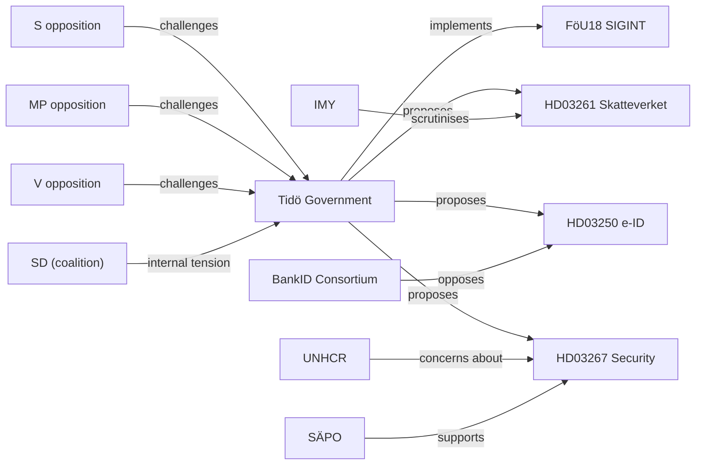

# Stakeholder Perspectives — Evening Analysis 2026-05-07

**Method**: Multi-actor analysis with evidence-based attribution  
**Admiralty**: B2

## Primary Stakeholders

### Government / Tidö Coalition

**Perspective**: Successful legislative completion of 2022–2026 programme.  
**M (Moderaterna)**: Presents security legislation (HD03267, FöU18) + financial regulation as evidence of competent governance. Positions e-ID (HD03250) as modernisation.  
**SD (Sverigedemokraterna)**: Claims credit for tough-on-crime measures (JuU series) + security threats legislation. Internal tension on forestry (prop. 242) creates uncomfortable narrative of coalition disagreement.  
**C (Centerpartiet, coalition support)**: Positioning for independent profile on criminal responsibility age challenge (prop. 246) — unusual constitutional depth in their motions. C is testing post-election independence.  
**KD (Kristdemokraterna)**: Supports security cluster; psychological violence law (JuU39) aligns with KD's family violence platform.  
**L (Liberalerna)**: Security legislation supported; potential constitutional reservations about Skatteverket expansion (HD03261) — L has historically been privacy-protective.

### Opposition Parties

**S (Socialdemokraterna)**: Using interpellations systematically to create accountability record — ILO (HD10475), minority policy (HD10479), Nordic transport (HD11799). Strategy: document government failures on international commitments for campaign use. Secondary: technical criticism of Skatteverket expansion risks.  
**V (Vänsterpartiet)**: Categorical opposition to criminal responsibility age (prop. 246) — evidence-based challenge. Would oppose HD03267 and Skatteverket expansion on rights grounds.  
**MP (Miljöpartiet)**: Gaza interpellations (HD10476, HD10478) reflect MP's human rights international platform. School in prison for 13-year-olds (HD11796) directly connected to prop. 246 — MP is building a coherent juvenile justice counter-narrative.

### Civil Society / Interest Groups

| Actor | Position | Key issue |
|-------|----------|-----------|
| Advokatsamfundet | Likely critical | HD03267 due process; HD03261 GDPR |
| LO / TCO | Supportive | ILO engagement (HD10475) |
| Swedish banking sector (Bankföreningen) | Ambivalent | HD03250 competes with BankID |
| BID Sweden (BankID consortium) | Opposed | HD03250 state e-ID market entry |
| FI (Finansinspektionen) | Implementing | FiU37, FiU38, CU35 |
| Skatteverket | Supportive | HD03261 — expands own authority |
| IMY (data protection) | Scrutinising | HD03261, HD03267 |
| SÄPO | Supportive | HD03267 — expands operational powers |
| Amnesty Sverige | Opposed | HD03267, HD03261 privacy; Gaza interpellations |
| UNHCR Sweden | Opposed to | HD03267 — non-refoulement concerns |
| Nordic Council Secretariat | Supportive | HD01JuU34 Nordic enforcement |
| Polisförbundet | Supportive | JuU32 public gathering security |

### EU Institutions

- **European Commission**: Positive on CU35, FiU38 (EU regulation implementation). No position on domestic security legislation (national competence).
- **EBA/ESMA**: Monitoring FiU37 (banking crisis management); FiU38 (OTC derivatives) — both fall under EU supervisory architecture.
- **ECHR**: Monitoring HD03267; Lagrådet referral signals awareness of Convention obligations.

### International Actors

**ILO** (HD10475): Swedish engagement in ILO Governing Body is active — ILO itself would welcome the interpellation as evidence of parliamentary oversight.  
**Gaza / UNRWA** (HD10476, HD10478): MP interpellations align with UNRWA's call for humanitarian access. Sweden's aid to UNRWA was maintained despite US/Israeli pressure — government faces accountability for implementation.

## Stakeholder Conflict Map

