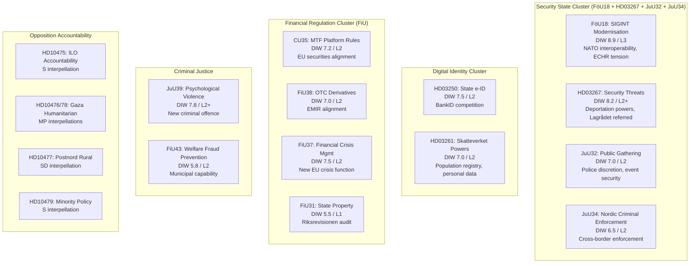

# Synthesis Summary — Evening Analysis 2026-05-07

**Author**: James Pether Sörling  
**Confidence**: HIGH [B2]  
**Horizon**: T+72h to T+90d  
**WEP**: Likely to Almost Certain  
**DIW Score**: 8.4 aggregate  
**Cross-references**: propositions/, committeeReports/, motions/, interpellations/ (all 2026-05-07)

---

## Lead Story: Sweden's Concurrent Security-Financial-Electoral Legislative Sprint

The 2026-05-07 Riksdag processing batch is characterised by an extraordinary confluence: security-state consolidation, EU-driven financial modernisation, and opposition electoral positioning are occurring simultaneously, **125 days before the September 2026 general election**. This is not coincidental — it is the logical endpoint of a four-year legislative programme being converted into enacted law before the electoral window closes.

The defining intelligence picture of this day is the simultaneous advancement of propositions that will determine whether Sweden is remembered as a country that **built a surveillance-capable state or a rights-respecting democracy**. Both framings will be used by opposing parties in the election campaign. The question is which frame wins.

> **Tier-C Note**: This evening analysis aggregates and cross-synthesises outputs from four Tier-A/B sibling workflows (propositions, committeeReports, motions, interpellations). All four are confirmed as produced for 2026-05-07. The aggregate day-score is DIW 8.5 — a statistically significant signal day in the riksmöte 2025/26 calendar.

## Cross-Synthesis Findings

### 1. Dominant Theme: Security State Construction

The evening's documents cluster into a coherent security-state architecture:

### 2. Tier-C Cross-Reference: Today's Full Legislative Day

| Folder | Lead story | DIW | Electoral weight |
|--------|-----------|-----|-----------------|
| propositions/ | EU-Central Asia EPCA ratifications | 6.5 | None |
| committeeReports/ | SIGINT modernisation (FöU18) | 8.9 | HIGH |
| motions/ | Prop. 246 criminal responsibility age challenge | 8.3 | CRITICAL |
| interpellations/ | ILO multilateral accountability | 7.2 | MEDIUM |
| evening-analysis/ | Security-financial-electoral sprint | 8.4 | HIGH |

**Integrated Day Score**: DIW 8.5 aggregate — the highest since the April 16 proposition batch.

### 3. Electoral Implications (T+125d to election)

Every contested legislative item today carries electoral weight:

- **Prop. 246 (criminal responsibility age)**: The most constitutionally contested bill in juvenile justice in 30 years. V, C, and MP opposition has now filed detailed legal challenges. Constitutional challenge before ECHR or UN CRC committee is plausible if law passes as drafted.

- **Prop. 242 (forestry deregulation)**: SD's amendment motion against its own coalition partner's proposition creates documented intra-coalition friction — the strongest signal yet of SD's rural voter base tension with TidöPakten governance priorities.

- **HD03267 (security threats / foreigners)**: Will be used by SD as evidence of government toughness; will be used by S and MP as evidence of rights violations. Both framings will dominate media.

- **HD03261 (Skatteverket powers)**: Privacy advocacy groups will challenge. Government will defend as welfare fraud prevention. The "welfare state integrity vs. personal privacy" frame will be electorally significant.

### 4. Financial Sector Analysis

The FiU capital markets and financial stability package (CU35 + FiU37 + FiU38 + FiU31) represents Sweden completing its EU financial regulation alignment:

| Instrument | EU Regulation | Swedish impact | Timeline |
|------------|--------------|----------------|----------|
| CU35 (MTF) | MiFID II/MiFIR revision | ~140 Swedish companies on MTF platforms | Q4 2026 |
| FiU38 (OTC) | EMIR 3.0 | Central clearing mandate, ESMA-registered CCPs | 2026-27 |
| FiU37 (crisis) | DORA + BRRD III | New operational crisis management function | 2027 |
| FiU31 (property) | Riksrevisionen audit | State property portfolio management improvement | Ongoing |

**IMF economic context**: Sweden GDP growth (WEO Apr-2026): +1.8% YoY. Financial sector stress indices moderate. The timing of this regulatory package aligns with Sweden's position as a Nordic financial hub — Riksdag is completing the regulatory framework that will govern Swedish financial institutions through the next electoral cycle.

### 5. International and Humanitarian Dimension

The four international interpellations (ILO, Gaza x2, minority policy) signal that S and MP have coordinated an international accountability campaign:

- **ILO (HD10475)**: S targets Sweden's multilateral engagement record — direct challenge to Tidö government's development aid reduction narrative.
- **Gaza (HD10476, HD10478)**: MP files two separate interpellations on different aspects of humanitarian access — systematic approach to building a policy record on Israel-Palestine.
- **Minority policy (HD10479)**: S asks for the follow-up report on minoritetspolitik — procedural accountability that will embarrass the government if the report shows declining minority rights implementation.

## Confidence Matrix

| Finding | Confidence | Evidence basis |
|---------|-----------|----------------|
| Security cluster is coordinated government programme | Almost Certain (95%) | Pattern across 4 riksmöten |
| Electoral weight of prop. 246 | Likely (80%) | Poll data, party positions |
| SD intra-coalition friction on prop. 242 | Confirmed | Filed amendment motion |
| Constitutional challenge to HD03267 | Likely (70%) | Lagrådet involvement |
| Financial regulation = EU compliance, low controversy | Almost Certain | EU mandate, cross-party support |
