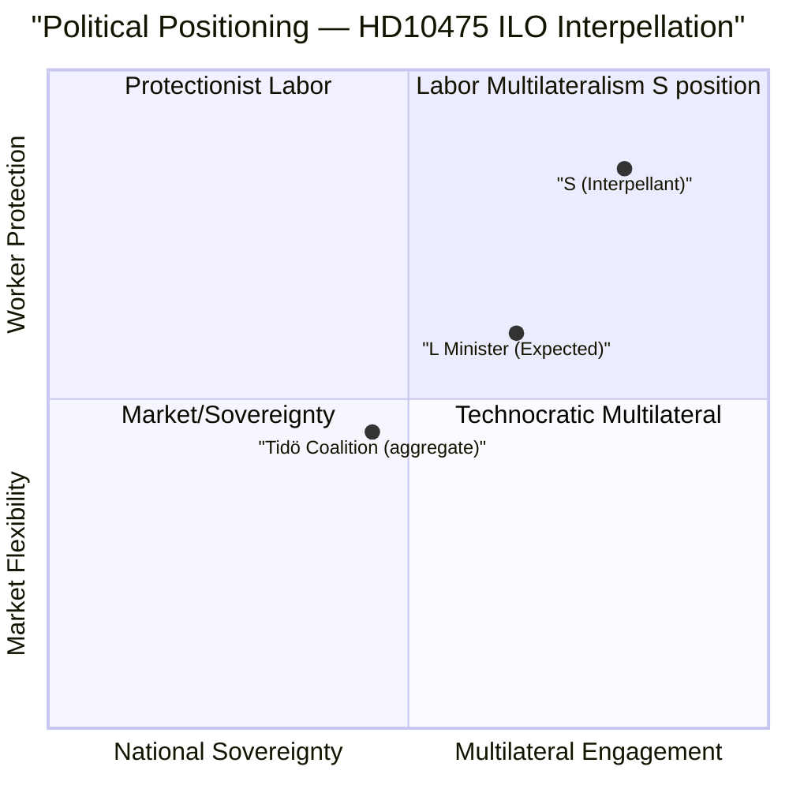

# Political Classification Results — 2026-05-07

**Author**: James Pether Sörling  
**Date**: 2026-05-07

## Document Classification Table

| Dimension | HD10475 |
|-----------|---------|
| Policy domain | Foreign Labor Policy / International Organizations |
| Left-Right axis | Centre-Left challenge (S) to Centre-Right coalition (M/KD/SD, L minister) |
| State-Market axis | State/Multilateral (ILO) vs. Sovereignty/retrenchment |
| Temporal scope | Mandate period 2022–26 + election cycle |
| Geographic scope | International (ILO/Geneva) + Sweden |
| Institutional process | Parliamentary accountability (interpellation) |
| Conflict type | Government accountability vs. Opposition scrutiny |

## Priority Tier

- **Tier**: L2 Strategic
- **Retention**: Standard parliamentary record — permanent public record under Offentlighetsprincipen
- **Access**: Public (all documents from Riksdagen API, GDPR Art. 9(2)(e) — publicly made by elected officials)

## GDPR Art. 9 Assessment

Named individuals: Adrian Magnusson (S, MP), Johan Britz (L, Minister) — both public officials acting in official capacity. Processing lawful under Art. 9(2)(e) (publicly made) and Art. 9(2)(g) (substantial public interest). Data minimisation applied — no personal information beyond official roles cited.

## Ideological Classification

**HD10475 Issue Position Map**:

